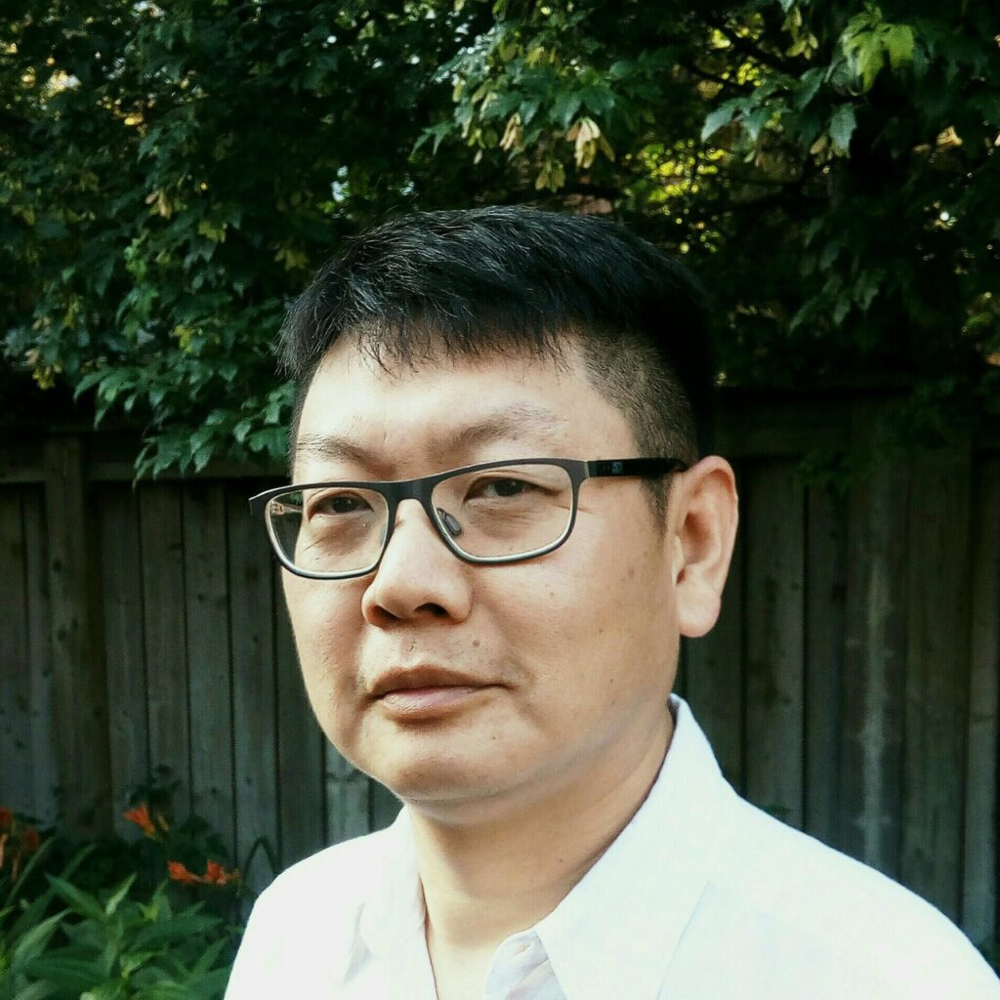

# Meet Your Faculty

<!--#### NAME

>JOB TITLE  
INSTITUTION  
LOCATION
>
> --- CONTACT INFO, IF PROVIDED

BIO GOES HERE-->

<!--### Zhibin Lu

>HPC and Bioinformatics Services Manager 
Princess Margaret Cancer Centre, University Health Network

Zhibin Lu is a senior manager at University Health Network Digital. He is responsible for UHN
HPC operations and scientific software. He manages two HPC clusters at UHN, including
system administration, user management, and maintenance of bioinformatics tools for
HPC4health. He is also skilled in Next-Gen sequence data analysis and has developed and
maintained bioinformatics pipelines at the Bioinformatics and HPC Core. He is a member of the
Digital Research Alliance of Canada Bioinformatics National Team and Scheduling National
Team.-->
