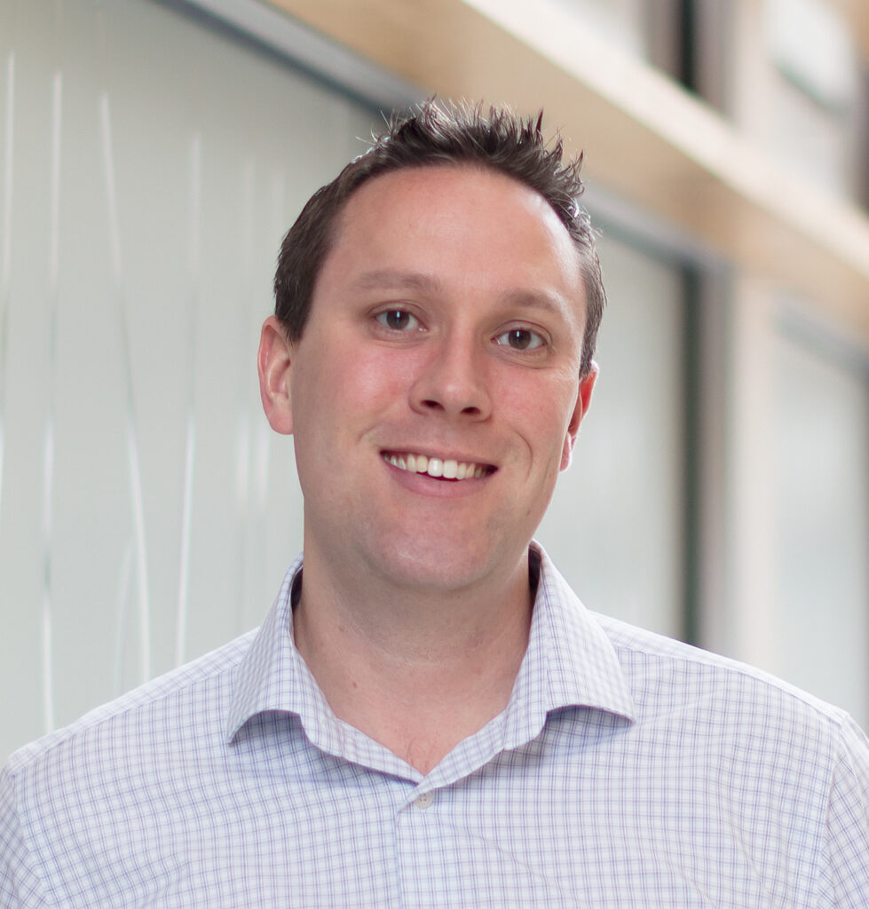
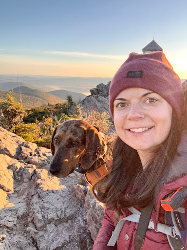
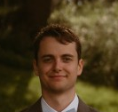
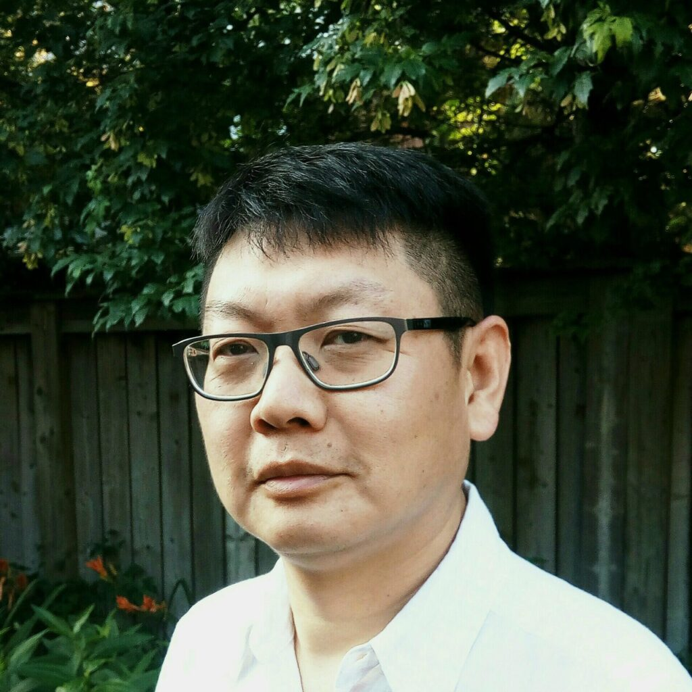

# Meet Your Faculty

#### Morgan Langille

>Professor 
Dalhousie University

The focus of Dr. Langille’s research is to better understand human-microbial interactions and how that can be used to improve human health. This includes leveraging novel genomic technologies and developing improved bioinformatic methods to process and integrate multi-omic data to aid in biological interpretation. These discoveries will hopefully lead to novel applications for diagnosis and therapeutics.

#### Robyn Wright

>Postdoctoral Fellow  
Dalhousie University

Robyn Wright is a microbial ecologist that completed her BSc in Marine Biology at the University of Plymouth (UK) before earning her PhD in Biological Sciences at the University of Warwick (UK) at the end of 2019. Her background is in marine microbial ecology and she studied the colonization and biodegradation of plastics during her PhD as well as in her first postdoc, where she moved to the School for Resources and Environmental Studies at Dalhousie University in Nova Scotia, Canada. She currently works within the lab of Dr. Morgan Langille, where her research aims to understand the roles that microbial communities play in human and ecosystem health and disease, and to assess and benchmark the methods that we use to study microbial systems. She enjoys working on diverse microbial ecology topics and several of her current research projects study the associations between the oral microbiome and mental and physical health conditions. She is also involved with maintaining and updating computational tools, including PICRUSt2 – a popular tool used for functional prediction within microbial communities – and with developing new tools, for example, for use in verifying the results that we obtain from metagenomic taxonomic classification tools.

#### Abbey Saunders

>Graduate Student 
Dalhousie University

Abbey is a graduate student in the Department of Microbiology and Immunology at Dalhousie University. Her research focuses on understanding how dietary therapies influence the gut microbiome in paediatric Crohn’s disease and how microbial changes relate to treatment response. Her work uses long-read metagenomic sequencing and various bioinformatics approaches to reconstruct microbial genomes and investigate strain-level differences in microbial virulence and functional pathways associated with diet-induced remission. Her research aims to identify microbial features that may contribute to disease persistence or remission, with the goal of improving our understanding of treatment response and informing the development of more targeted therapies for Crohn’s disease.

#### Jacob Nearing

>Postdoctoral Fellow 
Dalhousie University

Dr. Jacob Nearing is a postdoctoral fellow at Dalhousie University in the lab of Dr. Morgan Langille and a close collaborator with Dr. Curtis Huttenhower at the Harvard T.H. Chan School of Public Health. Dr. Nearing's work is centered around developing and applying bioinformatic methods to help create a better understanding of the complex interactions between microbial communities are their hosts. 

### Zhibin Lu

>HPC and Bioinformatics Services Manager 
Princess Margaret Cancer Centre, University Health Network

Zhibin Lu is a senior manager at University Health Network Digital. He is responsible for UHN
HPC operations and scientific software. He manages two HPC clusters at UHN, including
system administration, user management, and maintenance of bioinformatics tools for
HPC4health. He is also skilled in Next-Gen sequence data analysis and has developed and
maintained bioinformatics pipelines at the Bioinformatics and HPC Core. He is a member of the
Digital Research Alliance of Canada Bioinformatics National Team and Scheduling National
Team.
