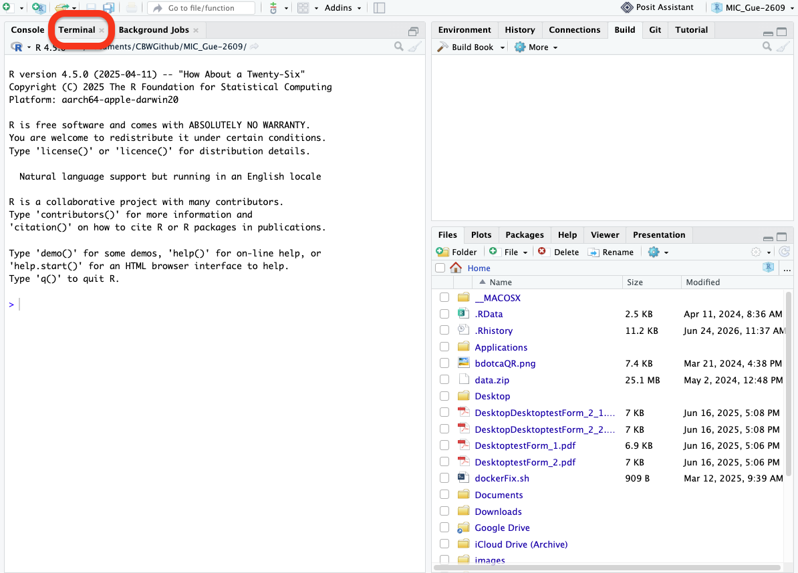

# AWS/UNIX
## 1. Logging into AWS

<iframe src="https://docs.google.com/presentation/d/1ZY-afauh-x6a_v7M0DjI-UHRqbJ6oZ8L/preview" width="640" height="480" allow="autoplay"></iframe>  

### Logging into the Amazon Cloud During the Workshop  

* These instructions will **ONLY** be relevant in class, as the Cloud will not be accessible from home in advance of the class.
 
* On the cloud, we're going to use the default username: **ubuntu**
 

### Logging in with ssh (Mac/Linux)

* Make sure the permissions on your private key are secure. Use chmod on your downloaded pem file:

```bash
 chmod 600 CBW.pem
```

* To log in to the instance, use the -i command line argument to specify your private key:

```bash
 ssh -i CBW.pem ubuntu@##.uhn-hpc.ca
```

(where ## is your assigned student number.)

### Logging in with OpenSSH client (Windows)

-   Make sure OpenSSH client is installed on your machine. Settings > System > Optional features, then search for "OpenSSH" in your added features.

-   open the "Command Prompt" or "Windows PowerShell" and run

``` bash
 C:\Windows\System32\OpenSSH\ssh.exe -i CBW.pem ubuntu@##.uhn-hpc.ca
```

### Alternative: logging in to the terminal with the browser (Windows)

If you're on a managed/work computer or wifi network, sometimes port access will be blocked, making the above steps fail. An alternative option is to use the browser. In your browser of choice, enter the following into the URL bar, where ## indicates the unique portion of your hostname:

```
http://##.uhn-hpc.ca:8080
```

This should bring up the RStudio login screen. Enter the username and password from the Slack channel. You should see a screen similar to the following. Click the Terminal tab (might be partway down the screen):



You are now connected! Note that the Console tab allows you to work in R, while the Terminal tab allows you to work on the command line (Bash).

### File System Layout

When you log in, you'll notice that you have two directories: **CourseData** and **workspace**.

* The **CourseData** directory will contain the files that you'll need to complete your lab assignments.

* The **workspace** directory is where you will work on your labs. Files here will be accessible through your browser.

### Workspace

* Everything created in your workspace on the cloud is also available by a web server on your cloud instance.  Simply go to the following in your browser:

```
 http://##.uhn-hpc.ca/
```
(where ## is your assigned student number.)

### RStudio 
* RStudio server is installed on your instance. It is accessible in your browser
```
 http://##.uhn-hpc.ca:8080
```
(where ## is your assigned student number.) The username is ***ubuntu***. We will give you the password in class.

### Jupyter Notebook

-   Jupyter Notebook is installed on your instance. It is accessible in your browser

```         
 http://##.uhn-hpc.ca:8000
```

(where \## is your assigned student number.) We will give you the password in class.

## 2. Introduction to the command line

<iframe src="https://docs.google.com/presentation/d/1wwMR21Ffno2ZArZapD7BuVAkfby4mOAK/preview" width="640" height="480" allow="autoplay"></iframe>  

### Exercise: Exploring the filesystem

1. Connect to your AWS instance


2. Type the `ls` command - what is the output?

<details>
  <summary>
Solution
  </summary>

```bash
$ ls
CourseData  R  workspace
```


The `ls` command lists the contents of a working directory.

</details>  <br>


3. Type the `pwd` command - what is the output?

<details>
  <summary>
Solution
  </summary>


```bash
$ pwd
/home/ubuntu
```

The `pwd` command shows the absolute *path to the working directory*.

</details>

## 3. File manipulation

<iframe src="https://docs.google.com/presentation/d/1WUSa0iepejwGTYuo2m1IwLlUeOSTo9ya/preview" width="640" height="480" allow="autoplay"></iframe>  

### Exercise: Reading text files

Using the commands you just learned, explore the .gff3 file in the Home directory. 

1. Is the file a text file?

<details>
  <summary>
Solution
  </summary>

Yes. You can use `less`, `cat`, `head`, or `tail` and get human-readable info. Note that this doesn't have anything to do with its file extension.
</details> <br>


2. How many lines does the file have?

<details>
  <summary>
Solution
  </summary>


```bash
$ wc -l GCF_009858895.2_ASM985889v3_genomic.gff 
67 GCF_009858895.2_ASM985889v3_genomic.gff
```

There are 67 lines in this file.

</details> <br>

  

3. Can you read the content of the file using less?

<details>
  <summary>
Solution
  </summary>

```bash
$ less GCF_009858895.2_ASM985889v3_genomic.gff 
```

</details>

---

### Exercise: Editing text files

Using the commands you just learned, create a file called helloworld.txt and edit it using nano. 

1. Write “Hello world” into the file. Save the file and exit nano. 
2. Create a subdirectory called “test”; move the helloworld.txt file into test.
3. Create a copy of the helloworld.txt file called helloworld2.txt 

<details>
  <summary>
Solution
  </summary>

1. First, use the `nano` command to open a file called `helloworld.txt`

```bash
$ nano helloworld.txt
```

Inside the nano editor, write "Hello world", then use the `^O` option to write the changes and `^X` to exit.

2. Create a subdirectory called “test”; move the helloworld.txt file into test.

Use the command `mkdir` to create this new directory. Then, use `mv` to move `helloworld.txt` into this directory.


```bash
$ mkdir test
$ mv helloworld.txt test/
```

3. Create a copy of the `helloworld.txt` file called `helloworld2.txt`. 

Change the working directory using `cd`, then use the `cp` command to create the copy.

```bash
$ cd test
$ cp helloworld.txt helloworld2.txt

```

</details>


### Reference material
Here are two cheat-sheets that can be useful to have as a reference for common UNIX/Linux commands:

- [FOSSwire.com Unix/Linux Command Reference](https://files.fosswire.com/2007/08/fwunixref.pdf)
- [SUSO.org Unix/Linux Command Syntax and Reference](https://i.redd.it/6s2q64ticje51.png)

## 4. Searching and sorting through files

### Setup


We want to explore some data on our instances, but it is a compressed ZIP file, so we'll need to unzip it first. First move into your home directory, and then unzip the file named data.zip:

```bash
cd ~
unzip data.zip
cd data
```

Take a look at what's in your home directory after unzipping using ls:

```
ls 
```

```
GCF_009858895.2_ASM985889v3_genomic.gff  __MACOSX  data  data.zip
```

Note that the original zipped file (data.zip) is still present, but there is now a folder (data) that you can enter. There is also a file called __MACOSX. This is because the folder was zipped using a Mac; you can safely ignore it here.


### Data Exploration

We'll begin by looking at files are in Genbank gbff. This is a text file that describes the nucleotide sequence and annotation features on those nucleotide sequences. First of all, we run the `ls` command to view the names of the files in the `ecoli_genomes` directory:

```bash
$ ls genomes
```

```
atlanta.gbff      braunschweig.gbff lab-strain.gbff   london.gbff       muenster.gbff     nevada.gbff       texas.gbff
```


Let’s go into that directory with `cd` and run an example command `wc london.gbff`:

```bash
$ cd genomes
$ wc london.gbff
```

```
212462  899913 13993868 london.gbff
```


`wc` is the ‘word count’ command: it counts the number of lines, words, and characters in files (from left to right, in that order).

If we run the command `wc *.gbff`, the `*` wildcard matches zero or more occurences of any character, so the shell turns `*.gbff` into a list of all gbff files in the current directory:

```bash
$ wc *.gbff
```

```
  217040  915629 14251456 atlanta.gbff
  204528  837084 13332241 braunschweig.gbff
  191859  685480 11851718 lab-strain.gbff
  212462  899913 13993868 london.gbff
  202036  823021 13167730 muenster.gbff
  216788  883045 14082598 nevada.gbff
  208514  849571 13555200 texas.gbff
 1453227 5893743 94234811 total
```


Note that `wc *.gbff` also shows the total number of all lines in the last line of the output.

If we run `wc -l` instead of just `wc`, the output shows only the number of lines per file:

```bash
$ wc -l *.gbff
```

```
  217040 atlanta.gbff
  204528 braunschweig.gbff
  191859 lab-strain.gbff
  212462 london.gbff
  202036 muenster.gbff
  216788 nevada.gbff
  208514 texas.gbff
 1453227 total
```


Which of these files contains the fewest lines? It’s an easy question to answer when there are only six files, but what if there were 6000? Our first step toward a solution is to run the command:

```bash
$ wc -l *.gbff > lengths.txt
```

The greater than symbol, `>`, tells the shell to redirect the command’s output to a file instead of printing it to the screen. (This is why there is no screen output: everything that wc would have printed has gone into the file `lengths.txt` instead.) The shell will create the file if it doesn’t exist. If the file exists, it will be silently overwritten, which may lead to data loss and thus requires some caution. `ls lengths.txt` confirms that the file exists:

```bash
$ ls lengths.txt
lengths.txt
```

We can now send the content of `lengths.txt` to the screen using `cat lengths.txt`. The cat command gets its name from ‘concatenate’ i.e. join together, and it prints the contents of files one after another. There’s only one file in this case, so cat just shows us what it contains:

```bash
$ cat lengths.txt
```

```
  217040 atlanta.gbff
  204528 braunschweig.gbff
  191859 lab-strain.gbff
  212462 london.gbff
  202036 muenster.gbff
  216788 nevada.gbff
  208514 texas.gbff
 1453227 total
```


### Sorting

The `sort` command rearranges the lines in a file in order. There are different methods of sorting - lexigraphically (a-z1-9) or numerically. The default sort type is lexigraphically, where numbers are treated one character at a time. Given a the file "numbers.txt" that looks like:

```bash
cd ../sorting
cat numbers.txt
```

```
10
2
19
22
6
```


If we run `sort` on this file:

```bash
sort numbers.txt
```

```
10
19
2
22
6
```


If we run `sort -n` on the same input - specifying that we want to sort numerically, we get this instead:

```bash
sort -n numbers.txt
```

```
2
6
10
19
22
```


Explain why `-n` has this effect.

<details>
  <summary>
   Solution
  </summary>
  The -n option specifies a numerical rather than an alphanumerical sort.
</details>

We will sort our lengths.txt file using the `-n` option to specify that the sort is numerical instead of alphanumerical. Note that running sort does not modify the file; instead, it sends the sorted result to the screen:

```bash
cd ../genomes
$ sort -n lengths.txt
```

```
  191859 lab-strain.gbff
  202036 muenster.gbff
  204528 braunschweig.gbff
  208514 texas.gbff
  212462 london.gbff
  216788 nevada.gbff
  217040 atlanta.gbff
 1453227 total
```


We can put the sorted list of lines in another temporary file called `sorted-lengths.txt` by putting `> sorted-lengths.txt` after the command, just as we used `> lengths.txt` to put the output of `wc` into `lengths.txt`. Once we’ve done that, we can run another command called `head` to get the first few lines in sorted-lengths.txt:

```bash
$ sort -n lengths.txt > sorted-lengths.txt
$ head -n 1 sorted-lengths.txt
```

```
  191859 lab-strain.gbff
```


Using `-n 1` with head tells it that we only want the first line of the file; `-n 20` would get the first 20, and so on. Since `sorted-lengths.txt` contains the lengths of our files ordered from least to greatest, the output of head must be the file with the fewest lines.

### What Does >> Mean?

We have seen the use of `>`, but there is a similar operator `>>` which works slightly differently. We’ll learn about the differences between these two operators by printing some strings. We can use the echo command to print strings e.g.

```bash
$ echo The echo command prints text
```

```
The echo command prints text
```


Now test the commands below to reveal the difference between the two operators:

```bash
$ echo hello > testfile01.txt
```

and:

```bash
$ echo hello >> testfile01.txt
```

### Running Commands Together

If you think this is confusing, you’re in good company: even once you understand what `wc`, `sort`, and `head` do, all those intermediate files make it hard to follow what’s going on. We can make it easier to understand by running sort and head together:

```bash
$ sort -n lengths.txt | head -n 1
```

```
  191859 lab-strain.gbff
```


The vertical bar, `|`, between the two commands is called a pipe. It tells the shell that we want to use the output of the command on the left as the input to the command on the right.

Nothing prevents us from chaining pipes consecutively. That is, we can for example send the output of `wc` directly to sort, and then the resulting output to head. Thus we first use a pipe to send the output of `wc` to `sort`:

```bash
$ wc -l *.gbff | sort -n
```

```
  191859 lab-strain.gbff
  202036 muenster.gbff
  204528 braunschweig.gbff
  208514 texas.gbff
  212462 london.gbff
  216788 nevada.gbff
  217040 atlanta.gbff
 1453227 total
```


And now we send the output of this pipe, through another pipe, to head, so that the full pipeline becomes:

```bash
$ wc -l *.gbff | sort -n | head -n 1
```

```
  191859 lab-strain.gbff
```


The redirection and pipes used in the last few commands are illustrated below:


### Piping Commands Together

In our current directory, we want to find the 3 files which have the least number of lines. Which command listed below would work?

```bash
$ wc -l * > sort -n > head -n 3
$ wc -l * | sort -n | head -n 1-3
$ wc -l * | head -n 3 | sort -n
$ wc -l * | sort -n | head -n 3
```

This idea of linking programs together is why Unix has been so successful. Instead of creating enormous programs that try to do many different things, Unix programmers focus on creating lots of simple tools that each do one job well, and that work well with each other. This programming model is called ‘pipes and filters’. We’ve already seen pipes; a filter is a program like `wc` or `sort` that transforms a stream of input into a stream of output. Almost all of the standard Unix tools can work this way: unless told to do otherwise, they read from standard input, do something with what they’ve read, and write to standard output.

The key is that any program that reads lines of text from standard input and writes lines of text to standard output can be combined with every other program that behaves this way as well. You can and should write your programs this way so that you and other people can put those programs into pipes to multiply their power.

### Pipe Reading Comprehension

A file called `annotation-dates.txt` (in the `data/collection` folder) contains the annotation dates and source location for our strains in CSV format. Note the file contains some duplicate lines:

```
2021-05-23,atlanta
2021-05-19,branschweig
2021-05-23,london
2021-05-23,london
2021-05-26,muenster
2021-05-27,nevada
2021-05-30,texas
2021-05-30,texas
2004-06-10,lab-strain
```

What text passes through each of the pipes and the final redirect in the pipeline below?

```bash
$ cd ../collection
$ cat annotation-dates.txt | head -n 5 | tail -n 3 | sort -r > final.txt
```

<details>
  <summary>
   Solution
  </summary>

  <p>
  The head command extracts the first 5 lines from <code>annotation-dates.txt</code>. Then, the last 3 lines are extracted from the previous 5 by using the tail command. With the <code>sort -r</code> command those 3 lines are sorted in reverse order and finally, the output is redirected to a file <code>final.txt</code>. The content of this file can be checked by executing <code>cat final.txt</code>. The file should contain the following lines:

  <div class="language-plaintext output highlighter-rouge"><pre class="highlight">
  <code>2021-05-26,muenster
2021-05-23,london
2021-05-23,london
  </code></pre></div>
  </p>
</details>

### Pipe Construction

For the file `annotation-dates.txt` from the previous exercise, consider the following command:

```bash
$ cut -d , -f 2 annotation-dates.txt
```

The `cut` command is used to remove or ‘cut out’ certain sections of each line in the file, and `cut` expects the lines to be separated into columns by a Tab character. A character used in this way is a called a delimiter. In the example above we use the `-d` option to specify the comma as our delimiter character. We have also used the `-f` option to specify that we want to extract the second field (column). This gives the following output:

```
atlanta
branschweig
london
london
muenster
nevada
texas
texas
lab-strain
```


The `uniq` command filters out adjacent matching lines in a file. How could you extend this pipeline (using `uniq` and another command) to see the source location of the genomes in the file (without any duplicates in their names)?

<details>
    <summary>
   Solution
    </summary>

<div class="language-bash highlighter-rouge"><div class="highlight"><pre class="highlight"><code><span class="nv">$ </span><span class="nb">cut</span> <span class="nt">-d</span> , <span class="nt">-f</span> 2 annotation-dates.txt | <span class="nb">sort</span> | <span class="nb">uniq</span>
</code></pre></div></div>

</details>

### Which Pipe?

The `uniq` command has a `-c` option which gives a count of the number of times a line occurs in its input. Assuming your current directory is `data/collection`, what command would you use to produce a table that shows the total number of times each *E. coli* strain appears in the file?

1. `sort annotation-dates.txt | uniq -c`
2. `sort -t, -k2,2 annotation-dates.txt | uniq -c`
3. `cut -d, -f 2 annotation-dates.txt | uniq -c`
4. `cut -d, -f 2 annotation-dates.txt | sort | uniq -c`
5. `cut -d, -f 2 annotation-dates.txt | sort | uniq -c | wc -l`


<details>
  <summary>
 Solution
  </summary>
  Option 4. is the correct answer. If you have difficulty understanding why, try running the commands, or sub-sections of the pipelines (make sure you are in the `data/collections` directory).
</details>

### Checking Files

Let's say our collaborator has created 17 files in the `north-pacific-gyre/2012-07-03` directory. As a quick check, starting from the `data` directory, if we type:

```bash
$ cd north-pacific-gyre/2012-07-03
$ wc -l *.txt
```

The output is 18 lines that look like this:

```
300 NENE01729A.txt
300 NENE01729B.txt
300 NENE01736A.txt
300 NENE01751A.txt
300 NENE01751B.txt
300 NENE01812A.txt
...
```


Now if we run

```bash
$ wc -l *.txt | sort -n | head -n 5
```

```
  240 NENE02018B.txt
  300 NENE01729A.txt
  300 NENE01729B.txt
  300 NENE01736A.txt
  300 NENE01751A.txt
```


Whoops: one of the files is 60 lines shorter than the others. Hypothetically speaking, — someone was probably in using the machine on the weekend entering the data, and forgot to save the last few lines. Before re-running that sample, lets checks to see if any files have too much data:

```bash
$ wc -l *.txt | sort -n | tail -n 5
```

```
 300 NENE02040B.txt
 300 NENE02040Z.txt
 300 NENE02043A.txt
 300 NENE02043B.txt
5040 total
```


Those numbers look good — but what’s that ‘Z’ doing there in the third-to-last line? All of her samples should be marked ‘A’ or ‘B’; by convention, her lab uses ‘Z’ to indicate samples with missing information. To find others like it, we can:

```bash
$ ls *Z.txt
```

```
NENE01971Z.txt    NENE02040Z.txt
```


It turns outt hat there’s no depth recorded for either of those samples. Since it’s too late to get the information any other way, we must exclude those two files from our analysis. We could delete them using rm, but there are actually some analyses we might do later where depth doesn’t matter, so instead, we'll have to be careful later on to select files using the wildcard expression *[AB].txt. As always, the * matches any number of characters; the expression [AB] matches either an ‘A’ or a ‘B’, so this matches all the valid data files she has.

### Wildcard Expressions

Wildcard expressions can be very complex, but you can sometimes write them in ways that only use simple syntax, at the expense of being a bit more verbose. Consider the directory `data/north-pacific-gyre/2012-07-03` : the wildcard expression *[AB].txt matches all files ending in `A.txt` or `B.txt`. Imagine you forgot about this.

Can you match the same set of files with basic wildcard expressions that do not use the [] syntax? Hint: You may need more than one command, or two arguments to the ls command.

If you used two commands, the files in your output will match the same set of files in this example. What is the small difference between the outputs?

If you used two commands, under what circumstances would your new expression produce an error message where the original one would not?

<details>
  <summary>
    Solution
  </summary>

1: A solution using two wildcard commands:

<code>ls *A.txt</code> and then <code>ls *B.txt</code>

A solution using one command but with two arguments:

<code>ls *A.txt *B.txt</code>

2: The output from the two new commands is separated because there are two commands.

3: When there are no files ending in `A.txt`, or there are no files ending in `B.txt`, then one of the two commands will fail.
</details>


### Key Points

- `cat` displays the contents of its inputs.
- `head` displays the first 10 lines of its input.
- `tail` displays the last 10 lines of its input.
- `sort` sorts its inputs.
- `wc` counts lines, words, and characters in its inputs.
- `command > [file]` redirects a command’s output to a file (overwriting any existing content).
- `command >> [file]` appends a command’s output to a file.
- `[first] | [second]` is a pipeline: the output of the first command is used as the input to the second.
- The best way to use the shell is to use pipes to combine simple single-purpose programs (filters).

## 5. Putting it all together


### Writing your first script 

We are finally ready to see what makes the shell such a powerful programming environment. We are going to take the commands we repeat frequently and save them in files so that we can re-run all those operations again later by typing a single command. For historical reasons, a bunch of commands saved in a file is usually called a shell script, but make no mistake: these are actually small programs.

Not only will writing shell scripts make your work faster– you won’t have to retype the same commands over and over again– it will also make it more accurate (fewer chances for typos) and more reproducible. If you come back to your work later (or if someone else finds your work and wants to build on it) you will be able to reproduce the same results simply by running your script, rather than having to remember or retype a long list of commands.

Let’s start by going back to `data/genomes` and creating a new file, `count_tags.sh` which will become our shell script:

```bash
$ cd data/genomes
$ nano count_tags.sh
```

The command nano `count_tags.sh` opens the file `count_tags.sh` within the text editor ‘nano’ (which runs within the shell). If the file does not exist, it will be created. We can use the text editor to directly edit the file – we’ll simply insert the following line:

```bash
echo -n "atlanta.gbff: "
grep "/locus_tag=" atlanta.gbff | wc -l
```

Then we save the file (Ctrl-O in nano), and exit the text editor (Ctrl-X in nano). Check that the directory molecules now contains a file called `count_tags.sh`.

Once we have saved the file, we can ask the shell to execute the commands it contains. Our shell is called bash, so we run the following command:

```bash
$ bash count_tags.sh
```

```
atlanta.gbff 12237
```


Sure enough, our script’s output is exactly what we would get if we ran that pipeline directly.

I've noticed that each locus tag appears twice in the gbff file, so we're double-counting a lot of tags. Let's modify our script to only count unique tags:

```bash
$ nano count_tags.sh
```

```bash
echo -n "atlanta.gbff: "
grep "/locus_tag=" atlanta.gbff | sort | uniq | wc -l
```

Now when we run the script:

```bash
$ bash count_tags.sh
```

```
atlanta.gbff 6109
```


What if we want to count the number of locus tags in many files? Let's introduce a new concept: loopingOpen up our script again

```bash
$ nano count_tags.sh
```

```bash
for filename in atlanta.gbff london.gbff
do
  echo -n "$filename "
  grep "/locus_tag=" $filename | sort | uniq | wc -l
done
```

We feed the loop with two elements: the text "atlanta.gbff" and then with the text "london.gbff".
The loop executes all of the commands between `do` and `done` for each time the loop iterates, and each time, the variable "$filename" is replaced by either "atlanta.gbff" or "london.gbff"


What if we wanted to count the number of tags in other gbff file. At the moment, the filenames are hard-coded into our script. It only counts tags in atlanta.gbff and london.gbff. We can make the script a little bit more flexible by using the variable nams "$1" and "$2"

```bash
$ nano count_tags.sh
```

Now, within “nano”, replace the text "atlanta.gbff" with the special variable called $1:

```bash
for filename in $1 $2
do
  echo -n "$filename "
  grep "/locus_tag=" $filename | sort | uniq | wc -l
done
```

Inside a shell script, `$1` means ‘the first filename (or other argument) on the command line’. Similarly, `$2` is the second argument passed to the script. We can now run our script like this:

```bash
$ bash count_tags.sh atlanta.gbff london.gbff
```

```
atlanta.gbff 6109
london.gbff 5831
```


or on a different file like this:

```bash
$ bash count_tags.sh nevada.gbff texas.gbff
```

```
nevada.gbff 5691
texas.gbff 5424
```


In case the filename happens to contain any spaces, we surround $1 with double-quotes.

This is better, but our script still isn't quite as flexible as I'd like. It can only operate on two files at a time. What if I wanted to count the tags in three or four files at a time?

There is a special variable "$@" which holds all of the arguments passed to the script. Let's make another modification to our script:


```bash
$ nano count_tags.sh
```

```bash
for filename in $@
do
  echo -n "$filename "
  grep "/locus_tag=" $filename | sort | uniq | wc -l
done
```

The "$@" variable gets replaced with all of the arguments passed to our script. This allows us to run:

```bash
$ bash count_tags.sh *.gbff
```

```
atlanta.gbff 6109
braunschweig.gbff 5248
lab-strain.gbff 4609
london.gbff 5831
muenster.gbff 5176
nevada.gbff 5691
texas.gbff 5424
```


This works, but it may take the next person who reads `count_tags.sh` a moment to figure out what it does. We can improve our script by adding some comments at the top:

```bash
$ nano count_tags.sh
```

```bash
# Counts the number of unique locus tags in one or more gbff files.

for filename in $@
do
  echo -n "$filename "
  grep "/locus_tag=" $filename | sort | uniq | wc -l
done
```

A comment starts with a `#` character and runs to the end of the line. The computer ignores comments, but they’re invaluable for helping people (including your future self) understand and use scripts. The only caveat is that each time you modify the script, you should check that the comment is still accurate: an explanation that sends the reader in the wrong direction is worse than none at all.

Lastly, let's make our script executable. First we'll modify the file permissions. This can be done using the `chmod` command:

```bash
chmod +x count_tags.sh
```

We'll also add a "shebang" line to our script which tells the shell what program should be used to run our script. Modify our script to include this first line:

```bash
#!/bin/bash
# Counts the number of unique locus tags in one or more gbff files.

for filename in $@
do
  echo -n "$filename "
  grep "/locus_tag=" $filename | sort | uniq | wc -l
done
```

Exercise: Can you create a command that uses our count_tags.sh script to find the gbff file with the smallest number of locus tags?

### Awk

Another very helpful "Swiss Army knife" of the shell is the program `awk`. Awk that, like `grep`, allows you to search for lines in a file matching some condition, but `awk` /also/ allows you to perform some small operations on those lines once you have matched them.

Let's build an simple example piece by piece.

Open up a new file:

```bash
nano find_lengths.awk
```

In this awk script, let's just write:

```awk
/LOCUS/
```

This is instructing awk to find all files that match the string "LOCUS". We can find all the lines matching "LOCUS" in the atlanta.gbff file by running:

```bash
awk -f find_lengths.awk atlanta.gbff
```

```
LOCUS       NZ_CP027572          5858866 bp    DNA     circular CON 24-MAY-2021
LOCUS       NZ_CP027571            97037 bp    DNA     circular CON 24-MAY-2021
```


Notice that the third column in the "LOCUS" lines includes the length of the sequence. Let's pull that out. Modify the contents of `find_lengths.awk` to include a block (executed each time awk finds a matching line)


In an awk script, we can use $3 to refer to the text in the third column (space-separated). Note that this is different to the dollar-sign variables in bash. Here we are writing in a script in the awk language, and not the bash language.

```awk
/LOCUS/ {
    print "Found a locus with length " $3 " bp"
}
```

Running the script now gives:

```bash
awk -f find_lengths.awk atlanta.gbff
```

```
Found a locus with length 5858866 bp
Found a locus with length 97037 bp
```


It might be helpful to sum up those lengths. We can create a variable called 'total' and add the numbers found in the third column. Open up the awk script and modify the contents to read

```awk
/LOCUS/ {
    print "Found a locus with length " $3 " bp"
    sum += $3
}

END {
    print "Total: " sum " bp"
}
```

We've written a new block here. Our first block uses the `/LOCUS/` matcher so it is run every time awk finds a line that matches "LOCUS". The `END` block is a special block that is run only once - when awk reaches the end of the input file. There is a similar optional `BEGIN` block run once at the beginning, but we have no use for that in our example.

Running the script now gives:

```bash
awk -f find_lengths.awk atlanta.gbff
```

```
Found a locus with length 5858866 bp
Found a locus with length 97037 bp
Total: 5955903 bp
```


I think that this script is a little bit too long and verbose. Let's clean it up a little to read simply:


```awk
/LOCUS/ {sum += $3}
END {print sum}
```

This gives us just the total length for a file:

```bash
awk -f find_lengths.awk atlanta.gbff
```

```
5955903
```


It is actually not even necessary to write our awk command in a separte file. Our script is short enough that we might even just want to write it in-line inside a command:

```bash
awk '/LOCUS/{sum += $3} END{print sum}' atlanta.gbff
```

```
5955903
```


Exercise: Can you write a command or a bash script to find the genome with the smallest total size?


### Key Points

1. Save commands in files (usually called shell scripts) for re-use.
2. `bash [filename]` runs the commands saved in a file.
3. `$@` refers to all of a shell script’s command-line arguments.
4. `$1`, `$2`, etc., refer to the first command-line argument, the second command-line argument, etc.
5. Place variables in quotes if the values might have spaces in them.
6. Letting users decide what files to process is more flexible and more consistent with built-in Unix commands.
