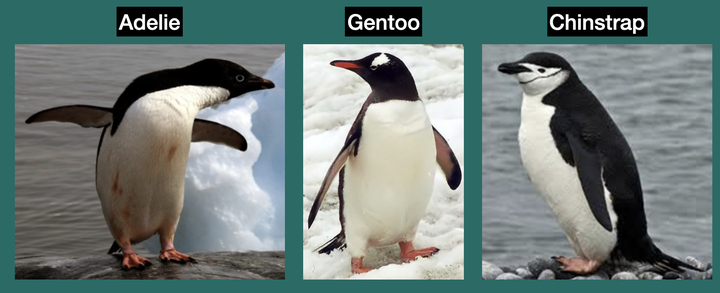

# R

This R tutorial was adapted from [Software Carpentry's Intro to R and
RStudio
Lessons](https://swcarpentry.github.io/r-novice-gapminder/01-rstudio-intro.html)

## Seeking Help with R

::: {.infobox}
**Learning Objectives**

-   To be able to read R help files for functions, data objects and
    special operators.
-   To be able to use CRAN task views to identify packages to solve a
    problem.
:::

```{r, include=FALSE}
```

### Reading Help Files

R, and every package, provide help files for functions or data objects.
The general syntax to search for help on any function, "function_name",
from a specific function that is in a package loaded into your R session
is:

```{r, eval=FALSE}
?function_name
help(function_name)
```

For example take a look at the help file for `mean()`

```{r, eval=FALSE}
?mean()
```

This will load up a help page in RStudio.

Each help page is broken down into sections:

-   `Description`: A brief description of what a function does or what a
    data object contains.
-   `Usage`: For functions, shows how the function is called, including
    its arguments and their default values. For data objects, shows the
    name of the object and - sometimes how it is structured or loaded.
-   `Arguments`: For functions, describes each argument and the type of
    input it expects. This section is usually absent for data objects.
-   `Format`: Common for data objects; describes the structure of the
    object, such as the number of observations and variables, variable
    names, data types, and what each variable represents.
-   `Details`: Provides additional information about how the function
    works or important background information about the data object.
-   `Value`: For functions, describes what the function returns. This
    section is usually absent for data objects.
-   `Source`: Common for data objects; describes where the data came
    from or provides a reference to the original source.
-   `Examples`: Provides example code demonstrating how to use the
    function or work with the data object.

Different functions/objects might have different sections, but these are
the main ones you should be aware of.

### Tip: Running Examples

From within the function help page, you can highlight code in the
Examples and hit <kbd>Return</kbd> to run it in RStudio console. This
gives you a quick way to get a feel for how a function works.

### Tip: Reading Help Files

One of the most daunting aspects of R is the large number of functions
available. It would be prohibitive, if not impossible to remember the
correct usage for every function you use. Luckily, using the help files
means you don't have to remember that!

### Data Objects

R by default comes with a collection of built-in data objects from the
alphabets and months of the year to datasets collected about penguins
and tooth growth in guinea pigs. These objects provide convenient
examples for learning how to explore, manipulate, summarize, and
visualize different types of data in R. Additionally, many R packages
come with their own data objects, such as example datasets, reference
databases, lookup tables, and precomputed results. Understanding what
these data objects contain and how they are structured can be essential
for using certain packages effectively.

```{r, eval=FALSE}
?iris()
?LETTERS()
```

### Special Operators

To seek help on special operators, use quotes or backticks:

```{r, eval=FALSE}
?"<-"
?`<-`
```

### Getting Help with Packages

Many packages come with "vignettes": tutorials and extended example
documentation. Without any arguments, `vignette()` will list all
vignettes for all installed packages; `vignette(package="package-name")`
will list all available vignettes for `package-name`, and
`vignette("vignette-name")` will open the specified vignette.

If a package doesn't have any vignettes, you can usually find help by
typing `help("package-name")`.

RStudio also has a set of excellent
[cheatsheets](https://rstudio.com/resources/cheatsheets/) for many
packages.

```{r, eval = F}
vignette("ggplot2")
```


### When You Remember Part of the Function Name

If you're not sure what package a function is in or how it's
specifically spelled, you can do a fuzzy search:

```{r, eval=FALSE}
??function_name
```

A fuzzy search is when you search for an approximate string match. For
example, you may remember that the function to set your working
directory includes "set" in its name. You can do a fuzzy search to help
you identify the function:

```{r, eval=FALSE}
??standarddeviation
```

### When You Have No Idea Where to Begin

If you don't know what function or package you need to use [CRAN Task
Views](https://cran.at.r-project.org/web/views) is a specially
maintained list of packages grouped into fields. This can be a good
starting point.

### Other Ways to Get Help

R's built-in documentation is not always enough, especially when you are
trying to solve a specific problem. Other useful sources of help
include:

-   Package websites: Popular packages often have dedicated websites
    containing documentation, tutorials, and examples.
-   Stack Overflow: Searching for the error message or problem you are
    encountering can often lead to solutions from other R users.
-   R community forums: Communities such as Posit Community provide a
    place to ask questions and discuss R-related problems.
-   GitHub: Package repositories can be useful for checking known
    issues, reporting bugs, and finding examples of how a package is
    being developed or used.
-   AI/LLMs: AI tools such as ChatGPT can help explain R concepts,
    interpret error messages, suggest functions or packages, and
    generate or troubleshoot code. However, AI-generated answers can be
    incorrect or outdated, so you should verify important information
    against official documentation and other reliable sources.

### Resources

-   [Quick R](https://www.statmethods.net/)
-   [RStudio cheat
    sheets](https://www.rstudio.com/resources/cheatsheets/)
-   [Cookbook for R](https://www.cookbook-r.com/)

## Data Structures, Data Types and Data frames

::: {.infobox}
**Learning Objectives**

-   To begin exploring data frames, and understand how they are related
    to vectors.
-   To be able to ask questions from R about the type and
    structure of an object.
-   To be able to manipulate rows and columns of a data frame.
:::

```{r, include=FALSE}
options(stringsAsFactors = FALSE)
```

One of R's most powerful features is its ability to work with **tabular
data**, such as data you might already have in a spreadsheet or CSV
file. Tabular data in R is commonly stored as a **data frame**, which
can be thought of as a collection of vectors arranged into columns. Each
vector represents a single column, while each row typically represents
an observation or record.

::: infobox
**What is a vector?**

In R, a vector is a sequence of values that all have the same data type.
Vectors are one of the fundamental data structures in R and form the
individual columns of a data frame.

Some of the most common data types you will encounter in R include:

-   `Double`: Numeric values that can contain decimals, such as 3.14 or
    10.5.
-   `Integer`: Whole numbers, such as 1, 5, or 100.
-   `Character`: Text values, such as "Hello" or "world".
-   `Logical`: Boolean values that can be either TRUE or FALSE.
:::

Let's start by creating a toy data frame containing information about
three different penguins.

```{r}
pg <- data.frame(
  species = c("Adelie", "Chinstrap", "Gentoo"),
  island = c("Torgersen", "Dream", "Biscoe"),
  bill_len = c(39.1, 46.5, 46.1),
  flipper_len = c(181, 192, 211),
  is_male = c(TRUE, FALSE, FALSE)
)
pg
```



<br>

We can begin exploring our dataset right away. Individual columns can be
accessed by specifying the name of the data frame followed by the \$
operator and the name of the column:

```{r, eval = F}
pg$bill_len
```

This returns the bill_len column as a vector. Because it is a numeric
vector, we can perform mathematical operations directly on its values:

```{r, eval = F}
pg$bill_len * 2
```

Notice the operation is applied to every value in the vector.

### Data Types

To know the data types each of the column in our toy dataset, there are
several methods to do this:

1.  Use `str()` to examine the structure of the data frame

```{r}
str(pg)
```

`str()` provides a compact overview of the entire data frame, including
its dimensions, column names, data types, and some example values. This
is often one of the first functions you will use when exploring a new
dataset.

2.  Use `summary()` to summarize each column

```{r}
summary(pg)
```

`summary()` provides a summary appropriate for the type of data in each
column. For numeric columns, this includes statistics such as the
minimum, median, mean, and maximum. For other data types, the
information displayed will differ.

3.  Use `typeof()` to inspect the underlying type of a specific column

```{r, collapse = T}
typeof(pg$species)
typeof(pg$bill_len)
typeof(pg$flipper_len)
typeof(pg$is_male)
```

Notice that `flipper_len` is also stored as a double, even though all of
its values are whole numbers. In R, entering a number such as 181
creates a double by default. To explicitly create an integer, the number
is followed by L, for example:

```{r, collapse = T}
typeof(181)
typeof(181L)
```

For everyday data analysis, you will often use str() to quickly inspect
an entire dataset and functions such as typeof() when you need to
investigate a particular object in more detail.

### Manipulating data frames

Now that we know how to access parts of a data frame, let's try
manipulating the data stored within it. There are many ways a data frame
can be manipulated. For example, we can add or remove columns, keep
specific observations, or modify the values of an existing column.

1.  Add a new column

Let's multiply the flipper length by two and store the resulting vector
as a new column:

```{r}
flip_length_x2 <- pg$flipper_len * 2
pg$flip_length_x2 <- flip_length_x2
pg
```

We can also perform the calculation and create the new column in a
single step:

```{r}
pg$flip_length_x2 <- pg$flipper_len * 2
pg
```

2.  Remove a column

One way to exclude a column is to select only the columns that we want
to keep. Data frames can be subset using the notation:

```         
data_frame[rows, columns]
```

For example, we can keep all rows and only the first five columns:

```{r}
pg <- pg[, 1:5]
pg
```

Leaving the space before the comma empty means that we want to keep all
rows, while `1:5` specifies that we want to keep columns 1 through 5.

3.  Keep specific observations

The same notation can be used to select specific rows. For example, we
can keep the first and third penguins:

```{r}
pg[c(1, 3), ]
```

Here, `c(1, 3)` specifies the rows we want to keep, while leaving the
space after the comma empty means that we want to keep all columns.

We can also specify both rows and columns:

```{r}
pg[c(1, 3), 1:5]
```

This keeps rows 1 and 3 and columns 1 through 5.

3.  Modify an existing column

Existing columns can also be replaced with new values. For example, we
can multiply every value in `flipper_len` by two:

```{r}
pg$flipper_len <- pg$flipper_len * 2
pg
```

The `<-` assignment operator is important here. Without it,
`pg$flipper_len * 2` would calculate and return the new values but would
not modify the original data frame.

### Reading and Writing Data Frames

Data stored in R can be written to a file so that it can be saved or
used by other programs. Similarly, data stored in external files can be
read into R as data frames.

#### Writing a data frame

The `write.table()` function provides a flexible way to write tabular
data to a text file:

```{r}
write.table(
  pg,                            # data object to write
  file = "penguins_dataset.csv", # name of the output file
  quote = FALSE,                 # whether to quote character values
  sep = ",",                     # column separator: "," for CSV, "\t" for TSV
  row.names = FALSE,             # whether to include row names
  col.names = TRUE               # whether to include column names
)
```

Because we specified `sep = ","`, the resulting file is a
comma-separated values (CSV) file.

R also provides the convenience function `write.csv()` specifically for
writing CSV files:

```{r}
write.csv(
  pg,
  file = "penguins_dataset.csv",
  row.names = FALSE,
  col.names = TRUE
)
```

#### Reading a data frame

We can read the CSV file back into R using `read.csv()`:

```{r}
pg2 <- read.csv(
  "penguins_dataset.csv",
  header = TRUE
)

pg2
```

## Creating Plots with ggplot2

::: {.infobox}
**Learning Objectives**

-   To be able to use ggplot2 to generate publication-quality graphics.
-   To apply geometry, aesthetic, and statistics layers to a ggplot
    plot.
-   To manipulate the aesthetics of a plot using different colors,
    and shapes
-   To save a plot created with ggplot to disk.
:::

Plotting our data is one of the best ways to quickly explore it and the
various relationships between variables.

There are various plotting systems available in R, but today we'll be learning about the `ggplot2` package because it provides a flexible and powerful system for creating publication-quality graphics.

`ggplot2` is built on the **grammar of graphics**, the idea that any plot
can be built from the same set of components: a **data set**, **mapping
aesthetics**, and graphical **layers**:

-   **Data sets** are the data that you, the user, provide.

-   **Mapping aesthetics** are what connect the data to the graphics.
    They tell ggplot2 how to use your data to affect how the graph
    looks, such as changing what is plotted on the X or Y axis, or the
    size or color of different data points.

-   **Layers** are the actual graphical output from ggplot2. Layers
    determine what kinds of plot are shown (scatterplot, histogram,
    etc.), the coordinate system used (rectangular, polar, others), and
    other important aspects of the plot. The idea of layers of graphics
    may be familiar to you if you have used image editing programs like
    Photoshop, Illustrator, or Inkscape.

Let's start off building an example using the entire `penguins` dataset.

```{r blank-ggplot, message=FALSE}
library("ggplot2")
head(penguins)
```

### Building a ggplot

The main function used to create a plot is `ggplot()`, which lets R know that we are creating a new plot. Any of the arguments we give the `ggplot` function
are the *global* options for the plot: they apply to all layers on the
plot.

```{r}
ggplot(data = penguins)
```

Here we called `ggplot` and told it what data we want to show on our
figure. This is not enough information for `ggplot` to actually draw
anything. It only creates a blank slate for other elements to be added
to.

Next, we need to specify the mapping aesthetics using the aes() function.

The `aes()` function tells `ggplot2` how variables in the data should map to aesthetic properties of the figure. For example, we can specify which columns should determine the **x** and **y** positions.

```{r ggplot-with-aes, message=FALSE}
ggplot(
  data = penguins, 
  mapping = aes(x = body_mass, y = flipper_len)
)
```

Here we told `ggplot` we want to plot the `body_mass` column of the
`penguins` data frame on the x-axis, and the `flipper_len` column on the
y-axis. Notice that we didn't need to explicitly pass `aes` these
columns (e.g. `aes(x = penguins$body_mass, y = penguins$flipper_len)`), this is because `ggplot`
is smart enough to know to look in the **data** for that column!

However, we still haven't told `ggplot2` how to display these observations. To do this, we add a graphical layer using one of the `geom_*()` functions.

```{r, warning = F, message=FALSE}
ggplot(
  data = penguins, 
  mapping = aes(x = bill_len, y = flipper_len)
) +
  geom_point()
```

Here we used `geom_point`, which tells `ggplot` we want to visually
represent the relationship between **x** and **y** as a scatterplot of
points.

Notice the `+` symbol after `ggplot()`. In `ggplot2`, we use `+` to progressively add new layers and components to our plot.

### Changing point aethetics

We can adjust the appearance of individual data points by specifying aesthetic properties, such as`size` and `colour` arguments inside `geom_point()`

```{r, warning = F, message=FALSE}
ggplot(
  data = penguins, 
  mapping = aes(x = body_mass, y = flipper_len)
) +
  geom_point(size = 4, colour = "navyblue")
```

After increasing the size of the points, we can see that many observations overlap with each other, forming clusters that can make the visualization more difficult to interpret.

One strategy for dealing with overlapping points is to adjust `alpha`, which controls the transparency of graphical elements.

```{r, warning = F}
ggplot(
  data = penguins, 
  mapping = aes(x = body_mass, y = flipper_len)
) +
  geom_point(size = 4, colour = "navyblue", alpha = 0.5)
```

An `alpha` value of 1 is completely opaque, while an alpha value closer to 0 is increasingly transparent. By making the points partially transparent, areas containing many overlapping observations become easier to identify.

### Mapping aesthetics to variables

So far, all observations have been displayed using the same colour. We can introduce another dimension to our plot by mapping the colour aesthetic to the species column, i.e. `aes(colour = species)`

Instead of assigning every point the same colour, we will colour each point according to its species

```{r, warning = F}
ggplot(data = penguins, mapping = aes(x = body_mass, y = flipper_len, colour = species)) +
  geom_point(size = 4, alpha = 0.5)
```

Notice an important difference between this plot and our previous example.

When we write:

```{r, eval = F}
geom_point(colour = "navyblue")
```

we are setting the colour of every point to the same value.

In contrast, when we write:

```{r, eval = F}
aes(colour = species)
```

we are mapping the `colour` aesthetic to a variable in the data. `ggplot2` therefore assigns different colours to the different species and automatically generates a legend.

This distinction between setting an aesthetic and mapping an aesthetic is an important concept when working with `ggplot2`.

We can create even greater contrast between species by also mapping the `shape` aesthetic to `species`.

```{r, warning = F}
ggplot(
  data = penguins, 
  mapping = aes(x = body_mass, y = flipper_len, colour = species, shape = species)
) +
  geom_point(size = 4, alpha = 0.5)
```

Now, observations belonging to different species are represented using both different colours and different shapes.

Mapping the same variable to multiple aesthetics can also improve accessibility because the groups can still be distinguished when colour differences are difficult to perceive.

### Adding labels and themes

Let's finalize our plot by adding informative axis labels, a title, and a figure caption using the `labs()` function.

```{r, warning = F}
ggplot(
  data = penguins, 
  mapping = aes(x = body_mass, y = flipper_len, colour = species, shape = species)
) +
  geom_point(size = 4, alpha = 0.5) +
  labs(
    x = "Body mass (g)",
    y = "Flipper length (mm)",
    title = "Heavier penguins have larger flippers",
    caption = "Data source: datasets R package",
  ) +
  theme_bw(15) # to remove the grey background
```

### Saving a ggplot

Once we are satisfied with our plot, we can save it to disk using the `ggsave()` function.

By default, `ggsave()` saves the most recently generated plot.

```{r}
ggsave(
  filename = "penguins_plot.png",
  width = 8,
  height = 6
)
```

The file format is determined automatically from the extension supplied to `filename`. For example, we could save the figure as a PDF by specifying `"penguins_plot.pdf"` instead.

For greater control, we can assign our plot to an R object.

```{r}
p <- ggplot(
  data = penguins, 
  mapping = aes(x = body_mass, y = flipper_len, colour = species, shape = species)) +
  geom_point(size = 4, alpha = 0.5) +
  labs(
    x = "Body mass (g)",
    y = "Flipper length (mm)",
    title = "Heavier penguins have larger flippers",
    caption = "Data source: datasets R package",
  ) +
  theme_bw(15) # to remove the grey background
```

We can then explicitly tell `ggsave()` which plot object we want to save using the plot argument.

```{r}
ggsave(
  filename = "penguins_plot.png",
  p, # ggplot object
  width = 8,
  height = 6
)
```

Assigning plots to objects is particularly useful when working with multiple plots because it allows us to modify, reuse, and save individual plots without having to recreate them.
