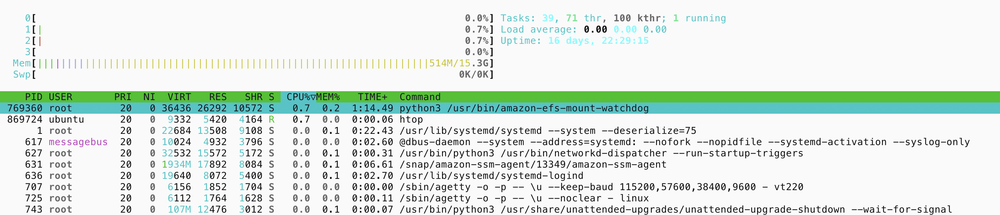
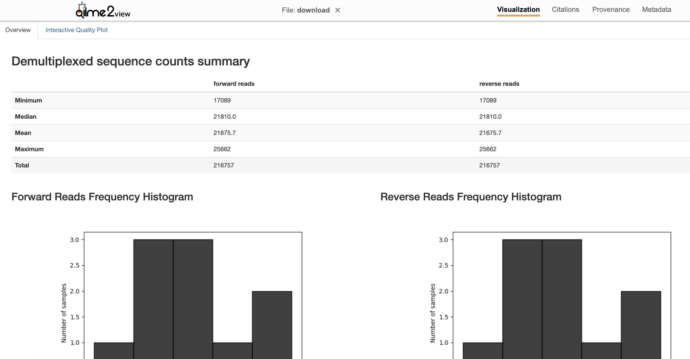

# (PART) Modules {-}

# Module 1

## Lecture

<!--<iframe width="640" height="360" src="YOUTUBE EMBED LINK" title="YouTube video player" frameborder="0" allow="accelerometer; autoplay; clipboard-write; encrypted-media; gyroscope; picture-in-picture; web-share" referrerpolicy="strict-origin-when-cross-origin" allowfullscreen></iframe>
-->

<iframe src="https://docs.google.com/presentation/d/1iPQesYpZPLTRc0Pe3zAEuZYQWGEoZrOP/preview" width="640" height="480" allow="autoplay"></iframe>  


## Lab

## Introduction

This tutorial is part of the 2026 CBW Microbiome Analysis (held in Guelph, ON, September 15-17). It is based on the Amplicon SOP available on the [Microbiome Helper](https://microbiomehelper.ca/) and previous workshops designed by Robyn Wright, Monica Alvaro Fuss, Diana Haider and Robert Beiko.

**Author**: Robyn Wright

This module provides a walkthrough of an end-to-end pipeline using the command line interface for the analysis of high-throughput marker gene data. Commonly used marker genes for microbiome analysis include the 16S ribosomal RNA (rRNA) for prokaryotes, 18S rRNA for eukaryotes, and the internal transcribed spacer (ITS) for fungi.

:::: {.greenbox data-latex=""}
::: {.center data-latex=""}
**BEFORE YOU START!**<br><br>
**1. 16S dataset from wild blueberry, Vaccinium angustifolium (soil microbiome)**
- [Variation in Bacterial and Eukaryotic Communities Associated with Natural and Managed Wild Blueberry Habitats](https://apsjournals.apsnet.org/doi/10.1094/PBIOMES-03-17-0012-R)
- [Metagenomic Functional Shifts to Plant Induced Environmental Changes](https://www.frontiersin.org/articles/10.3389/fmicb.2019.01682/full#B50)
<br>
**2. 18S dataset from plastics incubated in a coastal marine environment (plastisphere)**
- [Microbial pioneers of plastic colonisation in coastal seawaters](https://www.sciencedirect.com/science/article/pii/S0025326X22003836#s0050)
<br>
**3. ITS2 dataset from stool samples from pregnant women (gut microbiome)**
- [Landscape of the gut mycobiome dynamics during pregnancy and its relationship with host metabolism and pregnancy health](https://gut.bmj.com/content/73/8/1302.long)
:::

You can jump to one of the below sections for the commands needed for processing each of these amplicons. We recommend choosing one of them - 16S is the most widely used and also allows you to easily generate a phylogenetic tree. If you have never done any amplicon analysis before then we recommend choosing the 16S dataset.

In this module we will cover the basics of marker gene analysis from raw reads to filtered feature table and phylogenetic tree. The pipeline described is embedded in the latest version of QIIME2 (Quantitative Insights into Microbial Ecology version rachis-qiime2-2026.7), which is a popular microbiome bioinformatics platform for microbial ecology built on user-made software packages called plugins that work on QIIME2 artifact or QZA files. Documentation for these plugins can be found in the [QIIME 2 user documentation](https://qiime2.org/), along with tutorials and other useful information. QIIME2 also provides interpretable visualizations that can be accessed by opening any generated QZV files within [QIIME2 View](https://view.qiime2.org/).

:::: {.greenbox data-latex=""}
::: {.center data-latex=""}
Throughout this module, there are some questions aimed to help your understanding of some of the key concepts. You’ll find the answers at the bottom of this page, but no one will be marking them.
:::

## Reminder on logging into the server

:::: {.greenbox data-latex=""}
::: {.center data-latex=""}
**Connecting to AWS**<br><br>
As a reminder, there are instructions on logging into your instances [here](https://bioinformaticsdotca.github.io/MIC_Gue-2609/awsunix.html).
:::

## 1. 16S

Create a directory for this module inside workspace and create a symlink (the same as creating a shortcut to a folder) to the raw FASTQ files and the metadata file.

```
cd ~/workspace
mkdir amplicon_data amplicon_data/16S_Blueberry
cd amplicon_data/16S_Blueberry
ln -s ~/CourseData/amplicon_data/16S_Blueberry/raw_data .
ln -s ~/CourseData/amplicon_data/16S_Blueberry/metadata.tsv .
```

You should have learnt about conda environments in the pre-work, and here we have a couple of environments already installed that we'll use in this module:
- `rachis-qiime2-2026.7` - the latest QIIME2 version
- `quality_control` - an environment containing FastQC and MultiQC, programs that we'll use for quality control of the reads

```
conda activate rachis-qiime2-2026.7
```

:::: {.greenbox data-latex=""}
::: {.center data-latex=""}
If you get logged off the server at any point, you will need to change back to this directory and reactivate the environment before picking up where you left off!
:::

### 1.1. 16S First steps

#### 1.1.1. Inspect raw data

First, let’s take a look at the directory containing our raw reads as well as our metadata file.

```
ls raw_data
```

```
head metadata.tsv
```

:::: {.greenbox data-latex=""}
::: {.center data-latex=""}
**Question 1:** How many samples are there?<br>
**Question 2:** Into what group(s) are the samples classified?
:::

#### 1.1.2. Quality control

Use FastQC and MultiQC for quality control of reads. 

Now let's activate the environment with these programs:
```
conda activate quality_control
```

:::: {.greenbox data-latex=""}
::: {.center data-latex=""}
Note that we are only going to show this in this module so that we don't repeat things in this workshop, but this is something that you would need to do at the start of every analysis!
:::

First we’ll be running fastqc, and to do that, we’ll first make a directory for the output to go: ```mkdir fastqc_out```

Now we’ll run fastqc:
```
fastqc -t 4 raw_data/*fastq.gz -o fastqc_out
```

Here the arguments that we’re giving fastqc are: 
- `-t 4`: the number of threads to use. Sometimes “threads” will be shown as --threads, --cpus, --processors, --nproc, or similar. Basically, developers of packages can call things whatever they like, but you can use the help documentation to see what options are available. We’re using 4 here because that’s the maximum that we have available. See below (htop) for how we find out about how many we have available. 
- `raw_data/*.fastq`: the fastq files that we want to check the quality of. 
- `-o fastqc_out`: the folder to save the output to.

#### 1.1.3. htop - looking at the number of processes we have available or running

Try running `htop`. This is an interactive viewer that shows you the processes that are running on your computer/server. There are a lot of different bits of information that this is showing us - you can see all of that here, but the key things for us are: 
- The CPUs (labelled 0, 1, 2, 3 at the top left) - this shows the percentage of the CPU being used for each core, and the number of cores shown here is the number of different processes/threads that we have available to us. In our case, this is 4. 
- Memory - this is the amount of memory, or RAM, that we have available to us. You’ll see that it is ~16GB - this is similar to many laptops now, but many servers that you’ll use or have access to for bioinformatics analysis will have much more than a standard computer. For example, one of the Langille lab servers has ~1.5 TB RAM. The larger your dataset, or the deeper your sequencing depth, the more RAM you are likely to need. 
- The processes (at the bottom) - you can see everything that is running under a PID (Process ID). This is useful when you’re using a shared server to see who is running what, particularly for when you’re wanting to run something that will use a lot of memory or will take a long time and you want to check that it won’t bother anyone else.



When you’re done looking at this, press `F10` (on a Mac this is `fn`+`F10`) or `q` to exit from this screen.

#### 1.1.4. Back to the quality control

Now take a look at one of the .html files in `fastqc_out/` 

:::: {.greenbox data-latex=""}
::: {.center data-latex=""}
Note that you’ll need to download it from http://##.uhn-hpc.ca/ (replace ## with your number!), and if you already have that webpage open, you will need to refresh it.
:::

Next we’ll run multiqc. The name suggests it might be performing QC on multiple files, but it’s actually for combining the output together of multiple files, so we can run it like this:

```
multiqc fastqc_out --filename multiqc.html
```

So we’ve given as arguments: 
- `fastqc_out`: the folder that contains the fastqc output. 
- `--filename multiqc.html`: the file name to save the output as.

Now look at `multiqc.html`.

There are some questions here to help you look at the files and interpret these:

:::: {.greenbox data-latex=""}
::: {.center data-latex=""}
**Question 3:** What is the GC% of the samples?<br>
**Question 4:** What % of the samples are duplicate reads? Is this what you expected?<br>
**Question 5:** Now look at the Sequence Counts section. Which sample has the most reads?<br>
**Question 6:** How many unique and duplicate reads are in the sample with the most reads?<br>
**Question 7:** Look at the Sequence Quality Histograms. Do these seem good to you? Why or why not? Does this seem normal?<br>
**Question 8:** Look at the top overrepresented sequence. If you want to see what it is, paste it into the “Enter accession number(s), gi(s), or FASTA sequence(s)” box [here](https://blast.ncbi.nlm.nih.gov/Blast.cgi?PROGRAM=blastn&PAGE_TYPE=BlastSearch&LINK_LOC=blasthome) and click on the blue “BLAST” button at the bottom of the page.
:::

#### 1.1.5. Import FASTQs as QIIME2 artifact

To standardize QIIME 2 analyses and to keep track of provenance (i.e. a list of what commands were previously run to produce a file) a special format is used for all QIIME 2 input and output files called an “artifact” (with the extension QZA). The first step is to import the raw reads as a QZA file. We will first activate the QIIME2 environment and create a new directory.

```
conda activate rachis-qiime2-2026.7
mkdir reads_qza
```

```
qiime tools import \
  --type SampleData[PairedEndSequencesWithQuality] \
  --input-path raw_data/ \
  --output-path reads_qza/reads.qza \
  --input-format CasavaOneEightSingleLanePerSampleDirFmt
```

This might take a minute! If it hasn’t come back up with the command prompt that looks something like 
```
(rachis-qiime2-2026.7) ubuntu@ip-10-0-1-248:~/workspace/amplicon_data/16S_Blueberry$ 
```
yet, then it hasn’t finished running yet and you’ll need to be patient :)

All of the FASTQs are now in the single artifact file `reads_qza/reads.qza`. This file format can be a little confusing at first, but it is actually just a zipped folder. You can manipulate and explore these files better with the qiime tools utilities (e.g. peek and view).

### 1.1.6. Trim primers with cutadapt

Screen out reads that do not begin with primer sequence and remove primer sequence from reads using the [cutadapt](http://cutadapt.readthedocs.io/en/stable/guide.html) QIIME 2 plugin. The below primers correspond to the 16S V6-V8 region (bacteria-specific primer set). You can see more about different primers and the taxa that they target [here](https://imr.bio/protocols.html).

```
qiime cutadapt trim-paired \
  --i-demultiplexed-sequences reads_qza/reads.qza \
  --p-cores 4 \
  --p-front-f ACGCGHNRAACCTTACC \
  --p-front-r ACGGGCRGTGWGTRCAA \
  --p-discard-untrimmed \
  --p-no-indels \
  --o-trimmed-sequences reads_qza/reads_trimmed.qza \
  --o-stats reads_qza/trim_stats.qza
```

Visualizing your output data is a good idea after any step to make sure nothing unexpected occurred. The following command generates a “visualization” file with the extension QZV.

Let's take a look at what these paired-end reads look like before joining. Run the following command and open the QZV file in [QIIME2 View](https://view.qiime2.org/). Remember that you can view all of the files on your AWS server by going to here:  http://##.uhn-hpc.ca/ (and replacing ## with your number!)

```
qiime demux summarize \
  --i-data reads_qza/reads_trimmed.qza \
  --o-visualization reads_qza/reads_trimmed_summary.qzv
```

You should see that the first tab looks something like this:


Here you can see summaries of the numbers of reads in your samples as well as histograms showing the numbers of reads per sample and a table with the read numbers at the bottom.

The interactive quality plot tab shows you the quality across your forward and reverse reads:


:::: {.greenbox data-latex=""}
::: {.center data-latex=""}
**Question 9:** What would happen if you ran this exact command on V4/V5-amplified sequences?
:::

### 1.2. 16S Denoising the reads into amplicon sequence variants

Different denoising tools require different levels of preprocessing before the actual denoising happens. For example, DADA2 performs read joining and quality filtering as part of the denoising step itself, and can be run directly after trimming the primers. Due to speed considerations, we’ll be using Deblur instead, which requires that these steps be carried out separately. Guidelines for running DADA2 can be found [here](https://github.com/LangilleLab/microbiome_helper/wiki/QIIME2-DADA2-Quick-Reference).


#### 1.2.1. Join paired-end reads

Forward and reverse reads can be joined with VSEARCH as shown below. This will generate QZA files for both the joined/merged sequences and unmerged sequences.
```
qiime vsearch merge-pairs \
  --i-demultiplexed-seqs reads_qza/reads_trimmed.qza \
  --output-dir reads_qza/reads_joined
```

#### 1.2.2. Filter out low-quality reads

This command will filter out low-quality reads based on the default options.

```
qiime quality-filter q-score \
  --i-demux reads_qza/reads_joined/merged_sequences.qza \
  --o-filter-stats filt_stats.qza \
  --o-filtered-sequences reads_qza/reads_trimmed_joined_filt.qza
```

#### 1.2.3. Summarize joined and filtered reads

It is a good idea at this point just to verify that there haven’t been any substantial losses of reads, before going through the whole ASV process, at either the joining or quality-filtering steps above. You will also need to select a length to trim back to that maintains the largest/acceptable quantity of reads during denoising.

```
qiime demux summarize \
  --i-data reads_qza/reads_trimmed_joined_filt.qza \
  --o-visualization reads_qza/reads_trimmed_joined_filt_summary.qzv
```

Now open this file in [QIIME2 View](https://view.qiime2.org/) and look at the Overview and Interactive Quality Plot tabs to explore your data and answer the following questions.

:::: {.greenbox data-latex=""}
::: {.center data-latex=""}
**Question 10:** How long are our forward reads? Why are there no reverse reads in our file?<br>
**Question 11:** What would be a good trim length for our reads? Remember that there are answers at the bottom of the page if you would like to check this.
:::

#### 1.2.4. Running Deblur

Running the Deblur workflow will correct the raw reads into amplicon sequence variants (ASVs). This denoising tool filters out reads that either do match to known noise or that do not match with low similarity to the expected amplicon region. Note that the below command will retain singletons, which would have been filtered out unless we set –p-min-reads 1, and is for 16S sequences only. For other amplicon regions, you can either use the denoise-other option in the command and specify a reference database of sequences to use for positive filtering (as in the below versions for 18S and ITS) or use DADA2.

The trim length `390` here is what we just decided in question 11 above. It's important here that you use the same number so that your results are the same as we have here. 

```
qiime deblur denoise-16S \
  --i-demultiplexed-seqs reads_qza/reads_trimmed_joined_filt.qza \
  --p-trim-length 390 \
  --p-sample-stats \
  --p-jobs-to-start 4 \
  --p-min-reads 1 \
  --output-dir deblur_output
```

:::: {.greenbox data-latex=""}
::: {.center data-latex=""}
This command may take a few minutes to run.
:::

#### 1.2.5. Summarizing Deblur output

Once a denoising pipeline has been run you can summarize the output table with the below command, which will create a visualization artifact for you to view. We will use this visualization later to determine the the cut-offs for filtering the table below, but for now you should mainly take a look at the visualization to ensure that sufficient reads have been retained after running deblur. This denoising tool filters out reads that either do match to known noise or that do not match with low similarity to the expected amplicon region. If your samples have very low depth after running deblur (compared to the input read depth) this could be a red flag that either you ran the tool incorrectly, you have a lot of noise in your data, or that deblur is inappropriate for your dataset.

```
qiime feature-table summarize \
    --i-table deblur_output/table.qza \
    --o-feature-frequencies deblur_output/deblur_table_summary_feature_frequencies.qza \
    --o-sample-frequencies deblur_output/deblur_table_summary_sample_frequencies.qza \
    --o-summary deblur_output/deblur_table_summary.qzv
```

:::: {.greenbox data-latex=""}
::: {.center data-latex=""}
**Question 12:** What is the mean sequencing depth per sample after denoising?<br>
**Question 13:** Which sample has the least reads?
:::

### 1.3. 16S Assign taxonomy to ASVs

You can assign taxonomy to your ASVs using a Naive-Bayes approach implemented in the [scikit learn](http://scikit-learn.org/stable/) Python library and the [SILVA](https://www.arb-silva.de/) or [UNITE](https://unite.ut.ee/) databases. This approach requires that a classifier be trained in advance on a reference database. We recommend users use a widely used classifier to help ensure there are no unexpected issues with the Naive-Bayes model. We previously maintained primer-specific classifiers, which theoretically can provide more accurate classifications, but we no longer do this due to concerns regarding issues with the trained models that are difficult to catch if only a couple people are running them. The full-length 16S/18S classifier can be downloaded from the [QIIME 2 website](https://library.qiime2.org/data-resources#external-references-2026-4-and-beyond) (silva-138-99-nb-classifier.qza for the latest classifier). Custom classifiers for the ITS region that we have generated from the UNITE database are available as well ([see downloads](http://kronos.pharmacology.dal.ca/public_files/MH/taxa_classifiers/scikit-learn_v1.4.2_classifiers/) and [commands used to create these files](https://github.com/LangilleLab/microbiome_helper/wiki/Creating-QIIME-2-Taxonomic-Classifiers)):

- Full ITS - fungi only (classifier_sh_refs_qiime_ver9_99_s_27.10.2022_ITS.qza)
- Full ITS - all eukaryotes (classifier_sh_refs_qiime_ver9_99_s_all_27.10.2022_ITS.qza)

We're going to use the GTDB classifier today.

```
wget https://zenodo.org/records/21619532/files/gtdb-r232.0-2026.7.0-classifier.qza?download=1 -O gtdb-r232.0-2026.7.0-classifier.qza
```

You can run the taxonomic classification with this command, which is one of the longest running and most memory-intensive command of the tutorial. If you receive an error related to insufficient memory (and if you cannot increase your memory usage) then you can look into the `--p-reads-per-batch` option and set this to be lower than the default (which is dynamic depending on sample depth and the number of threads) and also try running the command with fewer jobs (e.g. set `--p-n-jobs 1`).

```
qiime feature-classifier classify-sklearn \
  --i-reads deblur_output/representative_sequences.qza \
  --i-classifier gtdb-r232.0-2026.7.0-classifier.qza \
  --p-n-jobs 4 \
  --output-dir taxa
```

:::: {.greenbox data-latex=""}
::: {.center data-latex=""}
**TERMINATED**<br><br>
You're probably going to see an alert that tells you your command was terminated. :( Unfortunately we don’t actually have enough memory to run this. Instead, we’ll copy across the output that we would have got.
:::

```
mkdir taxa
cp ~/CourseData/amplicon_data/output/16S_Blueberry/taxa/classification.qza taxa/
```

As with all QZA files, you can export the output file to take a look at the classifications and confidence scores:
```
qiime tools export \
  --input-path taxa/classification.qza \
  --output-path taxa
```

### 1.3.2 Assess subset of taxonomic assignments with BLAST

The performance of the taxonomic classification is difficult to assess without a gold-standard reference, but nonetheless one basic sanity check is to compare the taxonomic assignments with the top BLASTn hits for certain ASVs. First, generate a QZV file for the denoised representative sequences in QIIME 2 by running:

```
qiime feature-table tabulate-seqs \
  --i-data deblur_output/representative_sequences.qza \
  --o-visualization deblur_output/representative_sequences.qzv
```

This QZV file tabulates the denoised sequences. Clicking on the nucleotide sequence links to a BLASTn search for that sequence. By comparing these BLAST hits with the taxonomic assignment of ASVs generated above you can reassure yourself that the taxonomic assignments overall worked correctly. It’s a good idea to select ~5 ASVs to BLAST for this validation, which should be from taxonomically different groups, such as different phyla, according to the taxonomic classifier.

You can then check the taxonomy that was assigned to them using your classifier - you can either open up the taxonomy.tsv file and search for the Feature ID/ASV names there, or you can use the grep command like so:
```
grep "XXXXXX" taxa/taxonomy.tsv
```

Replace the XXXXXX with whichever ASV name from your .qzv file that you clicked on!

### 1.4. 16S Filtering resultant table

Filtering the denoised table is an important step of microbiome data analysis. You can see more details on this process in the [QIIME 2 filtering tutorial](https://docs.qiime2.org/2022.11/tutorials/filtering/).

#### 1.4.1. Filter out rare ASVs

Based on the summary visualization created in step 1.2.5 above you can choose a cut-off for how frequent a variant needs to be (and optionally how many samples need to have the variant) for it to be retained. Here we will remove all ASVs that have a frequency of less than 0.1% of the mean sample depth. This cut-off excludes ASVs that are likely due to MiSeq bleed-through between runs (reported by Illumina to be 0.1% of reads). To calculate this cut-off you would identify the mean sample depth in the visualization created in step 1.2.5 (deblur_table_summary.qzv), multiply it by 0.001, and round to the nearest integer.

:::: {.greenbox data-latex=""}
::: {.center data-latex=""}
So if the mean frequency is 6,669.8:
6,669.8 x 0.001 = 6.6698<br>
Rounded to the nearest integer = 7
:::

Once you’ve determined how you would like to filter your table you can do so with this command (X is a placeholder for your choice):

```
qiime feature-table filter-features \
  --i-table deblur_output/table.qza \
  --p-min-frequency X \
  --p-min-samples 1 \
  --o-filtered-table deblur_output/deblur_table_filt.qza
```

#### 1.4.2. Filter out contaminant and unclassified ASVs

Once we have assigned taxonomy to our ASVs we can use that information to remove ASVs which are likely contaminants or noise based on the taxonomic labels. Two common contaminants in 16S sequencing data are mitochondrial and chloroplast 16S sequences, which can be removed by excluding any ASV which contains those terms in its taxonomic label. It can also be sometimes useful to exclude any ASV that is unclassified at the phylum level since these sequences could be noise (e.g. possible chimeric sequences). Note that if your data has not been classified against the default database you may need to change `p\_\_` to be a string that enables phylum-level assignments to be identified or simply omit that line.

In general though, it can be very informative if your sequencing reads are coming back with significant amounts of unclassified ASVs as it can indicate upstream analysis problems or indicate you are studying a poorly characterized environment where you have a good chance of identifying a lot of novel phyla. Therefore, our recommendation is to not filter out the unclassified sequences by default, but we will do so here.

```
qiime taxa filter-table \
  --i-table deblur_output/deblur_table_filt.qza \
  --i-taxonomy taxa/classification.qza \
  --p-include p__ \
  --p-exclude mitochondria,chloroplast \
  --o-filtered-table deblur_output/deblur_table_filt_contam.qza
```

#### 1.4.3. <i>(Optional) Exclude low-depth samples</i>

Often certain samples will have quite low depth after these filtering steps, which can be excluded from downstream analyses since they will largely add noise. There is no single cut-off that works best for all datasets, but researchers often use minimum cut-offs within the range of 1000 to 4000 reads. You can also use a cut-off much lower than this if you want to retain all samples except those that failed entirely (e.g. depth < 50 reads).

Ideally you would choose this cut-off after visualizing rarefaction curves to determine at what read depth the richness of your samples plateaus and choose a cut-off as close to this plateau as possible while retaining sufficient sample size for your analyses. We learn more about rarefaction curves in the next module, and so we're going to skip this step for now.

#### 1.4.4. Subset and summarize filtered table

Check output after filtering.
```
qiime feature-table summarize \
    --i-table deblur_output/deblur_table_filt_contam.qza \
    --o-feature-frequencies deblur_output/deblur_table_filt_contam_summary_feature_frequencies.qza \
    --o-sample-frequencies deblur_output/deblur_table_filt_contam_summary_sample_frequencies.qza \
    --o-summary deblur_output/deblur_table_filt_contam_summary.qzv
```

:::: {.greenbox data-latex=""}
::: {.center data-latex=""}
**Question 14:** What is the minimum and maximum sequencing depth across all samples?
:::

Happy? Copy a final table.

```
mkdir final_output
cp deblur_output/deblur_table_filt_contam.qza final_output/deblur_table_final.qza
```

Once we have our final filtered table we will need to subset the QZA file containing the ASV sequences to the same set. You can exclude any removed ASVs from the sequence file with this command:

```
qiime feature-table filter-seqs \
  --i-data deblur_output/representative_sequences.qza \
  --i-table final_output/deblur_table_final.qza  \
  --o-filtered-data final_output/rep_seqs_final.qza
```

Finally, you can make a new summary of the final filtered abundance table:

```
qiime feature-table summarize \
    --i-table final_output/deblur_table_final.qza \
    --o-feature-frequencies final_output/deblur_table_final_summary_feature_frequencies.qza \
    --o-sample-frequencies final_output/deblur_table_final_summary_sample_frequencies.qza \
    --o-summary final_output/deblur_table_final_summary.qzv
```

### 1.5. Build tree with [SEPP QIIME 2 plugin](https://amplicon-docs.qiime2.org/en/latest/references/plugins/fragment-insertion.html#q2-plugin-fragment-insertion)

[SEPP](https://www.ncbi.nlm.nih.gov/pmc/articles/PMC5904434/) (SATé-enabled Phylogenetic Placement) is a tool used to place short DNA sequences—such as 16S rRNA amplicon sequence variants (ASVs)—into an existing, high-quality reference phylogenetic tree. This is particularly helpful when you are working with microbiome data and want to infer evolutionary relationships more accurately. We will use QIIME 2’s `q2-fragment-insertion` plugin to place ASVs derived from our 16S data into a reference phylogenetic tree using the command below.

```
qiime fragment-insertion sepp \
  --i-representative-sequences final_output/rep_seqs_final.qza \
  --i-reference-database ~/CourseData/amplicon_data/taxa_classifiers/greengenes_2022.10.backbone.sepp-reference.qza \
  --o-tree final_output/asvs-tree.qza \
  --o-placements final_output/insertion-placements.qza \
  --p-threads 4
```

:::: {.greenbox data-latex=""}
::: {.center data-latex=""}
**TERMINATED**<br><br>
You're probably going to see the alert telling you that your command was terminated again. :( Again, we don't have enough memory to run this so we'll copy over the output.
:::


```
cp ~/CourseData/amplicon_data/output/16S_Blueberry/final_output/asvs-tree.qza final_output/
cp ~/CourseData/amplicon_data/output/16S_Blueberry/final_output/insertion-placements.qza final_output/
```

High-quality reference phylogenetic trees can be downloaded from QIIME2’s data resources. It doesn't really matter whether the reference tree used for sequence placement matches the reference database used for taxonomic classification - what really matters is that the reference tree used is quite complete so it will make a good skeleton for inserting our sequences into. Custom reference files can be specified for placing other types of amplicons. However, for marker genes such as 18S and ITS, the recommended approach is to construct a de novo phylogenetic tree, as outlined in the later sections. Considerations for 18S and ITS data and and further detailed in the Microbiome Helper repository.

### 1.6. Exporting data from QIIME 2 for use in other software

While QIIME 2 offers a wide range of tools for microbial community analysis, you may want to perform additional custom analyses in software like R, Python, or MATLAB. To do so, you’ll need to export your QIIME 2 artifacts into formats that are compatible with these platforms.

Representative sequences (i.e., ASVs) are stored in a `.qza` artifact that contains the DNA sequences used in downstream analysis. To export them into a standard FASTA format, use the following command:

```
qiime tools export \
   --input-path final_output/rep_seqs_final.qza \
   --output-path final_output_exported
```

Your sequences will be saved as `dna-sequences.fasta` inside the `final_output_exported` folder. This file can be read by any downstream tool that accepts FASTA files.

[BIOM](https://academic.oup.com/gigascience/article/1/1/2047-217X-1-7/2656152) (Biological Observation Matrix) is a standardized format for representing feature tables, typically containing: 
- Rows = features (e.g., ASVs, OTUs, taxa) 
- Columns = samples 
- Cells = abundance values (counts, relative abundances, etc.) 
- Optional metadata (taxonomy, sample info)

BIOM files are widely used in microbiome analysis and supported by R packages like phyloseq, microbiome, and tools in Python such as scikit-bio and biom-format.To export a BIOM table (with taxonomy added as metadata) you can use the commands below.

```
#First we fix taxonomy header with sed (required for biom add-metadata)
sed -i -e '1 s/Feature/#Feature/' -e '1 s/Taxon/taxonomy/' taxa/taxonomy.tsv

#Second we export the raw feature table and create the biom table
qiime tools export \
   --input-path final_output/deblur_table_final.qza \
   --output-path final_output_exported

#Third we add taxonomy metadata to the BIOM file
biom add-metadata \
   -i final_output_exported/feature-table.biom \
   -o final_output_exported/feature-table_w_tax.biom \
   --observation-metadata-fp taxa/taxonomy.tsv \
   --sc-separated taxonomy
   
#Last we convert the BIOM file to TSV format (tab-separated values)
biom convert \
   -i final_output_exported/feature-table_w_tax.biom \
   -o final_output_exported/feature-table_w_tax.txt \
   --to-tsv \
   --header-key taxonomy
```

This will give you a plain-text feature table (`feature-table_w_tax.txt`) with taxonomy annotations in the header row, which is especially useful for tools like R (phyloseq), Excel, or even manual inspection.

To export the tree of your ASVs in a `.nwk` format, use the command below.

```
qiime tools export \
  --input-path final_output/asvs-tree.qza \
  --output-path final_output_exported
```

### 16S Answers

**Question 1:** How many samples are there?

We have 10 samples. The raw data folder contains one fastq.gz file for each set of the forward and reverse sequences (labelled R1 and R2, respectively) for each of the samples (B-Rtxxx).

**Question 2:** Into what group(s) are the samples classified?

The samples we are using are classified into two different groups: Forest or Managed sites. The study we’re looking at does also look at bulk or rhizosphere samples, but we’re just using a small subset of the samples for this workshop.

**Question 3:** What is the GC% of the samples?
56-57%

**Question 4:** What % of the samples are duplicate reads? Is this what you expected?
In the “General Statistics” section, we can see that ~52-89% of the reads are duplicated. Looking in the “Sequence Counts” section and hovering over each sample will show us how many of the reads are unique. This makes sense, because the reads are from PCR-amplified samples so we are expecting most to occur more than once.

**Question 5:** Now look at the Sequence Counts section. Which sample has the most reads?
B-Rt154.

**Question 6:** How many unique and duplicate reads are in the sample with the most reads?
11,460 and 14,934 in each of the forward (R1) and reverse (R2) files.

**Question 7:** Look at the Sequence Quality Histograms. Do these seem good to you? Why or why not? Does this seem normal?
Here we can see that the quality tends to be good (>30 phred score) until ~280 bp in R1 files and ~220 bp in R2 files. It is very normal for the R2 files to have lower quality than the R1 files, and the quality in Illumina reads always drops off towards the end of the read, so yes, this seems normal.

**Question 8:** Look at the top overrepresented sequence. If you want to see what it is, paste it into the “Enter accession number(s), gi(s), or FASTA sequence(s)” box [here](https://blast.ncbi.nlm.nih.gov/Blast.cgi?PROGRAM=blastn&PAGE_TYPE=BlastSearch&LINK_LOC=blasthome) and click on the blue “BLAST” button at the bottom of the page.
The top hits for the first few sequences that aren't all N's are Acidobacteriaceae, "uncultured bacterium", and "uncultured bacterium". Unfortunately, this is very normal in soil samples!

**Question 9:** What would happen if you ran this exact command on V4/V5-amplified sequences?

Cutadapt will only trim reads that match the specified primer sequence. Therefore, most reads would be discarded because we are including the `--p-discard-untrimmed` option.

**Question 10:** How long are our forward reads? Why are there no reverse reads in our file?

The forward read median length is 405 nucleotides. There are no reverse reads because forward and reverse reads were merged into one sequence during read joining.

**Question 11:** What would be a good trim length for our reads?

There is no one right answer for this question, but a trim length of 390 nucleotides will maintain most of our sequences apart from any that are really short. You could choose a different length, but this will give different answers further on. Typically, this choice is a trade-off between maintaining a longer sequence length where we’re more likely to get finer-resolution taxonomic classification, or trimming more so that we retain more sequences.

**Question 12:** What is the mean sequencing depth per sample after denoising?

The mean sequencing depth (frequency) across all denoised samples is 6,669.8 reads.

**Question 13:** Which sample has the least reads?

Sample B-Rt151 has the lowest sequencing depth (4,332 reads).

**Question 14:** What is the minimum and maximum sequencing depth across all samples?

The final minimum sequencing depth is 3,432 and the maximum sequencing depth is 8,650 reads.

## 2. 18S

Create a directory for this module inside workspace and create a symlink (the same as creating a shortcut to a folder) to the raw FASTQ files and the metadata file.

```
cd ~/workspace
mkdir amplicon_data amplicon_data/18S_Plastisphere
cd amplicon_data/18S_Plastisphere
ln -s ~/CourseData/amplicon_data/18S_Plastisphere/raw_data .
ln -s ~/CourseData/amplicon_data/18S_Plastisphere/metadata.tsv .
```

You should have learnt about conda environments in the pre-work, and here we have a couple of environments already installed that we'll use in this module:
- `rachis-qiime2-2026.7` - the latest QIIME2 version
- `quality_control` - an environment containing FastQC and MultiQC, programs that we'll use for quality control of the reads

:::: {.greenbox data-latex=""}
::: {.center data-latex=""}
If you get logged off the server at any point, you will need to change back to this directory and reactivate the environment before picking up where you left off!
:::

### 2.1. 18S First steps

#### 2.1.1. Inspect raw data

First, let’s take a look at the directory containing our raw reads as well as our metadata file.

```
ls raw_data
```

```
head metadata.tsv
```

:::: {.greenbox data-latex=""}
::: {.center data-latex=""}
**Question 1:** How many samples are there?<br>
**Question 2:** Into what group(s) are the samples classified?
:::

#### 2.1.2. Quality control

Use FastQC and MultiQC for quality control of reads. 

Now let's activate the environment with these programs:
```
conda activate quality_control
```

:::: {.greenbox data-latex=""}
::: {.center data-latex=""}
Note that we are only going to show this in this module so that we don't repeat things in this workshop, but this is something that you would need to do at the start of every analysis!
:::

First we’ll be running fastqc, and to do that, we’ll first make a directory for the output to go: ```mkdir fastqc_out```

Now we’ll run fastqc:
```
fastqc -t 4 raw_data/*fastq.gz -o fastqc_out
```

Here the arguments that we’re giving fastqc are: 
- `-t 4`: the number of threads to use. Sometimes “threads” will be shown as --threads, --cpus, --processors, --nproc, or similar. Basically, developers of packages can call things whatever they like, but you can use the help documentation to see what options are available. We’re using 4 here because that’s the maximum that we have available. See below (htop) for how we find out about how many we have available. 
- `raw_data/*.fastq`: the fastq files that we want to check the quality of. 
- `-o fastqc_out`: the folder to save the output to.

#### 2.1.3. htop - looking at the number of processes we have available or running

Try running `htop`. This is an interactive viewer that shows you the processes that are running on your computer/server. There are a lot of different bits of information that this is showing us - you can see all of that here, but the key things for us are: 
- The CPUs (labelled 0, 1, 2, 3 at the top left) - this shows the percentage of the CPU being used for each core, and the number of cores shown here is the number of different processes/threads that we have available to us. In our case, this is 4. 
- Memory - this is the amount of memory, or RAM, that we have available to us. You’ll see that it is ~16GB - this is similar to many laptops now, but many servers that you’ll use or have access to for bioinformatics analysis will have much more than a standard computer. For example, one of the Langille lab servers has ~1.5 TB RAM. The larger your dataset, or the deeper your sequencing depth, the more RAM you are likely to need. 
- The processes (at the bottom) - you can see everything that is running under a PID (Process ID). This is useful when you’re using a shared server to see who is running what, particularly for when you’re wanting to run something that will use a lot of memory or will take a long time and you want to check that it won’t bother anyone else.

When you’re done looking at this, press `F10` (on a Mac this is `fn`+`F10`) to exit from this screen.

#### 2.1.4. Back to the quality control

Now take a look at one of the .html files in `fastqc_out/` 

:::: {.greenbox data-latex=""}
::: {.center data-latex=""}
Note that you’ll need to download it from http://##.uhn-hpc.ca/ (replace ## with your number!), and if you already have that webpage open, you will need to refresh it.
:::

Next we’ll run multiqc. The name suggests it might be performing QC on multiple files, but it’s actually for combining the output together of multiple files, so we can run it like this:

```
multiqc fastqc_out --filename multiqc.html
```

So we’ve given as arguments: 
- `fastqc_out`: the folder that contains the fastqc output. 
- `--filename multiqc.html`: the file name to save the output as.

Now look at `multiqc.html`.

There are some questions here to help you look at the files and interpret these:

:::: {.greenbox data-latex=""}
::: {.center data-latex=""}
**Question 3:** What is the GC% of the samples?<br>
**Question 4:** What % of the samples are duplicate reads? Is this what you expected?<br>
**Question 5:** Now look at the Sequence Counts section. Which sample has the most reads?<br>
**Question 6:** How many unique and duplicate reads are in the sample with the most reads?<br>
**Question 7:** Look at the Sequence Quality Histograms. Do these seem good to you? Why or why not? Does this seem normal?<br>
**Question 8:** Look at the top overrepresented sequence. If you want to see what it is, paste it into the “Enter accession number(s), gi(s), or FASTA sequence(s)” box [here](https://blast.ncbi.nlm.nih.gov/Blast.cgi?PROGRAM=blastn&PAGE_TYPE=BlastSearch&LINK_LOC=blasthome) and click on the blue “BLAST” button at the bottom of the page.
:::

#### 2.1.5. Import FASTQs as QIIME2 artifact

To standardize QIIME 2 analyses and to keep track of provenance (i.e. a list of what commands were previously run to produce a file) a special format is used for all QIIME 2 input and output files called an “artifact” (with the extension QZA). The first step is to import the raw reads as a QZA file. We will first activate the QIIME2 environment and create a new directory.

```
conda activate rachis-qiime2-2026.7
mkdir reads_qza
```

```
qiime tools import \
  --type SampleData[PairedEndSequencesWithQuality] \
  --input-path raw_data/ \
  --output-path reads_qza/reads.qza \
  --input-format CasavaOneEightSingleLanePerSampleDirFmt
```

This might take a minute! If it hasn’t come back up with the command prompt that looks something like 
```
(rachis-qiime2-2026.7) ubuntu@ip-10-0-1-248:~/workspace/amplicon_data/18S_Plastisphere$ 
```
yet, then it hasn’t finished running yet and you’ll need to be patient :)

All of the FASTQs are now in the single artifact file `reads_qza/reads.qza`. This file format can be a little confusing at first, but it is actually just a zipped folder. You can manipulate and explore these files better with the qiime tools utilities (e.g. peek and view).

### 2.1.6. Trim primers with cutadapt

Screen out reads that do not begin with primer sequence and remove primer sequence from reads using the [cutadapt](http://cutadapt.readthedocs.io/en/stable/guide.html) QIIME 2 plugin. The below primers correspond to the 18S V4 region. You can see more about different primers and the taxa that they target [here](https://imr.bio/protocols.html).

```
qiime cutadapt trim-paired \
  --i-demultiplexed-sequences reads_qza/reads.qza \
  --p-cores 4 \
  --p-front-f ATAACAGGTCTGTGATGCCCT \
  --p-front-r CCTTCYGCAGGTTCACCTAC \
  --p-discard-untrimmed \
  --p-no-indels \
  --o-trimmed-sequences reads_qza/reads_trimmed.qza \
  --o-stats reads_qza/trim_stats.qza
```

Visualizing your output data is a good idea after any step to make sure nothing unexpected occurred. The following command generates a “visualization” file with the extension QZV.

Let's take a look at what these paired-end reads look like before joining. Run the following command and open the QZV file in [QIIME2 View](https://view.qiime2.org/). Remember that you can view all of the files on your AWS server by going to here:  http://##.uhn-hpc.ca/ (and replacing ## with your number!)

```
qiime demux summarize \
  --i-data reads_qza/reads_trimmed.qza \
  --o-visualization reads_qza/reads_trimmed_summary.qzv
```

:::: {.greenbox data-latex=""}
::: {.center data-latex=""}
**Question 9:** What would happen if you ran this exact command on 16S V4/V5-amplified sequences?
:::


### 2.2. 18S Denoising the reads into amplicon sequence variants

Different denoising tools require different levels of preprocessing before the actual denoising happens. For example, DADA2 performs read joining and quality filtering as part of the denoising step itself, and can be run directly after trimming the primers. Due to speed considerations, we’ll be using Deblur instead, which requires that these steps be carried out separately. Guidelines for running DADA2 can be found [here](https://github.com/LangilleLab/microbiome_helper/wiki/QIIME2-DADA2-Quick-Reference).


#### 2.2.1. Join paired-end reads

Forward and reverse reads can be joined with VSEARCH as shown below. This will generate QZA files for both the joined/merged sequences and unmerged sequences.
```
qiime vsearch merge-pairs \
  --i-demultiplexed-seqs reads_qza/reads_trimmed.qza \
  --output-dir reads_qza/reads_joined
```

#### 2.2.2. Filter out low-quality reads

This command will filter out low-quality reads based on the default options.

```
qiime quality-filter q-score \
  --i-demux reads_qza/reads_joined/merged_sequences.qza \
  --o-filter-stats filt_stats.qza \
  --o-filtered-sequences reads_qza/reads_trimmed_joined_filt.qza
```

#### 2.2.3. Summarize joined and filtered reads

It is a good idea at this point just to verify that there haven’t been any substantial losses of reads, before going through the whole ASV process, at either the joining or quality-filtering steps above. You will also need to select a length to trim back to that maintains the largest/acceptable quantity of reads during denoising.

```
qiime demux summarize \
  --i-data reads_qza/reads_trimmed_joined_filt.qza \
  --o-visualization reads_qza/reads_trimmed_joined_filt_summary.qzv
```

Now open the file in [QIIME2 View](https://view.qiime2.org/) and look at the Overview and Interactive Quality Plot tabs to explore your data and answer the following questions.

:::: {.greenbox data-latex=""}
::: {.center data-latex=""}
**Question 10:** How long are our forward reads? Why are there no reverse reads in our file?<br>
**Question 11:** What would be a good trim length for our reads? Remember that there are answers at the bottom of the page if you would like to check this.
:::

#### 2.2.4. Running Deblur

Running the Deblur workflow will correct the raw reads into amplicon sequence variants (ASVs). This denoising tool filters out reads that either do match to known noise or that do not match with low similarity to the expected amplicon region. Note that the below command will retain singletons, which would have been filtered out unless we set –p-min-reads 1. 

Unlike for 16S above, which has the `qiime deblur denoise-16S` option, for other amplicon regions we need to specify a reference database of sequences to use for positive filtering or use DADA2. We keep these files available for others on our lab server [here](http://kronos.pharmacology.dal.ca/public_files/MH/deblur_non16S_ref/).

We’ll go ahead and download the 18S sequences. You can do that by right-clicking on the `gb203_pr2_all_10_28_99p_clean_prob-rm.fasta` file, and clicking “Copy Link Address”. You can then use the `wget` command to download the file at this link. So your command should look something like:
```bash
wget https://kronos.pharmacology.dal.ca:8080/public_files/MH/deblur_non16S_ref/gb203_pr2_all_10_28_99p_clean_prob-rm.fasta
```

And then we'll import this into QIIME2:
```bash
qiime tools import \
   --input-path gb203_pr2_all_10_28_99p_clean_prob-rm.fasta \
   --output-path gb203_pr2_all_10_28_99p_clean_prob-rm.qza \
   --type 'FeatureData[Sequence]'
```

The trim length `302` here is what we just decided in question 11 above. It's important here that you use the same number so that your results are the same as we have here. 

```
qiime deblur denoise-other \
   --i-demultiplexed-seqs reads_qza/reads_trimmed_joined_filt.qza \
   --i-reference-seqs gb203_pr2_all_10_28_99p_clean_prob-rm.qza \
   --p-trim-length 302 \
   --p-sample-stats \
   --p-jobs-to-start 4 \
   --p-min-reads 1 \
   --output-dir deblur_output
```

:::: {.greenbox data-latex=""}
::: {.center data-latex=""}
This command may take a few minutes to run.
:::

#### 2.2.5. Summarizing Deblur output

Once a denoising pipeline has been run you can summarize the output table with the below command, which will create a visualization artifact for you to view. We will use this visualization later to determine the the cut-offs for filtering the table below, but for now you should mainly take a look at the visualization to ensure that sufficient reads have been retained after running deblur. This denoising tool filters out reads that either do match to known noise or that do not match with low similarity to the expected amplicon region. If your samples have very low depth after running deblur (compared to the input read depth) this could be a red flag that either you ran the tool incorrectly, you have a lot of noise in your data, or that deblur is inappropriate for your dataset.

```
qiime feature-table summarize \
    --i-table deblur_output/table.qza \
    --o-feature-frequencies deblur_output/deblur_table_summary_feature_frequencies.qza \
    --o-sample-frequencies deblur_output/deblur_table_summary_sample_frequencies.qza \
    --o-summary deblur_output/deblur_table_summary.qzv
```

:::: {.greenbox data-latex=""}
::: {.center data-latex=""}
**Question 12:** What is the mean sequencing depth per sample after denoising?<br>
**Question 13:** Which sample has the least reads?
:::

### 2.3. 18S Assign taxonomy to ASVs

You can assign taxonomy to your ASVs using a Naive-Bayes approach implemented in the [scikit learn](http://scikit-learn.org/stable/) Python library and the [SILVA](https://www.arb-silva.de/) or [UNITE](https://unite.ut.ee/) databases. This approach requires that a classifier be trained in advance on a reference database. We recommend users use a widely used classifier to help ensure there are no unexpected issues with the Naive-Bayes model. We previously maintained primer-specific classifiers, which theoretically can provide more accurate classifications, but we no longer do this due to concerns regarding issues with the trained models that are difficult to catch if only a couple people are running them. The full-length 16S/18S classifier can be downloaded from the [QIIME 2 website](https://library.qiime2.org/data-resources#external-references-2026-4-and-beyond) (silva-138-99-nb-classifier.qza for the latest classifier). Custom classifiers for the ITS region that we have generated from the UNITE database are available as well ([see downloads](http://kronos.pharmacology.dal.ca/public_files/MH/taxa_classifiers/scikit-learn_v1.4.2_classifiers/) and [commands used to create these files](https://github.com/LangilleLab/microbiome_helper/wiki/Creating-QIIME-2-Taxonomic-Classifiers)):

- Full ITS - fungi only (classifier_sh_refs_qiime_ver9_99_s_27.10.2022_ITS.qza)
- Full ITS - all eukaryotes (classifier_sh_refs_qiime_ver9_99_s_all_27.10.2022_ITS.qza)

For 18S, we’re going to be using the [PR2 (Protist Ribosomal Reference) database](https://pr2-database.org/). 

We’re going to use the PR2 classifier. As you did above, click on `“Copy Link Address”` for the file `pr2_version_5.1.0_SSU_18S.qza` and then use `wget` to download it. Check how you ran this command before if you’re unsure!

You can run the taxonomic classification with this command, which is one of the longest running and most memory-intensive command of the tutorial. If you receive an error related to insufficient memory (and if you cannot increase your memory usage) then you can look into the `--p-reads-per-batch` option and set this to be lower than the default (which is dynamic depending on sample depth and the number of threads) and also try running the command with fewer jobs (e.g. set `--p-n-jobs 1`).

```
qiime feature-classifier classify-sklearn \
  --i-reads deblur_output/representative_sequences.qza \
  --i-classifier pr2_version_5.1.0_SSU_18S.qza \
  --p-n-jobs 4 \
  --output-dir taxa
```

:::: {.greenbox data-latex=""}
::: {.center data-latex=""}
**TERMINATED**<br><br>
You're probably going to see an alert that tells you your command was terminated. :( Unfortunately we don’t actually have enough memory to run this. Instead, we’ll copy across the output that we would have got.
:::


```
mkdir taxa
cp ~/CourseData/amplicon_data/output/18S_Plastisphere/taxa/classification.qza taxa/
```

As with all QZA files, you can export the output file to take a look at the classifications and confidence scores:
```
qiime tools export \
  --input-path taxa/classification.qza \
  --output-path taxa
```

### 2.3.2 Assess subset of taxonomic assignments with BLAST

The performance of the taxonomic classification is difficult to assess without a gold-standard reference, but nonetheless one basic sanity check is to compare the taxonomic assignments with the top BLASTn hits for certain ASVs. First, generate a QZV file for the denoised representative sequences in QIIME 2 by running:

```
qiime feature-table tabulate-seqs \
  --i-data deblur_output/representative_sequences.qza \
  --o-visualization deblur_output/representative_sequences.qzv
```

This QZV file tabulates the denoised sequences. Clicking on the nucleotide sequence links to a BLASTn search for that sequence. By comparing these BLAST hits with the taxonomic assignment of ASVs generated above you can reassure yourself that the taxonomic assignments overall worked correctly. It’s a good idea to select ~5 ASVs to BLAST for this validation, which should be from taxonomically different groups, such as different phyla, according to the taxonomic classifier.

You can then check the taxonomy that was assigned to them using your classifier - you can either open up the taxonomy.tsv file and search for the Feature ID/ASV names there, or you can use the grep command like so:
```
grep "XXXXXX" taxa/taxonomy.tsv
```

Replace the XXXXXX with whichever ASV name from your .qzv file that you clicked on!

If we used, for example, the ASV `5ecf17cbc8af149eb7fbec898b841d72`, we should see that this sequence has been classified as `d__Eukaryota; sg__Archaeplastida; di__Rhodophyta; sd__Eurhodophytina; c__Florideophyceae; o__Ceramiales; f__Rhodomelaceae` with confidence ~0.99. If we look at the taxonomy on NCBI BLAST, then we’ll see that some of the top hits are *Osmundea pinnatifida* (identity 99.34%) and *Laurencia filiformis* (identity 98.01%). A quick google tells me that both of these are in the family Rhodomelaceae, so it seems pretty reasonable that - with two hits with relatively high identity that are from different genera - our classifier would determine that this ASV can be classified at the family level as Rhodomelaceae.

Try taking a look at a few more and seeing how they seem.

### 2.4. 18S Filtering resultant table

Filtering the denoised table is an important step of microbiome data analysis. You can see more details on this process in the [QIIME 2 filtering tutorial](https://docs.qiime2.org/2022.11/tutorials/filtering/).

#### 2.4.1. Filter out rare ASVs

Based on the summary visualization created in step 2.2.5 above you can choose a cut-off for how frequent a variant needs to be (and optionally how many samples need to have the variant) for it to be retained. Here we will remove all ASVs that have a frequency of less than 0.1% of the mean sample depth. This cut-off excludes ASVs that are likely due to MiSeq bleed-through between runs (reported by Illumina to be 0.1% of reads). To calculate this cut-off you would identify the mean sample depth in the visualization created in step 2.2.5 (deblur_table_summary.qzv), multiply it by 0.001, and round to the nearest integer.

:::: {.greenbox data-latex=""}
::: {.center data-latex=""}
So if the mean frequency is 6,588.9:<br>
6,588.9 x 0.001 = 6.5889<br>
Rounded to the nearest integer = 7
:::

Once you’ve determined how you would like to filter your table you can do so with this command (X is a placeholder for your choice):

```
qiime feature-table filter-features \
  --i-table deblur_output/table.qza \
  --p-min-frequency X \
  --p-min-samples 1 \
  --o-filtered-table deblur_output/deblur_table_filt.qza
```

#### 2.4.2. Filter out contaminant and unclassified ASVs

Once we have assigned taxonomy to our ASVs we can use that information to remove ASVs which are likely contaminants or noise based on the taxonomic labels. Two common contaminants in 16S sequencing data are mitochondrial and chloroplast 16S sequences, which can be removed by excluding any ASV which contains those terms in its taxonomic label. Obviously this is different for 18S, so we don’t need to exclude those here. It can also be sometimes useful to exclude any ASV that is unclassified at the phylum level since these sequences could be noise (e.g. possible chimeric sequences). Note that here we actually don’t have phylum-level classifications because the PR2 database doesn’t use these - it uses levels of domain, supergroup, division, subdivision, class, order, family, genus, and species. So in our taxonomy file you’ll see that these are `d`, `sg`, `di`, `sd`, `c`, `o`, `f`, `g`, and `s`, respectively. We’ll therefore probably want to use the `sg__` instead of `p__` like we used for 16S data.

In general though, it can be very informative if your sequencing reads are coming back with significant amounts of unclassified ASVs as it can indicate upstream analysis problems or indicate you are studying a poorly characterized environment where you have a good chance of identifying a lot of novel phyla. Therefore, our recommendation is to not filter out the unclassified sequences by default, but we will do so here.

```
qiime taxa filter-table \
  --i-table deblur_output/deblur_table_filt.qza \
  --i-taxonomy taxa/classification.qza \
  --p-include p__ \
  --p-exclude mitochondria,chloroplast \
  --o-filtered-table deblur_output/deblur_table_filt_contam.qza
```

#### 2.4.3. <i>(Optional) Exclude low-depth samples</i>

Often certain samples will have quite low depth after these filtering steps, which can be excluded from downstream analyses since they will largely add noise. There is no single cut-off that works best for all datasets, but researchers often use minimum cut-offs within the range of 1000 to 4000 reads. You can also use a cut-off much lower than this if you want to retain all samples except those that failed entirely (e.g. depth < 50 reads).

Ideally you would choose this cut-off after visualizing rarefaction curves to determine at what read depth the richness of your samples plateaus and choose a cut-off as close to this plateau as possible while retaining sufficient sample size for your analyses. We learn more about rarefaction curves in the next module, and so we're going to skip this step for now.

#### 2.4.4. Subset and summarize filtered table

Check output after filtering.
```
qiime feature-table summarize \
    --i-table deblur_output/deblur_table_filt_contam.qza \
    --o-feature-frequencies deblur_output/deblur_table_filt_contam_summary_feature_frequencies.qza \
    --o-sample-frequencies deblur_output/deblur_table_filt_contam_summary_sample_frequencies.qza \
    --o-summary deblur_output/deblur_table_filt_contam_summary.qzv
```

:::: {.greenbox data-latex=""}
::: {.center data-latex=""}
**Question 14:** What is the minimum and maximum sequencing depth across all samples?
:::

Happy? Copy a final table.

```
mkdir final_output
cp deblur_output/deblur_table_filt_contam.qza final_output/deblur_table_final.qza
```

Once we have our final filtered table we will need to subset the QZA file containing the ASV sequences to the same set. You can exclude any removed ASVs from the sequence file with this command:

```
qiime feature-table filter-seqs \
  --i-data deblur_output/representative_sequences.qza \
  --i-table final_output/deblur_table_final.qza  \
  --o-filtered-data final_output/rep_seqs_final.qza
```

Finally, you can make a new summary of the final filtered abundance table:

```
qiime feature-table summarize \
    --i-table final_output/deblur_table_final.qza \
    --o-feature-frequencies final_output/deblur_table_final_summary_feature_frequencies.qza \
    --o-sample-frequencies final_output/deblur_table_final_summary_sample_frequencies.qza \
    --o-summary final_output/deblur_table_final_summary.qzv
```

### 2.5. Build a tree

Unlike 16S data, 18S and ITS amplicons generally lack a universally accepted reference phylogeny. Therefore, we must generate de novo phylogenetic trees.

We'll start by creating a directory for our output:
```bash
mkdir tree_out
```

The first step in building a phylogenetic tree is creating a multiple sequence alignment of our sequences. This ensures that we're comparing homologous positions, and we use a tool called [mafft](https://mafft.cbrc.jp/alignment/server/index.html):
```bash
qiime alignment mafft --i-sequences final_output/rep_seqs_final.qza \
                      --p-n-threads 4 \
                      --o-alignment tree_out/rep_seqs_final_aligned.qza
```

Next, we `mask` unconserved or highly-gapped columns from our alignment (this improves phylogenetic tree accuracy):
```bash
qiime alignment mask --i-alignment  tree_out/rep_seqs_final_aligned.qza \
                     --o-masked-alignment  tree_out/rep_seqs_final_aligned_masked.qza
```

Now we are ready to build our tree with these masked sequences. We use `fasttree` within QIIME2 because - as the name suggests - it is relatively fast at building maximum-likelihood trees for large alignments:
```bash
qiime phylogeny fasttree --i-alignment tree_out/rep_seqs_final_aligned_masked.qza \
                         --p-n-threads 4 \
                         --o-tree tree_out/rep_seqs_final_aligned_masked_tree
```

Because all of our sequences are from the same region of the 18S, we do not have a natural outgroup for rooting a tree. We therefore use midpoint rooting:
```bash
qiime phylogeny midpoint-root --i-tree tree_out/rep_seqs_final_aligned_masked_tree.qza \
                              --o-rooted-tree tree_out/rep_seqs_final_aligned_masked_tree_rooted.qza
```

And that's it! Now we can copy a final version of our tree:
```bash
cp tree_out/rep_seqs_final_aligned_masked_tree_rooted.qza final_output/asvs-tree.qza
```

### 2.6. Exporting data from QIIME 2 for use in other software

While QIIME 2 offers a wide range of tools for microbial community analysis, you may want to perform additional custom analyses in software like R, Python, or MATLAB. To do so, you’ll need to export your QIIME 2 artifacts into formats that are compatible with these platforms.

Representative sequences (i.e., ASVs) are stored in a `.qza` artifact that contains the DNA sequences used in downstream analysis. To export them into a standard FASTA format, use the following command:

```
qiime tools export \
   --input-path final_output/rep_seqs_final.qza \
   --output-path final_output_exported
```

Your sequences will be saved as `dna-sequences.fasta` inside the `final_output_exported` folder. This file can be read by any downstream tool that accepts FASTA files.

[BIOM](https://academic.oup.com/gigascience/article/1/1/2047-217X-1-7/2656152) (Biological Observation Matrix) is a standardized format for representing feature tables, typically containing: 
- Rows = features (e.g., ASVs, OTUs, taxa) 
- Columns = samples 
- Cells = abundance values (counts, relative abundances, etc.) 
- Optional metadata (taxonomy, sample info)

BIOM files are widely used in microbiome analysis and supported by R packages like phyloseq, microbiome, and tools in Python such as scikit-bio and biom-format.To export a BIOM table (with taxonomy added as metadata) you can use the commands below.

```
#First we fix taxonomy header with sed (required for biom add-metadata)
sed -i -e '1 s/Feature/#Feature/' -e '1 s/Taxon/taxonomy/' taxa/taxonomy.tsv

#Second we export the raw feature table and create the biom table
qiime tools export \
   --input-path final_output/deblur_table_final.qza \
   --output-path final_output_exported

#Third we add taxonomy metadata to the BIOM file
biom add-metadata \
   -i final_output_exported/feature-table.biom \
   -o final_output_exported/feature-table_w_tax.biom \
   --observation-metadata-fp taxa/taxonomy.tsv \
   --sc-separated taxonomy
   
#Last we convert the BIOM file to TSV format (tab-separated values)
biom convert \
   -i final_output_exported/feature-table_w_tax.biom \
   -o final_output_exported/feature-table_w_tax.txt \
   --to-tsv \
   --header-key taxonomy
```

This will give you a plain-text feature table (`feature-table_w_tax.txt`) with taxonomy annotations in the header row, which is especially useful for tools like R (phyloseq), Excel, or even manual inspection.

To export the tree of your ASVs in a `.nwk` format, use the command below.

```
qiime tools export \
  --input-path final_output/asvs-tree.qza \
  --output-path final_output_exported
```

### 18S Answers

**Question 1:** How many samples are there?

We have 12 samples. The raw data folder contains one fastq.gz file for each set of the forward and reverse sequences (labelled R1 and R2, respectively) for each of the samples (MHxxxx18S).

**Question 2:** Into what group(s) are the samples classified?

The samples we are using are classified using two different variables: light and time. These are pieces of plastic that were either incubated in a sunny coastal environment (OpenCoast) or in a cave (Cave; the light variable), and they were incubated for 6h or 28h (time).

**Question 3:** What is the GC% of the samples?
48-53%

**Question 4:** What % of the samples are duplicate reads? Is this what you expected?
In the “General Statistics” section, we can see that ~88-98% of the reads are duplicated. Looking in the “Sequence Counts” section and hovering over each sample will show us how many of the reads are unique. This makes sense, because the reads are from PCR-amplified samples so we are expecting most to occur more than once.

**Question 5:** Now look at the Sequence Counts section. Which sample has the most reads?
MH28O118S.

**Question 6:** How many unique and duplicate reads are in the sample with the most reads?
1,145 and 53,790 in each of the forward (R1) and reverse (R2) files.

**Question 7:** Look at the Sequence Quality Histograms. Do these seem good to you? Why or why not? Does this seem normal?
Here we can see that the quality tends to be good (>30 phred score) until ~280 bp in R1 files and ~220 bp in R2 files. It is very normal for the R2 files to have lower quality than the R1 files, and the quality in Illumina reads always drops off towards the end of the read, so yes, this seems normal.

**Question 8:** Look at the top overrepresented sequence. If you want to see what it is, paste it into the “Enter accession number(s), gi(s), or FASTA sequence(s)” box [here](https://blast.ncbi.nlm.nih.gov/Blast.cgi?PROGRAM=blastn&PAGE_TYPE=BlastSearch&LINK_LOC=blasthome) and click on the blue “BLAST” button at the bottom of the page.
The top hits for the first sequence is *Aphanomyces* sp, along with some other 100% matches. As we are looking at only a short part of the sequence, it makes sense that there would be multiple matches to it.

**Question 9:** What would happen if you ran this exact command on V4/V5-amplified sequences?

Cutadapt will only trim reads that match the specified primer sequence. Therefore, most reads would be discarded because we are including the `--p-discard-untrimmed` option.

**Question 10:** How long are our forward reads? Why are there no reverse reads in our file?

The forward read median length is 331 nucleotides. There are no reverse reads because forward and reverse reads were merged into one sequence during read joining.

**Question 11:** What would be a good trim length for our reads?

There is no one right answer for this question, but a trim length of 302 nucleotides will maintain most of our sequences apart from any that are really short. You could choose a different length, but this will give different answers further on. Typically, this choice is a trade-off between maintaining a longer sequence length where we’re more likely to get finer-resolution taxonomic classification, or trimming more so that we retain more sequences.

**Question 12:** What is the mean sequencing depth per sample after denoising?

TThe mean sequencing depth (frequency) across all denoised samples is 6,588.8 reads.

**Question 13:** Which sample has the least reads?

Sample MH28C318S has the lowest sequencing depth (only 27 reads).

**Question 14:** What is the minimum and maximum sequencing depth across all samples?

The final minimum sequencing depth is 7 and the maximum sequencing depth is 12,890 reads.

## 3. ITS

Create a directory for this module inside workspace and create a symlink (the same as creating a shortcut to a folder) to the raw FASTQ files and the metadata file.

```
cd ~/workspace
mkdir amplicon_data amplicon_data/ITS_Pregnancy
cd amplicon_data/ITS_Pregnancy
ln -s ~/CourseData/amplicon_data/ITS_Pregnancy/raw_data .
ln -s ~/CourseData/amplicon_data/ITS_Pregnancy/metadata.tsv .
```

You should have learnt about conda environments in the pre-work, and here we have a couple of environments already installed that we'll use in this module:
- `rachis-qiime2-2026.7` - the latest QIIME2 version
- `quality_control` - an environment containing FastQC and MultiQC, programs that we'll use for quality control of the reads

:::: {.greenbox data-latex=""}
::: {.center data-latex=""}
If you get logged off the server at any point, you will need to change back to this directory and reactivate the environment before picking up where you left off!
:::


### 2.1. ITS First steps

#### 2.1.1. Inspect raw data

First, let’s take a look at the directory containing our raw reads as well as our metadata file.

```
ls raw_data
```

```
head metadata.tsv
```

:::: {.greenbox data-latex=""}
::: {.center data-latex=""}
**Question 1:** How many samples are there?<br>
**Question 2:** Into what group(s) are the samples classified?
:::

#### 2.1.2. Quality control

Use FastQC and MultiQC for quality control of reads. 

Now let's activate the environment with these programs:
```
conda activate quality_control
```

:::: {.greenbox data-latex=""}
::: {.center data-latex=""}
Note that we are only going to show this in this module so that we don't repeat things in this workshop, but this is something that you would need to do at the start of every analysis!
:::

First we’ll be running fastqc, and to do that, we’ll first make a directory for the output to go: ```mkdir fastqc_out```

Now we’ll run fastqc:
```
fastqc -t 4 raw_data/*fastq.gz -o fastqc_out
```

Here the arguments that we’re giving fastqc are: 
- `-t 4`: the number of threads to use. Sometimes “threads” will be shown as --threads, --cpus, --processors, --nproc, or similar. Basically, developers of packages can call things whatever they like, but you can use the help documentation to see what options are available. We’re using 4 here because that’s the maximum that we have available. See below (htop) for how we find out about how many we have available. 
- `raw_data/*.fastq`: the fastq files that we want to check the quality of. 
- `-o fastqc_out`: the folder to save the output to.

#### 2.1.3. htop - looking at the number of processes we have available or running

Try running `htop`. This is an interactive viewer that shows you the processes that are running on your computer/server. There are a lot of different bits of information that this is showing us - you can see all of that here, but the key things for us are: 
- The CPUs (labelled 0, 1, 2, 3 at the top left) - this shows the percentage of the CPU being used for each core, and the number of cores shown here is the number of different processes/threads that we have available to us. In our case, this is 4. 
- Memory - this is the amount of memory, or RAM, that we have available to us. You’ll see that it is ~16GB - this is similar to many laptops now, but many servers that you’ll use or have access to for bioinformatics analysis will have much more than a standard computer. For example, one of the Langille lab servers has ~1.5 TB RAM. The larger your dataset, or the deeper your sequencing depth, the more RAM you are likely to need. 
- The processes (at the bottom) - you can see everything that is running under a PID (Process ID). This is useful when you’re using a shared server to see who is running what, particularly for when you’re wanting to run something that will use a lot of memory or will take a long time and you want to check that it won’t bother anyone else.

When you’re done looking at this, press `F10` (on a Mac this is `fn`+`F10`) to exit from this screen.

#### 2.1.4. Back to the quality control

Now take a look at one of the .html files in `fastqc_out/` 

:::: {.greenbox data-latex=""}
::: {.center data-latex=""}
Note that you’ll need to download it from http://##.uhn-hpc.ca/ (replace ## with your number!), and if you already have that webpage open, you will need to refresh it.
:::

Next we’ll run multiqc. The name suggests it might be performing QC on multiple files, but it’s actually for combining the output together of multiple files, so we can run it like this:

```
multiqc fastqc_out --filename multiqc.html
```

So we’ve given as arguments: 
- `fastqc_out`: the folder that contains the fastqc output. 
- `--filename multiqc.html`: the file name to save the output as.

Now look at `multiqc.html`.

There are some questions here to help you look at the files and interpret these:

:::: {.greenbox data-latex=""}
::: {.center data-latex=""}
**Question 3:** What is the GC% of the samples?<br>
**Question 4:** What % of the samples are duplicate reads? Is this what you expected?<br>
**Question 5:** Now look at the Sequence Counts section. Which sample has the most reads?<br>
**Question 6:** How many unique and duplicate reads are in the sample with the most reads?<br>
**Question 7:** Look at the Sequence Quality Histograms. Do these seem good to you? Why or why not? Does this seem normal?<br>
**Question 8:** Look at the top overrepresented sequence. If you want to see what it is, paste it into the “Enter accession number(s), gi(s), or FASTA sequence(s)” box [here](https://blast.ncbi.nlm.nih.gov/Blast.cgi?PROGRAM=blastn&PAGE_TYPE=BlastSearch&LINK_LOC=blasthome) and click on the blue “BLAST” button at the bottom of the page.
:::

#### 2.1.5. Import FASTQs as QIIME2 artifact

To standardize QIIME 2 analyses and to keep track of provenance (i.e. a list of what commands were previously run to produce a file) a special format is used for all QIIME 2 input and output files called an “artifact” (with the extension QZA). The first step is to import the raw reads as a QZA file. We will first activate the QIIME2 environment and create a new directory.

```
conda activate rachis-qiime2-2026.7
mkdir reads_qza
```

```
qiime tools import \
  --type SampleData[PairedEndSequencesWithQuality] \
  --input-path raw_data/ \
  --output-path reads_qza/reads.qza \
  --input-format CasavaOneEightSingleLanePerSampleDirFmt
```

This might take a minute! If it hasn’t come back up with the command prompt that looks something like 
```
(rachis-qiime2-2026.7) ubuntu@ip-10-0-1-248:~/workspace/amplicon_data/18S_Plastisphere$ 
```
yet, then it hasn’t finished running yet and you’ll need to be patient :)

All of the FASTQs are now in the single artifact file `reads_qza/reads.qza`. This file format can be a little confusing at first, but it is actually just a zipped folder. You can manipulate and explore these files better with the qiime tools utilities (e.g. peek and view).

### 2.1.6. Trim primers with cutadapt

Screen out reads that do not begin with primer sequence and remove primer sequence from reads using the [cutadapt](http://cutadapt.readthedocs.io/en/stable/guide.html) QIIME 2 plugin. The below primers correspond to the ITS2 region. You can see more about different primers and the taxa that they target [here](https://imr.bio/protocols.html).

```
qiime cutadapt trim-paired \
  --i-demultiplexed-sequences reads_qza/reads.qza \
  --p-cores 4 \
  --p-front-f GCATCGATGAAGAACGCAGC \
  --p-front-r TCCTCCGCTTATTGATATGC \
  --p-discard-untrimmed \
  --p-no-indels \
  --o-trimmed-sequences reads_qza/reads_trimmed.qza \
  --o-stats reads_qza/trim_stats.qza
```

Visualizing your output data is a good idea after any step to make sure nothing unexpected occurred. The following command generates a “visualization” file with the extension QZV.

Let's take a look at what these paired-end reads look like before joining. Run the following command and open the QZV file in [QIIME2 View](https://view.qiime2.org/). Remember that you can view all of the files on your AWS server by going to here:  http://##.uhn-hpc.ca/ (and replacing ## with your number!)

```
qiime demux summarize \
  --i-data reads_qza/reads_trimmed.qza \
  --o-visualization reads_qza/reads_trimmed_summary.qzv
```

:::: {.greenbox data-latex=""}
::: {.center data-latex=""}
**Question 9:** What would happen if you ran this exact command on 16S V4/V5-amplified sequences?
:::

### 2.2. ITS Denoising the reads into amplicon sequence variants

Different denoising tools require different levels of preprocessing before the actual denoising happens. For example, DADA2 performs read joining and quality filtering as part of the denoising step itself, and can be run directly after trimming the primers. Due to speed considerations, we’ll be using Deblur instead, which requires that these steps be carried out separately. Guidelines for running DADA2 can be found [here](https://github.com/LangilleLab/microbiome_helper/wiki/QIIME2-DADA2-Quick-Reference).

#### 2.2.1. Join paired-end reads

Forward and reverse reads can be joined with VSEARCH as shown below. This will generate QZA files for both the joined/merged sequences and unmerged sequences.
```
qiime vsearch merge-pairs \
  --i-demultiplexed-seqs reads_qza/reads_trimmed.qza \
  --output-dir reads_qza/reads_joined
```

#### 2.2.2. Filter out low-quality reads

This command will filter out low-quality reads based on the default options.

```
qiime quality-filter q-score \
  --i-demux reads_qza/reads_joined/merged_sequences.qza \
  --o-filter-stats filt_stats.qza \
  --o-filtered-sequences reads_qza/reads_trimmed_joined_filt.qza
```

#### 2.2.3. Summarize joined and filtered reads

It is a good idea at this point just to verify that there haven’t been any substantial losses of reads, before going through the whole ASV process, at either the joining or quality-filtering steps above. You will also need to select a length to trim back to that maintains the largest/acceptable quantity of reads during denoising.

```
qiime demux summarize \
  --i-data reads_qza/reads_trimmed_joined_filt.qza \
  --o-visualization reads_qza/reads_trimmed_joined_filt_summary.qzv
```

Now open the file in [QIIME2 View](https://view.qiime2.org/) and look at the Overview and Interactive Quality Plot tabs to explore your data and answer the following questions.

:::: {.greenbox data-latex=""}
::: {.center data-latex=""}
**Question 10:** How long are our forward reads? Why are there no reverse reads in our file?<br>
**Question 11:** What would be a good trim length for our reads? Remember that there are answers at the bottom of the page if you would like to check this.
:::

#### 2.2.4. Running Deblur

Running the Deblur workflow will correct the raw reads into amplicon sequence variants (ASVs). This denoising tool filters out reads that either do match to known noise or that do not match with low similarity to the expected amplicon region. Note that the below command will retain singletons, which would have been filtered out unless we set –p-min-reads 1. 

Unlike for 16S above, which has the `qiime deblur denoise-16S` option, for other amplicon regions we need to specify a reference database of sequences to use for positive filtering or use DADA2. We keep these files available for others on our lab server [here](http://kronos.pharmacology.dal.ca/public_files/MH/deblur_non16S_ref/).

We’ll go ahead and download the ITS sequences. You can do that by right-clicking on the `UNITE_sh_refs_qiime_ver8_99_s_all_02.02.2019.fasta` file, and clicking “Copy Link Address”. You can then use the `wget` command to download the file at this link. So your command should look something like:
```bash
wget https://kronos.pharmacology.dal.ca:8080/public_files/MH/deblur_non16S_ref/UNITE_sh_refs_qiime_ver8_99_s_all_02.02.2019.fasta
```

And then we need to import this into QIIME2:
```bash
qiime tools import \
   --input-path UNITE_sh_refs_qiime_ver8_99_s_all_02.02.2019.fasta \
   --output-path UNITE_sh_refs_qiime_ver8_99_s_all_02.02.2019.qza \
   --type 'FeatureData[Sequence]'
```

The trim length `300` here is what we just decided in question 11 above. It's important here that you use the same number so that your results are the same as we have here. 

```
qiime deblur denoise-other \
   --i-demultiplexed-seqs reads_qza/reads_trimmed_joined_filt.qza \
   --i-reference-seqs gb203_pr2_all_10_28_99p_clean_prob-rm.qza \
   --p-trim-length 300 \
   --p-sample-stats \
   --p-jobs-to-start 4 \
   --p-min-reads 1 \
   --output-dir deblur_output
```

:::: {.greenbox data-latex=""}
::: {.center data-latex=""}
This command may take a few minutes to run.
:::

#### 2.2.5. Summarizing Deblur output

Once a denoising pipeline has been run you can summarize the output table with the below command, which will create a visualization artifact for you to view. We will use this visualization later to determine the the cut-offs for filtering the table below, but for now you should mainly take a look at the visualization to ensure that sufficient reads have been retained after running deblur. This denoising tool filters out reads that either do match to known noise or that do not match with low similarity to the expected amplicon region. If your samples have very low depth after running deblur (compared to the input read depth) this could be a red flag that either you ran the tool incorrectly, you have a lot of noise in your data, or that deblur is inappropriate for your dataset.

```
qiime feature-table summarize \
    --i-table deblur_output/table.qza \
    --o-feature-frequencies deblur_output/deblur_table_summary_feature_frequencies.qza \
    --o-sample-frequencies deblur_output/deblur_table_summary_sample_frequencies.qza \
    --o-summary deblur_output/deblur_table_summary.qzv
```

:::: {.greenbox data-latex=""}
::: {.center data-latex=""}
**Question 12:** What is the mean sequencing depth per sample after denoising?<br>
**Question 13:** Which sample has the least reads?
:::

### 2.3. ITS Assign taxonomy to ASVs

You can assign taxonomy to your ASVs using a Naive-Bayes approach implemented in the [scikit learn](http://scikit-learn.org/stable/) Python library and the [SILVA](https://www.arb-silva.de/) or [UNITE](https://unite.ut.ee/) databases. This approach requires that a classifier be trained in advance on a reference database. We recommend users use a widely used classifier to help ensure there are no unexpected issues with the Naive-Bayes model. We previously maintained primer-specific classifiers, which theoretically can provide more accurate classifications, but we no longer do this due to concerns regarding issues with the trained models that are difficult to catch if only a couple people are running them. The full-length 16S/18S classifier can be downloaded from the [QIIME 2 website](https://library.qiime2.org/data-resources#external-references-2026-4-and-beyond) (silva-138-99-nb-classifier.qza for the latest classifier). Custom classifiers for the ITS region that we have generated from the UNITE database are available as well ([see downloads](https://kronos.pharmacology.dal.ca:8080/public_files/MH/taxa_classifiers/scikit-learn_v1.4.2_classifiers/) and [commands used to create these files](https://github.com/LangilleLab/microbiome_helper/wiki/Creating-QIIME-2-Taxonomic-Classifiers)):

- Full ITS - fungi only (classifier_fungi_ITS_sh_taxonomy_sh_taxonomy_qiime_ver10_99_04.04.2024_dev.qza)
- Full ITS - all eukaryotes (classifier_alleuk_ITS_sh_refs_qiime_ver10_99_all_04.04.2024_dev.qza)

For ITS, we’re going to be using the UNITE database. 

We’re going to use the PR2 classifier. As you did above, click on `“Copy Link Address”` for the file `classifier_fungi_ITS_sh_taxonomy_sh_taxonomy_qiime_ver10_99_04.04.2024_dev.qza` and then use `wget` to download it. Check how you ran this command before if you’re unsure!

You can run the taxonomic classification with this command, which is one of the longest running and most memory-intensive command of the tutorial. If you receive an error related to insufficient memory (and if you cannot increase your memory usage) then you can look into the `--p-reads-per-batch` option and set this to be lower than the default (which is dynamic depending on sample depth and the number of threads) and also try running the command with fewer jobs (e.g. set `--p-n-jobs 1`).

```
qiime feature-classifier classify-sklearn \
  --i-reads deblur_output/representative_sequences.qza \
  --i-classifier classifier_fungi_ITS_sh_taxonomy_sh_taxonomy_qiime_ver10_99_04.04.2024_dev.qza \
  --p-n-jobs 4 \
  --output-dir taxa
```

:::: {.greenbox data-latex=""}
::: {.center data-latex=""}
**TERMINATED**<br><br>
You're probably going to see an alert that tells you your command was terminated. :( Unfortunately we don’t actually have enough memory to run this. Instead, we’ll copy across the output that we would have got.
:::

```
mkdir taxa
cp ~/CourseData/amplicon_data/output/ITS_Pregnancy/taxa/classification.qza taxa/
```

As with all QZA files, you can export the output file to take a look at the classifications and confidence scores:
```
qiime tools export \
  --input-path taxa/classification.qza \
  --output-path taxa
```

### 2.3.2 Assess subset of taxonomic assignments with BLAST

The performance of the taxonomic classification is difficult to assess without a gold-standard reference, but nonetheless one basic sanity check is to compare the taxonomic assignments with the top BLASTn hits for certain ASVs. First, generate a QZV file for the denoised representative sequences in QIIME 2 by running:

```
qiime feature-table tabulate-seqs \
  --i-data deblur_output/representative_sequences.qza \
  --o-visualization deblur_output/representative_sequences.qzv
```

This QZV file tabulates the denoised sequences. Clicking on the nucleotide sequence links to a BLASTn search for that sequence. By comparing these BLAST hits with the taxonomic assignment of ASVs generated above you can reassure yourself that the taxonomic assignments overall worked correctly. It’s a good idea to select ~5 ASVs to BLAST for this validation, which should be from taxonomically different groups, such as different phyla, according to the taxonomic classifier.

You can then check the taxonomy that was assigned to them using your classifier - you can either open up the taxonomy.tsv file and search for the Feature ID/ASV names there, or you can use the grep command like so:
```
grep "XXXXXX" taxa/taxonomy.tsv
```

Replace the XXXXXX with whichever ASV name from your .qzv file that you clicked on!

If we used, for example, the ASV `af38114da4fce5a55693cb937b8991ad`, we should see that this sequence has been classified as `k__Fungi;p__Ascomycota;c__Eurotiomycetes;o__Eurotiales;f__Aspergillaceae;g__Aspergillus` with confidence ~0.99. If we look at the taxonomy on NCBI BLAST, then we’ll see that the top hits are *Aspergillus cristatus* and *Aspergillus chevalieri*, both with 99.67% identity. If it’s just as good a match to two different species within the same genus, it makes sense why we just have the genus-level classification *Aspergillus* here, and seems reasonable.

Try taking a look at a few more and seeing how they seem.

### 2.4. ITS Filtering resultant table

Filtering the denoised table is an important step of microbiome data analysis. You can see more details on this process in the [QIIME 2 filtering tutorial](https://docs.qiime2.org/2022.11/tutorials/filtering/).

#### 2.4.1. Filter out rare ASVs

Based on the summary visualization created in step 2.2.5 above you can choose a cut-off for how frequent a variant needs to be (and optionally how many samples need to have the variant) for it to be retained. Here we will remove all ASVs that have a frequency of less than 0.1% of the mean sample depth. This cut-off excludes ASVs that are likely due to MiSeq bleed-through between runs (reported by Illumina to be 0.1% of reads). To calculate this cut-off you would identify the mean sample depth in the visualization created in step 2.2.5 (deblur_table_summary.qzv), multiply it by 0.001, and round to the nearest integer.

:::: {.greenbox data-latex=""}
::: {.center data-latex=""}
So if the mean frequency is 62,567.2:<br>
62,567.2 x 0.001 = 62.5672<br>
Rounded to the nearest integer = 63
:::

Once you’ve determined how you would like to filter your table you can do so with this command (X is a placeholder for your choice):

```
qiime feature-table filter-features \
  --i-table deblur_output/table.qza \
  --p-min-frequency X \
  --p-min-samples 1 \
  --o-filtered-table deblur_output/deblur_table_filt.qza
```

#### 2.4.2. Filter out contaminant and unclassified ASVs

Once we have assigned taxonomy to our ASVs we can use that information to remove ASVs which are likely contaminants or noise based on the taxonomic labels. Two common contaminants in 16S sequencing data are mitochondrial and chloroplast 16S sequences, which can be removed by excluding any ASV which contains those terms in its taxonomic label. We don’t really have that issue with ITS data, however. It can also be sometimes useful to exclude any ASV that is unclassified at the phylum level since these sequences could be noise (e.g. possible chimeric sequences). Note that if your data has not been classified against the default database you may need to change `p__` to be a string that enables phylum-level assignments to be identified or simply omit that line.

In general though, it can be very informative if your sequencing reads are coming back with significant amounts of unclassified ASVs as it can indicate upstream analysis problems or indicate you are studying a poorly characterized environment where you have a good chance of identifying a lot of novel phyla. Therefore, our recommendation is to not filter out the unclassified sequences by default, but we will do so here.

```
qiime taxa filter-table \
  --i-table deblur_output/deblur_table_filt.qza \
  --i-taxonomy taxa/classification.qza \
  --p-include p__ \
  --o-filtered-table deblur_output/deblur_table_filt_contam.qza
```

#### 2.4.3. <i>(Optional) Exclude low-depth samples</i>

Often certain samples will have quite low depth after these filtering steps, which can be excluded from downstream analyses since they will largely add noise. There is no single cut-off that works best for all datasets, but researchers often use minimum cut-offs within the range of 1000 to 4000 reads. You can also use a cut-off much lower than this if you want to retain all samples except those that failed entirely (e.g. depth < 50 reads).

Ideally you would choose this cut-off after visualizing rarefaction curves to determine at what read depth the richness of your samples plateaus and choose a cut-off as close to this plateau as possible while retaining sufficient sample size for your analyses. We learn more about rarefaction curves in the next module, and so we're going to skip this step for now.

#### 2.4.4. Subset and summarize filtered table

Check output after filtering.
```
qiime feature-table summarize \
    --i-table deblur_output/deblur_table_filt_contam.qza \
    --o-feature-frequencies deblur_output/deblur_table_filt_contam_summary_feature_frequencies.qza \
    --o-sample-frequencies deblur_output/deblur_table_filt_contam_summary_sample_frequencies.qza \
    --o-summary deblur_output/deblur_table_filt_contam_summary.qzv
```

:::: {.greenbox data-latex=""}
::: {.center data-latex=""}
**Question 14:** What is the minimum and maximum sequencing depth across all samples?
:::

Happy? Copy a final table.

```
mkdir final_output
cp deblur_output/deblur_table_filt_contam.qza final_output/deblur_table_final.qza
```

Once we have our final filtered table we will need to subset the QZA file containing the ASV sequences to the same set. You can exclude any removed ASVs from the sequence file with this command:

```
qiime feature-table filter-seqs \
  --i-data deblur_output/representative_sequences.qza \
  --i-table final_output/deblur_table_final.qza  \
  --o-filtered-data final_output/rep_seqs_final.qza
```

Finally, you can make a new summary of the final filtered abundance table:

```
qiime feature-table summarize \
    --i-table final_output/deblur_table_final.qza \
    --o-feature-frequencies final_output/deblur_table_final_summary_feature_frequencies.qza \
    --o-sample-frequencies final_output/deblur_table_final_summary_sample_frequencies.qza \
    --o-summary final_output/deblur_table_final_summary.qzv
```

### 2.5. Build a tree

Unlike 16S data, 18S and ITS amplicons generally lack a universally accepted reference phylogeny. Therefore, we must generate de novo phylogenetic trees.

We'll start by creating a directory for our output:
```bash
mkdir tree_out
```

The first step in building a phylogenetic tree is creating a multiple sequence alignment of our sequences. This ensures that we're comparing homologous positions, and we use a tool called [mafft](https://mafft.cbrc.jp/alignment/server/index.html):
```bash
qiime alignment mafft --i-sequences final_output/rep_seqs_final.qza \
                      --p-n-threads 4 \
                      --o-alignment tree_out/rep_seqs_final_aligned.qza
```

Next, we `mask` unconserved or highly-gapped columns from our alignment (this improves phylogenetic tree accuracy):
```bash
qiime alignment mask --i-alignment  tree_out/rep_seqs_final_aligned.qza \
                     --o-masked-alignment  tree_out/rep_seqs_final_aligned_masked.qza
```

Now we are ready to build our tree with these masked sequences. We use `fasttree` within QIIME2 because - as the name suggests - it is relatively fast at building maximum-likelihood trees for large alignments:
```bash
qiime phylogeny fasttree --i-alignment tree_out/rep_seqs_final_aligned_masked.qza \
                         --p-n-threads 4 \
                         --o-tree tree_out/rep_seqs_final_aligned_masked_tree
```

Because all of our sequences are from the same region of the ITS, we do not have a natural outgroup for rooting a tree. We therefore use midpoint rooting:
```bash
qiime phylogeny midpoint-root --i-tree tree_out/rep_seqs_final_aligned_masked_tree.qza \
                              --o-rooted-tree tree_out/rep_seqs_final_aligned_masked_tree_rooted.qza
```

And that's it! Now we can copy a final version of our tree:
```bash
cp tree_out/rep_seqs_final_aligned_masked_tree_rooted.qza final_output/asvs-tree.qza
```

### 2.6. Exporting data from QIIME 2 for use in other software

While QIIME 2 offers a wide range of tools for microbial community analysis, you may want to perform additional custom analyses in software like R, Python, or MATLAB. To do so, you’ll need to export your QIIME 2 artifacts into formats that are compatible with these platforms.

Representative sequences (i.e., ASVs) are stored in a `.qza` artifact that contains the DNA sequences used in downstream analysis. To export them into a standard FASTA format, use the following command:

```
qiime tools export \
   --input-path final_output/rep_seqs_final.qza \
   --output-path final_output_exported
```

Your sequences will be saved as `dna-sequences.fasta` inside the `final_output_exported` folder. This file can be read by any downstream tool that accepts FASTA files.

[BIOM](https://academic.oup.com/gigascience/article/1/1/2047-217X-1-7/2656152) (Biological Observation Matrix) is a standardized format for representing feature tables, typically containing: 
- Rows = features (e.g., ASVs, OTUs, taxa) 
- Columns = samples 
- Cells = abundance values (counts, relative abundances, etc.) 
- Optional metadata (taxonomy, sample info)

BIOM files are widely used in microbiome analysis and supported by R packages like phyloseq, microbiome, and tools in Python such as scikit-bio and biom-format.To export a BIOM table (with taxonomy added as metadata) you can use the commands below.

```
#First we fix taxonomy header with sed (required for biom add-metadata)
sed -i -e '1 s/Feature/#Feature/' -e '1 s/Taxon/taxonomy/' taxa/taxonomy.tsv

#Second we export the raw feature table and create the biom table
qiime tools export \
   --input-path final_output/deblur_table_final.qza \
   --output-path final_output_exported

#Third we add taxonomy metadata to the BIOM file
biom add-metadata \
   -i final_output_exported/feature-table.biom \
   -o final_output_exported/feature-table_w_tax.biom \
   --observation-metadata-fp taxa/taxonomy.tsv \
   --sc-separated taxonomy
   
#Last we convert the BIOM file to TSV format (tab-separated values)
biom convert \
   -i final_output_exported/feature-table_w_tax.biom \
   -o final_output_exported/feature-table_w_tax.txt \
   --to-tsv \
   --header-key taxonomy
```

This will give you a plain-text feature table (`feature-table_w_tax.txt`) with taxonomy annotations in the header row, which is especially useful for tools like R (phyloseq), Excel, or even manual inspection.

To export the tree of your ASVs in a `.nwk` format, use the command below.

```
qiime tools export \
  --input-path final_output/asvs-tree.qza \
  --output-path final_output_exported
```

### ITS Answers

**Question 1:** How many samples are there?

We have 20 samples. The raw data folder contains one fastq.gz file for each set of the forward and reverse sequences (labelled R1 and R2, respectively) for each of the samples (CRRxxxxxxx).

**Question 2:** Into what group(s) are the samples classified?

The samples we are using are classified into two different groups: below_20 or above_35. The study we’re looking at had information on the age of the pregnant women, so that’s what we’re looking at here. We also have their exact age in these samples.

**Question 3:** What is the GC% of the samples?
40-59%

**Question 4:** What % of the samples are duplicate reads? Is this what you expected?
In the “General Statistics” section, we can see that ~97.6-99.5% of the reads are duplicated. Looking in the “Sequence Counts” section and hovering over each sample will show us how many of the reads are unique. This makes sense, because the reads are from PCR-amplified samples so we are expecting most to occur more than once.

**Question 5:** Now look at the Sequence Counts section. Which sample has the most reads?
There are a few with similar numbers, but it looks like CRR1027872 has the most.

**Question 6:** How many unique and duplicate reads are in the sample with the most reads?
2,068 and 121,319 in each of the forward (R1) and reverse (R2) files.

**Question 7:** Look at the Sequence Quality Histograms. Do these seem good to you? Why or why not? Does this seem normal?
Here we can see that the quality is good (>30 phred score) across more-or-less the entire read, for both forward and reverse reads. If we look at the methods for this paper, it shows that these reads were actually sequences on an Illumina NovaSeq, not a MiSeq like the 16S and 18S sequences. The NovaSeq maintains high quality across the read length, so yes, this seems normal.

**Question 8:** Look at the top overrepresented sequence. If you want to see what it is, paste it into the “Enter accession number(s), gi(s), or FASTA sequence(s)” box [here](https://blast.ncbi.nlm.nih.gov/Blast.cgi?PROGRAM=blastn&PAGE_TYPE=BlastSearch&LINK_LOC=blasthome) and click on the blue “BLAST” button at the bottom of the page.
The top hits for the first sequence are *Polyscias fruticosa* and *Chrysobalanus icaco*, along with some other high identity matches. These are both plants, and may indicate they they (or something similar) were ingested by the participants, but as we are looking at only a short part of the sequence, there may be multiple matches to it and so this is not conclusive. 

**Question 9:** What would happen if you ran this exact command on V4/V5-amplified sequences?

Cutadapt will only trim reads that match the specified primer sequence. Therefore, most reads would be discarded because we are including the `--p-discard-untrimmed` option.

**Question 10:** How long are our forward reads? Why are there no reverse reads in our file?

The forward read median length is 364 nucleotides. There are no reverse reads because forward and reverse reads were merged into one sequence during read joining.

**Question 11:** What would be a good trim length for our reads?

There is no one right answer for this question, but a trim length of 300 nucleotides will maintain most of our sequences apart from any that are really short. You could choose a different length, but this will give different answers further on. Typically, this choice is a trade-off between maintaining a longer sequence length where we’re more likely to get finer-resolution taxonomic classification, or trimming more so that we retain more sequences.

**Question 12:** What is the mean sequencing depth per sample after denoising?

TThe mean sequencing depth (frequency) across all denoised samples is 62,566.6 reads.

**Question 13:** Which sample has the least reads?

Sample CRR1039764 has the lowest sequencing depth (only 21,453 reads).

**Question 14:** What is the minimum and maximum sequencing depth across all samples?

The final minimum sequencing depth is 192 and the maximum sequencing depth is 80,762 reads. This huge difference from the previous step (where it was actually a different sample that had the lowest depth!) would definitely indicate some problems if this were our own project. This was not a project that I was involved with, and this could just be because the ITS region is more difficult to accurately taxonomically classify than the 16S region, but I would definitely want to do some further investigating as to what is going on. We only removed ASVs that didn’t have phylum-level classifications, so the first thing that I would do is look at the `taxonomy.tsv` file. If we open this in Excel and sort based on Column B, we can see that 114/961 total ASVs within our samples have only been classified as Fungi (these are the ones that we would have filtered out). If we just have a quick search of a few of these ASVs in the deblur_table_summary.qzv Feature Detail tab, then we’ll see that e.g. `87121182b8f0d093e937d915b2b58b22` is present in 13 samples at a total frequency of 15,889 reads. Another one, `1086009b09b17b9364cb1ae984a552e1` is similar; it is present in 18 samples at a total frequency of 35,799 reads. Based on this, I don’t think I’d want to filter these out. So unlike with the other amplicons, I think I’d probably use the unfiltered table here.

