# Module 3

## Lecture


## Lab

This tutorial is part of the 2026 CBW Microbiome Analysis (held in Guelph, ON, September 15-17). It is based on the metagenomics workflows available on the [Microbiome Helper](https://microbiomehelper.ca/) and is based on previous versions written for the [2024 CBW Advanced Microbiome Analysis workshop by Ben Fisher](https://bioinformaticsdotca.github.io/AMB_2024_module1) and [2025 CBW Advanced Microbiome Analysis workshop by Robyn Wright](https://bioinformaticsdotca.github.io/AMB_2025/module-1.html#lab-introduction-to-metagenomics-and-readbased-profiling).

**Author:** Robyn Wright

## Overview

The goal of this tutorial is to familiarise students with processes by which we analyse metagenomic data and classify taxa within our samples. Shotgun Metagenomic Sequencing, sometimes called MGS or WGS, is capable of capturing any DNA extracted from a given sample (however, this does not necessarily mean it captures ALL of the DNA). With MGS reads, we must consider that there could be significant host contamination, so - depending on our sample type - we must filter against host sequences in our pipeline. We will then classify the taxa in our samples using two popular approaches - an all reads approach (Kraken2 + Bracken) and a marker-gene approach (MetaPhlAn). In all steps of bioinformatics, there are many tools that can work to produce similar results, and there is never a one-size-fits-all solution. It is up to us to learn about the options that are available and choose which one is most appropriate for our application - people often have different opinions, so sometimes we need to educate ourselves, make a decision, and be able to justify this decision to others. This lab is therefore a foray into some popular tools and processes, and how to appropriately use them for our analyses.

:::: {.callout type="purple"}
Throughout this module, there are some questions aimed to help your understanding of some of the key concepts. You’ll find the answers at the bottom of this page, but no one will be marking them.
::::

## About the samples

These samples are from the [Human Microbiome Project part 2 (HMP2)](https://www.nature.com/collections/fiabfcjbfj) and are Illumina shotgun metagenome profiles of stool samples taken from people with Crohn's disease (IBD) or without IBD. A lot more samples were collected than we'll use today (and they had more metadata, too!), but we're using a small subset of the samples and we've subsampled the reads in the samples so that we can run through these during the workshop. Metagenomic bioinformatic analyses often take weeks (or months) to run, but we're trying to give you an overview of everything in the time that we have!

:::: {.callout type="purple"}
Note that we are only going to show this in this module so that we don't repeat things in this workshop, but this is something that you would need to do at the start of every analysis!
::::

## 3.1. Initial setup for this module

As always, you'll first want to log back in to your instance.

:::: {.callout type="purple"}
If you get logged out at any point, remember to change back to the correct directory and activate your environment again!
::::

Before we get started on processing the data, there are a couple of tools that we often like to use: `tmux` and `GNU Parallel`. We'll test those out below, before we start.

### tmux - keeping your commands running when you're not logged into the server

For programs that may take a while, there are several tools that are pre-installed on most Linux systems that we can use to make sure that our program carries on running even if we get disconnected from the server. One of the most frequently used ones is called `tmux` (another common one is `screen`). To activate it, just type in `tmux` and press enter. It should take a second to start up, and then load up with a similar looking command prompt to previously, but with a coloured bar at the bottom of the screen.

To get out of this window again, press `ctrl`+`b` at the same time, let go of the keys completely, and then immediately press `d`. You should see your original command prompt and something like
```bash
[detached (from session 0)]
```

We can actually use tmux to have multiple sessions, so to see a list of the active sessions, use:
```bash
tmux ls
```

We can rename the tmux session that we just created with this:
```bash
tmux rename-session -t 0 metagenome
```
Note that we know it was session 0 because it said that we detached from session 0 when we exited it.

If we want to re-enter this window, we use:

```bash
tmux attach-session -t metagenome
```

Or if we want to go back to the last tmux session that we had open, we can just use:
```bash
tmux a
```

Now, we can run all of our analysis inside this tmux session, and if we get disconnected from the server we simply use the attach-session command above to get back into our analysis.

We need these because things like metagenomic assembly can take weeks to run, even on a server, and it's not realistic to stay connected to the server with no interruptions at all for that long.

### A Crash Course in GNU Parallel

Sometimes in bioinformatics, the number of tasks you have to complete can get VERY large (e.g. when we have thousands of samples). Fortunately, there are several tools that can help us with this. One such tool is [GNU Parallel](https://www.gnu.org/software/parallel/parallel_tutorial.html). This tool can simplify the way in which we approach large tasks, and as the name suggests, it can iterate though many tasks in parallel, i.e. at the same time. 

First, we'll activate the environment that we'll be using:
```bash
conda activate kneaddata-0.12.4
```


We can use a simple command to demonstrate how to use parallel:
```bash
parallel 'echo {}' ::: a b c
```

With the command above, the program contained within the quotation marks `' '` is `echo`. This program is run 3 times, as there are 3 inputs listed after the `:::` characters. What happens if there are multiple lists of inputs? Try the following:
```bash
parallel 'echo {}' ::: a b c ::: 1 2 3
```

Here, we have demonstrated how `parallel` treats multiple inputs. It uses all combinations of one of each from `a b c` and `1 2 3`. But, what if we wanted to use 2 inputs that were sorted in a specific order? This is where the `--link` flag becomes particularly useful. Try the following:
```bash
parallel --link 'echo {}' ::: a b c ::: 1 2 3
```

In this case, the inputs are “linked”, such that only one of each is used. If the lists are different lengths, `parallel` will go back to the beginning of the shortest list and continue to use it until the longest list is completed.
```bash
parallel --link 'echo {}' ::: light dark ::: red blue green
```

Notice how `light` appears a second time (on the third line of the output) to satisfy the length of the second list.

Another useful feature is specifying *which* inputs we give `parallel` are to go *where*. This can be done intuitively by using multiple brackets `{ }` containing numbers corresponding to the list we are interested in.
```bash
parallel --link 'echo {1} {3}; echo {2} {3}' ::: one red ::: two blue ::: fish
```

Finally, a handy feature is that `parallel` accepts files as inputs. This is done slightly differently than before, as we need to use four colon characters `::::` instead of three. Parallel will then read each line of the file and treat its contents as a list. You can also mix this with the three-colon character lists `:::` you are already familiar with. Using the following code, create a test file and use `parallel` to run the `echo` program:
```bash
echo -e "A\nB\nC" > test.txt
parallel --link 'echo {2} {1}' :::: test.txt ::: 1 2 3
```

Take a look inside `test.txt` with the `less` command if you like. Remember that you can use `q` to exit the file again.

And with that, you’re ready to use `parallel` for all of your bioinformatic needs! We will continue to use it throughout this tutorial and show some additional features along the way. There is also a cheat-sheet [here](https://www.gnu.org/software/parallel/parallel_cheat.pdf) for quick reference.

### Get the files

Then we'll make a new directory and symlink the data that we'll be using, as we did for the amplicon data yesterday. 

```bash
cd workspace
mkdir metagenome
cd metagenome
ln -s ~/CourseData/metagenome/raw_data/ .
ln -s ~/CourseData/metagenome/mgs_metadata.txt .
```

## 3.2. Filtering with KneadData

:::: {.callout type="purple"}
Remember that - as we said yesterday - we'd usually run fastqc/multiqc on everything as a first step to check that everything looks normal, but in the interests of time in this workshop, we're skipping it.
::::

KneadData is a tool which “wraps” several programs to create a pipeline that can be executed with one command. For this tutorial though, we will use KneadData to filter our reads for contaminant sequences against a human database. KneadData will:<br>
- Run Trimmomatic to remove adapter sequences<br>
- Run Bowtie2 to remove reads mapping to the reference genome and the PhiX genome (commonly used as a sequencing control)

With paired-end data it also:<br>
- Checks whether both pairs of a read exist<br>
- Checks whether they both map to the reference genome

Bowtie2 needs a reference genome/index file for its mapping step. There are some pre-made indexes on [this page](https://benlangmead.github.io/aws-indexes/bowtie) and we also have the option of using the KneadData command to download one:
```bash
kneaddata_database --download human_genome bowtie2 human_bt2db
```

With other sample types, we also often make a custom database. For example, I recently helped with the analysis of samples taken from cows. I therefore used the cow genome in place of the human genome for this step. We also usually want a couple of other things in our Bowtie2 database:<br>
- phiX genome - phiX is frequently added as a positive control for sequencing, but we want to make sure we remove these reads from our analysis.<br>
- Common vectors and adapter sequences<br>

If your samples are not host-associated, you'll likely want a database that only contains phiX and the vectors/adapter sequences. 

Now we are ready to run KneadData using parallel:
```bash
parallel -j 1 --eta --link 'kneaddata \
                            -i1 {1} \
                            -i2 {2} \
                            -o kneaddata_out \
                            -db human_bt2db/hg_39 \
                            --bypass-trim \
                            --remove-intermediate-output' ::: raw_data/*R1_subsampled.fastq.gz ::: raw_data/*R2_subsampled.fastq.gz
```

Hopefully you're getting the hang of how we give options to programs in the command line by now, and can figure out what all of these options are doing. If you're stuck, you can usually use the `--help` flag after a program name to see all available options. Try running `kneaddata --help` to see.

You can check out all of the files that `kneaddata` has produced by listing the contents of the output directory (there is a lot!). Take note of how the files are differentiated from one another, and try to identify some of the files we are interested in. Once kneaddata is complete, we want to stitch our reads together into a single file. This is accomplished with a Perl script from our very own Microbiome Helper. For your convenience, it is already on your student instance.
```bash
kneaddata_read_count_table --input kneaddata_out --output kneaddata_read_counts.txt
```

:::: {.callout type="green"}
**Question 1:** Take a look at this file. Are there any surprises? Which of the output files in ‘kneaddata_out’ will you use for analysis?<br>
**Question 2:** How many reads are in each sample before and after KneadData?
::::

We'll move the other output files that we're not interested into a new folder:
```bash
mkdir kneaddata_out/contam_seq
mkdir kneaddata_out/unmatched_seq
mv kneaddata_out/*_contam*.fastq kneaddata_out/contam_seq
mv kneaddata_out/*_unmatched*.fastq kneaddata_out/unmatched_seq
```

Sometimes we get kind of annoying long file names from this. Let's change them:
```bash
mkdir kneaddata_out_rename
cp kneaddata_out/*_paired_* kneaddata_out_rename

cd kneaddata_out_rename
for f in *.fastq; do
    newf="${f//"_1.fastq"/"_R1.fastq"}"
    newf="${newf//"_2.fastq"/"_R2.fastq"}"
    newf="${newf//"_R1_subsampled_kneaddata_paired_"/"_"}"
    mv $f $newf
    done
    
cd ..
```

Once kneaddata is complete, we want to stitch our reads together into a single file. This is accomplished with a Perl script from our very own Microbiome Helper. For your convenience, it is already on your student instance.
```bash
perl ~/CourseData/scripts/concat_paired_end.pl -p 4 -o cat_reads kneaddata_out_rename/*.fastq
```

The script finds paired reads that match a given *regex* and outputs the combined files.

- We first specify that our program is to be run with Perl, and then provide the path to the program.<br>
- The `-p` flag specifies how many processes to run in parallel. The default is to do one process at a time, so using `-p 4` speeds things up.<br>
- The `-o` flag specifies the directory where we want the concatenated files to go.<br>
- Our regex matches the paired reads that do not align to the human database from the KneadData output. This is because the reads that aren't "contaminants" actually align to the human genome, so what we are left with could contain microbial reads.<br>
    - Consider that our files of interest are named something like `MSMB4LXW_R1_subsampled_kneaddata_paired_1.fastq. If we want to match all of our paired contaminant files with a regex, we can specify the string unique to those filenames _paired_contam, and use wildcards * to fill the parts of the filename that will change between samples.<br>

## 3.3. Generating taxonomic profiles with Kraken 2

Now that we have our reads of interest, we want to understand what these reads are. To accomplish this, we use tools which annotate the reads based on different methods and databases. There are many tools which are capable of this, with varying degrees of speed and precision. For this tutorial, we will be using Kraken2 for fast exact k-mer matching against a database.

First, activate the environment:
```bash
conda activate kraken-2.17.1
```

We have also investigated which parameters impact tool performance in [this Microbial Genomics paper](https://pubmed.ncbi.nlm.nih.gov/36867161/). One of the most important factors is the contents of the database, which should include as many taxa as possible to avoid the reads being assigned an incorrect taxonomic label. Generally, the bigger and more inclusive database, the better. However, due to the constraints of our AWS cloud instances, we will be using a “PlusPF 8GB” index [provided by the Kraken2 developers](https://benlangmead.github.io/aws-indexes/k2).

We've already downloaded this, but you can see all of the options available for your own analysis at the link above. 

Create a symlink to the directory containing the database:
```bash
ln -s ~/CourseData/databases/k2_pluspf_08_GB_20260626/ .
```

:::: {.callout type="purple"}
**First, you must create the appropriate output directories, or Kraken2 will not write any files.** Use the `mkdir` command to make the directories to match what we’re using below. Using `parallel`, we will then run Kraken2 for our concatenated reads. You will notice that some programs create output directories themselves, some complain if you haven't made them, and some run anyway but needed them. 
::::

After you've made the `kraken2_outraw` and `kraken2_kreport` directories, run Kraken with parallel:
```bash
parallel -j 1 --link --eta --dry-run 'k2 classify \
                                      --db k2_pluspf_08_GB_20260626/ \
                                      --use-daemon \
                                      --threads 4 \
                                      --output kraken2_outraw/{1/.}.kraken \
                                      --report kraken2_kreport/{1/.}.kreport \
                                      --confidence 0 \
                                      --use-names \
                                      --paired {1} {2}' ::: kneaddata_out_rename/*_R1.fastq ::: kneaddata_out_rename/*_R2.fastq
```
Note that it’s often a good idea to first try out a `--dry-run` of `parallel` before you run any long jobs. If you’re satisfied with what it’s going to be running, remove the `--dry-run` flag and run it.

This process can take some time. While this runs, let’s learn about what our command is doing! 
- We first specify our options for parallel, where: <br>
    - the `-j 2` option specifies that we want to run two jobs concurrently<br>
    - the `--eta` option will count down the jobs are they are completed<br>
    - after the program contained in quotation marks, we specify our input files with `:::`, and use a regex to match all of the paired, unzipped `.fastq` files.

- We then describe how we want kraken to run: <br>
    - by first specifying the location of the database with the `--db` option<br>
    - giving the `--use-daemon` flag - this means that the database will remain loaded in RAM in-between samples. This is less important for this 8GB database, but when we're using databases that are hundreds of GB's (or even TB's) in size, the amount of time they take to load into RAM for each sample can be significant (hours)! You should have seen that the first sample took quite a long time to run, because the database was being loaded into RAM, but all of the other samples got processed almost instantly.<br>
    - specifying the number of `--threads` to use<br>
    - then specifying the `--output` directory for the raw kraken annotated reads<br>
    - notice that we use a special form of the brackets here, `{/.}`, this is a special function of parallel that will remove both the file path and extension when substituting the input into our kraken command. This is useful when files are going into different directories, and when we want to change the extension. <br>
    - similarly, we also specify the output of our “report” files with the `--report` option<br>
    - the `--confidence` option allows us to filter annotations below a certain threshold (a float between 0 and 1) into the unclassified node. We are using 0 because our samples are already subset, however this should generally be higher. See our paper for more information. <br>
    - the `--use-names` flag means that taxon names will be added in our output in addition to taxonomic IDs<br>
    - the `--paired` flag tells Kraken that it is looking for paired reads across two files. We could have used the concatenated files that we made above, but using the paired file means that the taxonomic classification will be performed across both reads at once.<br>
    - and finally, we use the empty brackets `{}` for parallel to tell kraken what our desired input file is.<br>
    
As Kraken runs, you should see it printing out a summary of the number of reads within each sample that it was able to classify.

:::: {.callout type="green"}
<b>An additional note on taxonomic annotation</b><br>
As a lab, we have spent a fairly significant amount of time investigating the best and fastest ways to classify taxa in metagenomic samples. While the method used doesn't seem to matter too much in high microbial biomass samples from well-characterised environments (think human stool samples), it makes a much larger difference in low microbial biomass samples (like tumour samples) or samples from less well characterised environments that aren't as well represented in reference databases (think soil or deep ocean water samples).<br><br>
Our ideas on how to best overcome these issues are constantly evolving as we try these methods on more samples from more different environments. In the paper that we mentioned above, we thought that the Kraken confidence threshold would fix most of our issues. On further investigation, we realised that in marine or soil samples (and likely many others that we haven't tried for ourselves) this quickly meant that we had very few reads classified.<br><br>
We weren't very satisfied with basing community profiles on only 10% of our data and came up with a new method where we didn't need to increase the confidence threshold but could instead verify the taxa that we identified by mapping reads back to reference genomes: [GeCoCheck](https://github.com/R-Wright-1/GeCoCheck/wiki) (Genome Coverage Checker; [see paper here](https://www.microbiologyresearch.org/content/journal/mgen/10.1099/mgen.0.001739) and section below).<br><br>
Because we are never able to classify very many reads in environmental samples, we're now working on ways to leverage information from assembling the samples into our overall taxonomic profiles that incorporate all reads from all samples. Keep an eye on the Microbiome Helper website for our current best practices at any point! And feel free to chat with us if you are interested in hearing more.
::::

With Kraken2, we have annotated the reads in our sample with taxonomy information. If we want to use this to investigate diversity metrics, we need to find the abundances of taxa in our samples. This is done with Kraken2’s companion tool, Bracken (Bayesian Reestimation of Abundance with KrakEN).

Again, we get some annoying naming here. Let's fix that so we won't need to worry about it in our other output:
```bash
cd kraken2_kreport
for f in *.kreport; do
    newf="${f//"_R1.kreport"/".kreport"}"
    mv $f $newf
    done

cd ..
    
cd kraken2_outraw
for f in *.kraken; do
    newf="${f//"_R1.kraken"/".kraken"}"
    mv $f $newf
    done
    
cd ..
```

Let’s run Bracken on our Kraken2 outputs! First, make the expected output directory:
```bash
mkdir bracken_out
```

Then run the following:
```bash
parallel -j 2 --eta 'bracken \
                    -d k2_pluspf_08_GB_20260626 \
                    -i {} \
                    -o bracken_out/{/.}.species.bracken \
                    -r 100 \
                    -l S \
                    -t 1' ::: kraken2_kreport/*.kreport
                    
parallel -j 2 --eta 'bracken \
                    -d k2_pluspf_08_GB_20260626 \
                    -i {} \
                    -o bracken_out/{/.}.phylum.bracken \
                    -r 100 \
                    -l P \
                    -t 1' ::: kraken2_kreport/*.kreport
```
Some notes about these commands: <br>
- `-d` specifies the database we want to use. It should be the same database we used when we ran Kraken2<br>
- `-i` is our input file(s)<br>
- `-o` is where and what we want the output files to be <br>
- `-r` is the read length to get all classifications for, the default is 100 <br>
- `-l` is the taxonomic level at which we want to estimate abundances - you should see that in the above commands we are running these at the phylum and the species levels<br>
- `-t` is the number of reads required prior to abundance estimation to perform re-estimation. We'd usually want to set this a little higher, but as we're using subsampled reads we're just using 1<br>

Finally, let’s merge our bracken outputs into a single file for each taxonomic level (and you can take a look at these files if you like):
```bash
combine_bracken_outputs.py \
  --files bracken_out/*species.bracken \
  -o bracken_output_species.tsv
  
combine_bracken_outputs.py \
  --files bracken_out/*phylum.bracken \
  -o bracken_output_phylum.tsv
```

## 3.4. Confirmation of taxonomic annotations with GeCoCheck

Hopefully you understand by now why running GeCoCheck might be important. There are full directions for installing and running it on the [Github page](https://github.com/R-Wright-1/GeCoCheck/wiki), but you can see how we're integrating it with our workflows here.

First, activate the environment:
```bash
conda activate gecocheck-1.0
```

And copy across a correctly formatted metadata table. You'll notice that this isn't very different from the `mgs_metadata.txt`, but it is comma-separated rather than tab-delimited, and only has the samples that we're actually looking at (you may have noticed that `mgs_metadata.txt` actually has more samples in it than we are using!)
```bash
ln -s ~/CourseData/metagenome/GeCoCheck_metadata.csv .
```

Now we can run `coverage_pipeline.py` within GeCoCheck:
```bash
coverage_pipeline.py \
            --processors 4 \
            --sample_metadata GeCoCheck_metadata.csv \
            --project_name HMP2 \
            --fastq_dir kneaddata_out_rename \
            --kraken_kreport_dir kraken2_kreport \
            --kraken_outraw_dir kraken2_outraw \
            --output_dir GeCoCheck_out \
            --coverage_program Bowtie2 \
            --read_lim 100 \
            --paired
```

To understand the options here, it's probably useful to first understand what this command is doing:<br>
1. Getting a list of samples from your metadata table, as well as the groups that these samples are in. One of the useful things that GeCoCheck does is look at the coverage of a taxon across multiple samples - the hope when we're looking at a "real" taxonomic classification is that if it is present in multiple samples, it should not be the exact same part of the genome that is covered in each. Combining the mapped reads across samples within a metadata variable as well as across the project as a whole allows us to look at this.<br>
2. Determining which taxa we are interested in getting the coverage of. We typically don't want to include *all* taxa because this would take a long time, and we probably only care about the taxa that we wouldn't be filtering out of analyses because they have too few reads anyway. Here we've chosen 100 reads, but you can change this depending on the sequencing depth in your own projects.<br>
3. Downloading the reference genomes for the taxa in our samples. <br>
4. Extracting the reads mapped to each taxon from our samples and creating individual files for each of these.<br>
5. Making Bowtie2 databasea and mapping the reads within our samples to the reference genomes for each taxon.<br>
6. Examining the mapping of sample reads across the reference genome and determining the coverage across each of these.<br>
7. Collating the output into a table that includes the initial number of reads mapped by Kraken2 (or Kaiju) as well as the number mapped by Bowtie2 and the genome fraction covered.<br>

The options here are:<br>
- `--sample_metadata` - the metdata file to use. In GeCoCheck, this is how it decides which samples to look at<br>
- `--project_name` - the name that will be given to our combined reads across all samples for each taxon<br>
- `--fastq_dir` - the directory containing our sample fastq files<br>
- `--kraken_kreport_dir` - where to find the Kraken 2 kreport files. These will be used to determine which taxa we want to look at<br>
- `--kraken_outraw_dir` - where to find the read-by-read Kraken 2 outraw files. These are used to determine which reads we want to take from our fastq files for each taxon<br>
- `--output_dir` - where to store the output. Note that by default, the downloaded genomes and Bowtie2 databases for the genomes will be stored inside folders in this directory, but if we expect to run GeCoCheck on multiple projects then it may be more efficient to specify a directory for these to save downloading the genomes multiple times (or having multiple copies of them)<br>
- `--coverage_program` - the program to use for determining reads that map to the reference genomes. The alternative option is Minimap2, but we have found that this sometimes uses very large amounts of memory<br>
- `--read_lim` - the number of reads required to map to a taxon to check the coverage of it<br>
- `--paired` - that we ran Kraken 2 with paired read files. This means that GeCoCheck will be looking for a single read ID in the Kraken 2 outraw file, e.g. `HKWGMBCXY170605:1:1101:10000:23552`, but it will look for the `/1` and `/2` versions of it in the fastq files: `HKWGMBCXY170605:1:1101:10000:23552/1` and `HKWGMBCXY170605:1:1101:10000:23552/2`<br>

Take a look at the run log: `Genome_Coverage_Checker_log` (press `tab` to complete it!) once it has finished. The name of this file will be slightly different each time as it includes the date/time that GeCoCheck was run.

And at the output folder:
```
ls GeCoCheck_out
```

The key output file here is `GeCoCheck_out/coverage_checker_output.tsv`

While one option here is to filter our results based on a certain number of reads mapped to the reference genome, or genome fraction covered, often what we want to do is just visualise these taxa. We have a couple of different ways to do this in GeCoCheck - sample-centric and taxon-centric.

We'll try the sample-centric version first, and we'll look at our combined "sample", `HMP2`, because this includes reads from all samples. We'll plot the top 20 taxa (by default this is top according to the number of reads assigned to them by Kraken 2):
```bash
plot_coverage.py \
            --running sample \
            --top_taxa 20 \
            --project_folder GeCoCheck_out \
            --samples HMP2
```

This should look something like this:
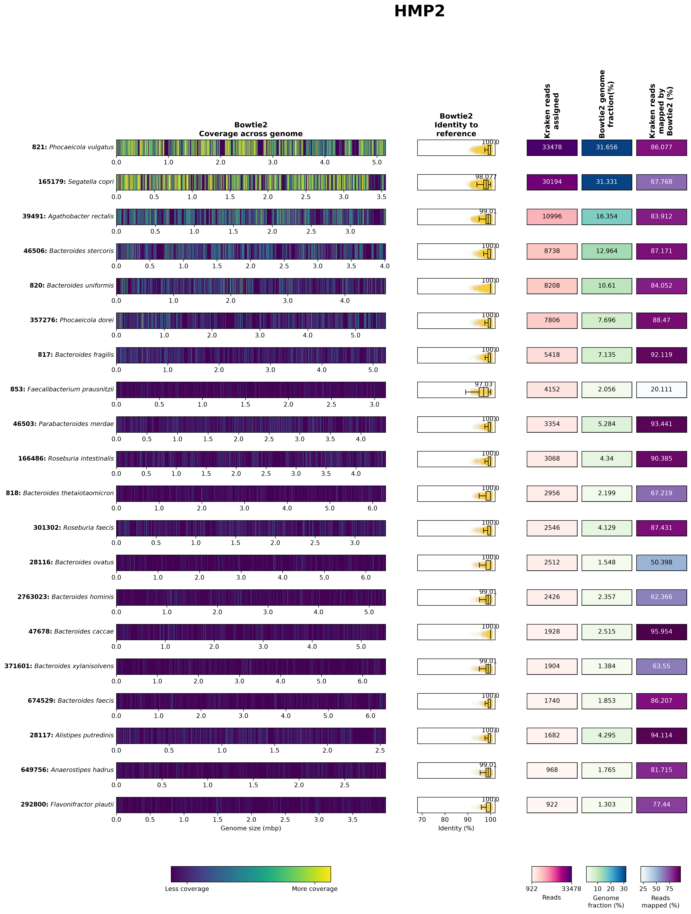

You can hopefully see that the majority of these look pretty good - to determine this, we're looking at a few key things:<br>
- a large percentage of the reads that were assigned to the taxa by Kraken 2 actually mapped to the reference genomes<br>
- the identity to the reference genomes is high<br>
- the reads appear to be mapped across the entire genome, and not just clustered in a small region

We can see a couple of exceptions to this, though:<br>
- in **821**: *Phocaeicola vulgatus* there are some regions with no reads mapped at all. These could be strain-specific differences or mobile genetic elements that are not present across all strains within this species.<br>
- in **853**: *Faecalibacterium prausnitzii* only 20% of the reads assigned by Kraken 2 can be mapped to the reference genome and they only have 97% identity to the reference genome. This could mean a few different things, but given the small Kraken 2 database that we used, likely means that it was actually a different *Faecalibacterium* species that was present in our sample, but this wasn't present in the Kraken 2 database.
  
  
Let's take a look at both of these taxa in more detail. Note that we're looking at all samples, the CD group and the non-IBD group in addition to all of our samples. I've also listed our samples in order, where the first 5 are CD and the second 5 are non-IBD.

Plot the taxon-centric figures:
```bash         
plot_coverage.py \
            --running taxon \
            --samples HMP2,CD,nonIBD,CSM79HR8,CSM7KOMH,HSMA33KE,PSM7J18I,HSM7J4QT,HSMA33J3,MSMB4LXW,MSM9VZHR,MSM79HA3,HSM6XRQY \
            --project_folder GeCoCheck_out \
            --taxid 821
            
plot_coverage.py \
            --running taxon \
            --samples HMP2,CD,nonIBD,CSM79HR8,CSM7KOMH,HSMA33KE,PSM7J18I,HSM7J4QT,HSMA33J3,MSMB4LXW,MSM9VZHR,MSM79HA3,HSM6XRQY \
            --project_folder GeCoCheck_out \
            --taxid 853
```

:::: {.callout type="green"}
**Question 3:** How would you use these results? What do you think you would do with them?<br>
::::

## 3.5. Annotation with MetaPhlAn

Another tool that is commonly used for taxonomic annotation of metagenomic sequences is MetaPhlAn. This tool is different from Kraken2 in that it uses a database of marker genes, instead of a collection of genomes, and it identifies only these marker genes within our reads, rather than trying to classify all reads. It then attempts to estimate the abundance of the taxa it identified within our whole samples, but it’s important to remember that this is an estimation, and not the actual number of reads classified. 

Usually, we would build the database ourselves so that we make sure to have the most recent version, but as we are limited for memory/RAM on these instances, we are using a smaller database that has already been made and is installed as the default database. 

```bash
conda activate metaphlan-4.2.6
```

Let's make an output folder and run MetaPhlAn:
```bash
mkdir metaphlan_out
parallel -j 1 --eta 'metaphlan \
                    --input_type fastq \
                    --no_map \
                    -o metaphlan_out/{/.}.mpa \
                    --nproc 4 \
                    {}' ::: cat_reads/*.fastq
```

And let's combine the output:
```bash
merge_metaphlan_tables.py metaphlan_out/*.mpa > metaphlan_output.txt
```

## 3.6. Visualisation of Kraken results in R

Now we’ll go to RStudio server: `http://##.uhn-hpc.ca:8080` (remember to replace `##` with your own instance number). 

#### Create the R Notebook

Using the menus, click `File > New File > R Notebook`, which will open an Untitled R markdown (Rmd) document. R notebooks are helpful in that you can run several lines, or chunks, of code at the same time and the results will appear within the document itself (in the whitespace following the chunk).

The default R Notebook contains a header and some information you may find helpful. Try running the chunk containing `plot(cars)` to see what happens!

You do not need to preserve most of the information in the new, untitled document. Select all of its contents by click+dragging your cursor or entering the `ctrl`+`a` (Windows) / `cmd`+`a` (Mac) shortcut, and press backspace or delete to clear the document.

The chunks are distinguished by the grey shading. Everything between the first ```` ```{r} ```` and subsequent ```` ``` ```` belongs to the chunk. Anything in the white space surrounding the chunk is meant to be annotation. *Although you can run lines of code outside of the chunks, the chunks are useful for running multiple lines in series with one click.*

You'll want something like this at the top of the notebook so it knows how it should be saved:
```r
---
title: "Module 3"
output: html_notebook
---
```

#### Adding new chunks

To add a new chunk into your R notebook by navigating to `Code > Insert Chunk` from the toolbar, or clicking on the little green `C` and selecting R.

And then save the document - it doesn’t really matter what you call it, but something like `metagenome_taxonomy.rmd` would be sensible.

#### Setup, Importing and Formatting Data

Now we’ll start building our R markdown notebook. Paste the following into a chunk, and then click the little green “play” button on the top right of the chunk to run it.

```r
knitr::opts_chunk$set(echo = TRUE)
library(phyloseq)
library(vegan)
library(ggplot2)
library(taxonomizr)
library(dplyr)
library(tidyr)
library(colorspace)
library(RColorBrewer)
library(stringr)

setwd("~/workspace/")
```
In this chunk, we’ve imported the libraries/packages that we’re going to use (phyloseq, vegan, ggplot2 and others) and we’ve told R which directory it should be working from.

Now we’re going to read in the Bracken output, and do some formatting of it. Again, post this into a new chunk and press play:
```r
ft = read.delim("metagenome/bracken_output_species.tsv", header = TRUE, sep = "\t", check.names = FALSE) #read in the file as a dataframe
df <- ft %>% #create a new object called df
  select(taxonomy_id, ends_with("_num")) %>% #keep only the column names that end with "_num" (this corresponds to the number of reads rather than the percentages)
  rename_with(~gsub(".species.bracken_num$", "", .), ends_with("_num")) #and then rename them so we're left with only the sample names
rownames(df) = ft$name #get the row (taxon) names from the first object
FT <- otu_table(as.matrix(df[, -1]), taxa_are_rows = TRUE) #and then turn it into a phyloseq "OTU table" - note that these don't need to be OTUs, this is just what a feature table is always called within phyloseq

tax_df <- ft %>% #now create a new object called tax_df
  select(name) #and get only the taxonomy column
rownames(tax_df) = ft$name #rename the rows from ft
colnames(tax_df) = c('Species') #rename the column
TAX <- tax_table(as.matrix(tax_df)) #and convert it to a phyloseq taxonomy table
```
If you’re not familiar with R or Python, anything after the # can be used for making comments, as it won’t be read by them. So you can see what I’ve written about each step.

The first few chunks of your R notebook should look something like this:
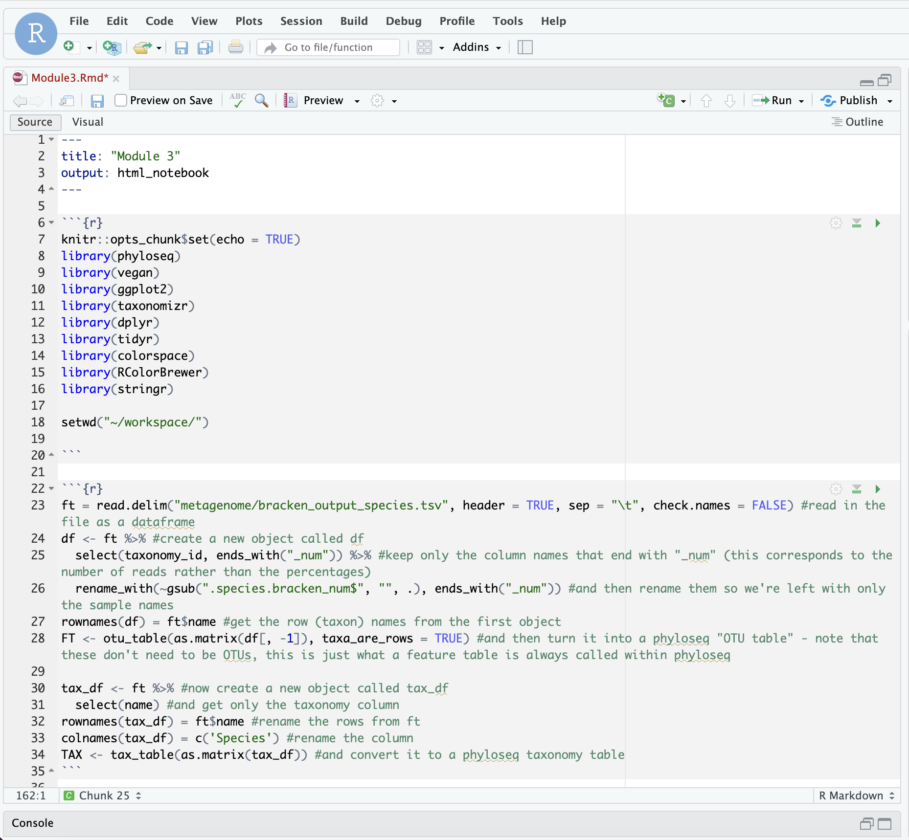


It’s good practice to take a look at what we’re changing each time! In the “Environment” section of RStudio, you should be able to see all of these objects. Click on them to have a look. I won’t always tell you to click on them, but it’s a good idea to either click on them or print them out so that you can understand what is changing each time. There are some other ways to look at this too:
```r
View(FT)
print(FT)
FT
```

Some of these options are more or less appropriate depending on what you’re doing, but regularly printing things out is the easiest way to troubleshoot a script that isn’t working. If you were wanting to print something out within a loop, you’d need to use the `print()` function.

Now we'll read in the metadata:
```r
metadata <- read.csv("metagenome/mgs_metadata.txt", header = TRUE, sep = "\t", check.names = FALSE)
rownames(metadata) = metadata$sample_id #give the rows names based on the sample_id column
metadata = metadata[colnames(df),] #get only the metadata that corresponds to the samples we've used
samples = sample_data(as.data.frame(metadata)) #convert this to a phyloseq sample_data format
sample_names(samples) = rownames(metadata) #add back the sample names
```

Now put the feature table, taxonomy table and metadata together as one phyloseq object:
```r
bracken = phyloseq(FT, TAX, samples)
```
Remember to have a look at the resulting object!

#### Remove Rare Taxa and Rarefy

As you'll know from yesterday, an important step in looking at alpha/beta diversity within sequencing data is normalising it in some way. For alpha diversity, this often involved rarefaction - randomly subsetting samples so that all samples have an even sequencing depth.

Rarefying has been a bit of a contentious topic in the microbiome community in the past (see: [Waste not, want not: why rarefying microbiome data is inadmissible](https://pubmed.ncbi.nlm.nih.gov/24699258/)), however, the current thinking is that "rarefaction is the most robust approach to control for uneven sequencing effort when considered across a variety of alpha and beta diversity metrics." (see: [Waste not, want not: revisiting the analysis that called into question the practice of rarefaction](https://journals.asm.org/doi/10.1128/msphere.00355-23)). 

We therefore still like to use it for alpha diversity analyses, and we typically like to test out a few different beta diversity metrics along with different normalisation methods to see what impact they have on our results; our hope is that our findings are robust to these different methods!

Generally, it is a good idea to start by manually removing rare taxa. It is common to remove taxa that have less than 20 reads across all samples in our dataset. To do this, we will use the `prune_taxa()` command from phyloseq.

Create a new chunk. If we view the otu_table of `bracken`, we will see as we scroll through that there are many taxa that appear sparsely across the different samples.
```r
View(bracken@otu_table)
```

We are not particularly interested in these rare taxa, so a quick way to deal with them is to "prune" taxa from our samples that have less than "n" reads across all samples. We can first look at the taxa sums in the form of a histogram.
```r
hist(taxa_sums(bracken), breaks = 2000, xlim = c(0,1000), main = "Taxa Sums before Pruning")
```

This should look like this:
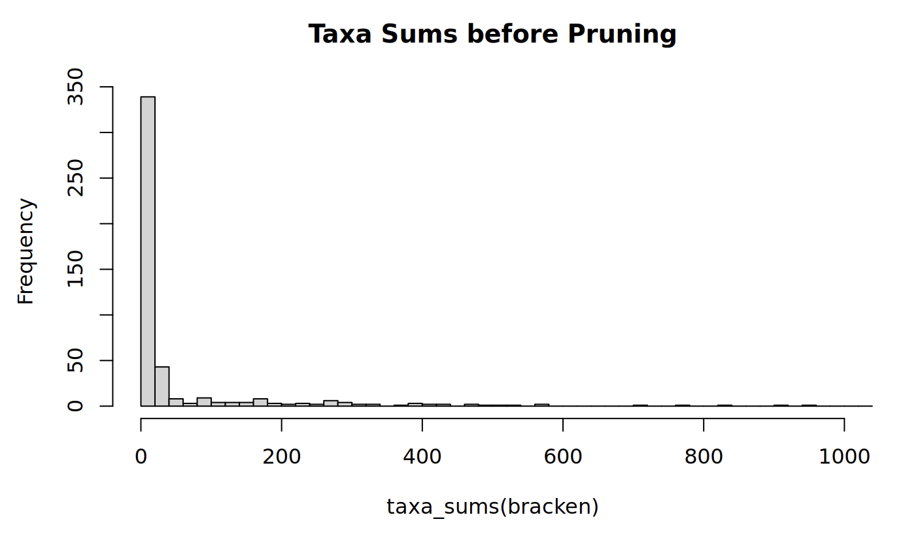

With this, we see that most frequently, the sum of all reads for a given taxa is in the 0-20 bin. This means that there are lots of taxa with low abundances (less than 20 reads total) in our dataset. So, we can prune these rare taxa with a built-in phyloseq command called `prune_taxa`:
```r
#Prune rare taxa from the dataset. This removes taxa that have less than 20 occurances across all samples.
bracken <- prune_taxa(taxa_sums(bracken) >= 20, bracken)
```

Some notes about this command:

- The first argument we give to `prune_taxa()` is the condition we want met for the taxa to 'pass' this filtering.<br>
- We are looking for the sum of the taxa (found by `taxa_sums`) in our phyloseq object bacteria to be greater than 20.<br>
- The second argument is the phyloseq object we are pruning, which will still be bracken.<br>
- The result of this command overwrites our previous `bracken` R object.<br>

With that, we can re-visit our histogram and see what this pruning has done:
```r
hist(taxa_sums(bracken), breaks = 2000, xlim = c(0,1000), main = "Taxa Sums after Pruning")
```

This should look like this:
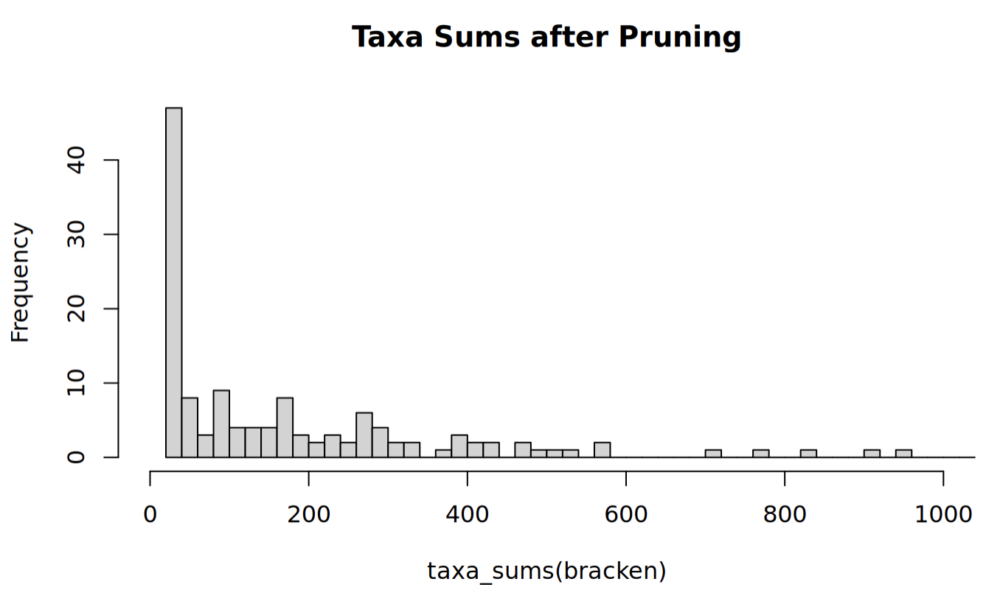

From the scale of the y-axes, we can see that this has pruned many of the rare taxa. This can be verified by viewing the otu_table with `View(bracken@otu_table)`.

Now we will rarefy this. Create a new chunk. To rarefy our dataset, we must first visualize the rarefaction curve of our samples using the vegan package. To do this, we need to create a dataframe that vegan can work with from our Phyloseq object `bracken`.
```r
rarecurve(as.data.frame(t(otu_table(bracken))), step=50,cex=0.5,label=TRUE, ylim = c(1,150))
```

This should look like this:
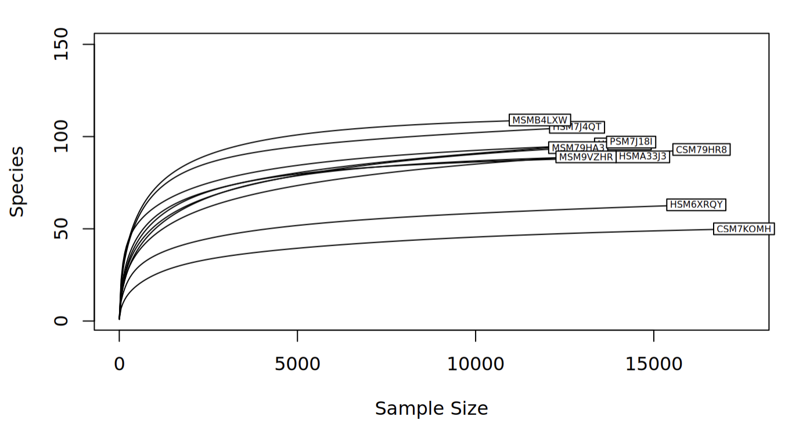

Some notes about this command:

- We apply a number of transformations to `bracken` before `rarecurve` works on it:
    - the otu_table of `bracken` is returned by the `otu_table(bracken)` command
    - the otu_table is then tranposed by `t()` such that the rows and columns are switched, because this is the format rarecurve expects
    - this transposed otu_table is then coerced to a dataframe by `as.data.frame()` so that rarecurve can read it
- The remainder of the `rarecurve` parameters control how the output is displayed.

Looking at the rarefaction curve, we can see that the number of species for all of the samples eventually begins to plateau, which is a good sign! This tells us that we have reached a sequencing depth where more reads does not improve the number of taxa we find in our sample. However, with the labels, it can be difficult to see exactly what these sample sizes are, so the following code will print it out for us:
```r
print(c("Minimum sample size:",min(sample_sums(bracken)), "Maximum sample size:", max(sample_sums(bracken))))
```

So, we know that at a minimum we must rarefy to the smaller number. However, considering some samples plateau much before this number, we should choose a smaller cutoff. There is not a strict method to choosing a cutoff, but we should remember we want to include abundant taxa and exclude rare taxa. With this in mind, it is acceptable to rarefy our samples to `10000` reads. Use the following lines of code to achieve this:
```r
#Set seed for reproducibility. Rarefy to a sample size equal to or smaller than the minimum sample sum.
set.seed(711)
rarefied <- rarefy_even_depth(bracken, rngseed = FALSE, sample.size = 10000, trimOTUs = TRUE)

#See that the samples are all the same size now.
rarecurve(as.data.frame(t(otu_table(rarefied))), step=50,cex=0.5,label=TRUE, ylim = c(1,150))
```

This should look like this:
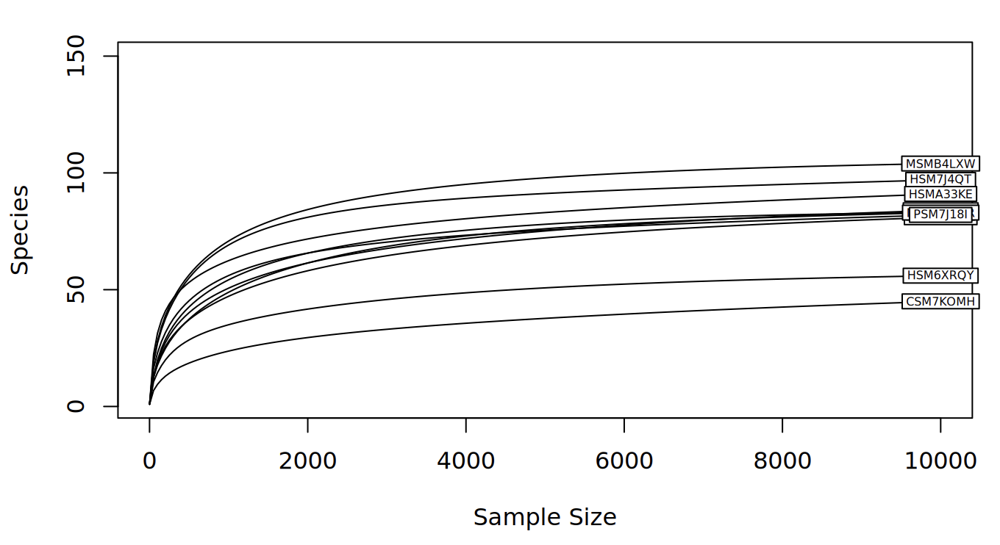

Some notes about these commands:

- We first set the seed to some number, in this case `711`. This is for reproducibility, since otherwise, `rarefy_even_depth()` would use a random seed by default. This means that if you ran the same code twice without setting the seed, you would get two different rarefied subsets.<br>
- The `rarefy_even_depth()` command needs to know to not use a random seed `(rngseed = FALSE)`, that our cutoff is `10000` (`sample.size = 10000`), and that we are rarefying the pruned phyloseq object.<br>
- The `trimOTUs = TRUE` parameter of `rarefy_even_depth()` means that if a taxa is subsampled to an abundance of 0 across all samples, that taxa is removed from the table. Having taxa with 0 reads can mess things up later in the analysis.<br>

:::: {.callout type="green"}
**Question 4:** Why do we prune rare taxa before rarefying?
::::

Excellent! Now that our data is imported, formatted, and rarefied, we can finally look at some diversity metrics!

#### Alpha diversity

Alpha diversity is a metric that evaluates the different types of taxa in a given sample. We covered this yesterday, but as a refresher, different alpha diversity methods typically use calculations based on different components of the sample, which are:<br>
- *Richness*: the number of taxa in a sample.<br>
- *Evenness*: the distribution of abundances of the taxa in a sample (i.e. similarities/differences in read quantity per taxa).

Some methods use only one of these components, some will use a combination of both, and others use neither. There are many indices to choose from, but some common ones are:<br>
- Observed taxa: The number of different taxa (richness)<br>
- Chao1 index: another measure of richness, more sensitive to rare taxa<br>
- Shannon index: a combination of richness and evenness, with more weight to the richness component.<br>
- Simpson index: a combination of richness and evenness, with more weight to the evenness component.<br>
- Fisher's diversity index / Fisher's alpha was one of the first methods to calculate the relationship between the number of different taxa and the abundance of individual taxa

You might note that we don't have Faith's phylogenetic diversity here - it's not commonly used for metagenomic data because we don't typically have a phylogenetic tree for read-based analyses (we're looking at reads from all across the genome, not a single marker like the 16S rRNA gene!). 

First, make a new chunk. Then, try running the following lines of code:
```r
#Plot alpha diversity with several metrics.
plot_richness(physeq = rarefied, x="disease_state", color = "disease_state", measures = c("Observed", "Shannon", "Simpson", "Fisher")) + geom_boxplot() +theme(axis.text.x = element_text(angle = 45, vjust = 1, hjust=1))
```

This should look like this:
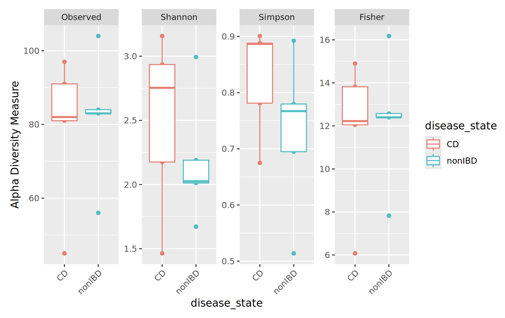

We can see that the groups are not identical, and that the different indices yield different plots. As well, some indices are similar to each other (like observed taxa and Fisher's alpha). Since we see differences in both the Shannon and Simpson plots, we can say that there are differences in both richness and evenness between our CD and non-IDB sample groups.

Try adding or changing the measures to see how they compare to one another. Also, try changing value of "x" to different (categorical) metadata variables.

:::: {.callout type="green"}
**Question 5:** How can you use the `View()` command to see what metadata you can choose from?
::::

#### Beta diversity

Beta diversity is another useful metric we use to compare microbiome compositions. Specifically, beta diversity is used to evaluate the differences between entire samples in a dataset. You can imagine that each sample is compared to one another, and the "distance" between these samples is calculated, such that we get a symmetric matrix of pairwise comparisons.

To capture beta diversity, we use some metric to calculate these pairwise distances between samples. There are several to choose from, but the most common include:<br>
- *Bray-Curtis dissimilarity*: takes into account presence/absence and abundance of taxa<br>
- *Jaccard distance*: takes into account only presence/absence of taxa<br>
- *Weighted UniFrac*: accounts for phylogenetic distances between present and absent taxa, weighted by taxa abundance<br>
- *Unweighted UniFrac*: accounts for phylogenetic distances between present and absent taxa<br>
- *(Robust) Aitchison's distance*: this is a compositional metric that calculates Euclidean distance after a centered log ratio (CLR) is applied to the taxon counts. Centered log ratios are a different way of normalising abundances so that we can see if they are more or less abundant than the average abundance of a taxon within each sample (so they account for uneven sampling depth in this way). The robust version of Aitchison's distance uses robust CLR values - CLR transformations applied only to the non-zero taxon counts. 

Once we decide on the metric(s) to use, we then have to consider how to ordinate our data. Ordination is the method by which we take our data points in multidimensional space and project them them to lower dimensional, i.e. 2D space. This allows us to more intuitively visualize our data and the differences between groups.

Common ordination methods include:<br>
- Principal Coordinate Analysis (PCoA) uses eigenvalue decomposition of the distance matrix for normally distributed data<br>
- Non-metric Multidimensional Scaling (NMDS) uses iterative rank-order calculations of the distance matrix for non-normally distributed data

Any combinations of the above metrics and methods can be used, depending on the type of data to be analyzed. For our dataset, we will be using the Bray-Curtis dissimilarity and Robust Aitchison's distance and PCoA method. Fortunately, all of these can easily be implemented in R.

We'll convert our data to relative abundance and look at Bray-Curtis dissimilarity first. Transform to relative abundance:
```r
percentages <- transform_sample_counts(rarefied, function(x) x*100 / sum(x))
```

Now, we have a new phyloseq object percentages in which the abundances are relative. With this object we can create an ordination by selecting our method and distance metric. Fortunately, the `ordinate` function from phyloseq can do this transformation in one step:
```r
ordination <- ordinate(physeq = percentages, method = "PCoA", distance = "bray")
```

We are ready to plot our ordination! In this step, we have to specify what data we are using and what our ordination object is. Additionally, we can select our metadata group of interest with the `color` parameter.
```r
plot_ordination(physeq = percentages, ordination = ordination, color="disease_state") +
  geom_point(size=10, alpha=0.1) + geom_point(size=5) + stat_ellipse(type = "t", linetype = 2) + theme(text = element_text(size = 20)) +  ggtitle("Beta Diversity", subtitle = "Bray-Curtis dissimilarity")
```

This should look like this:
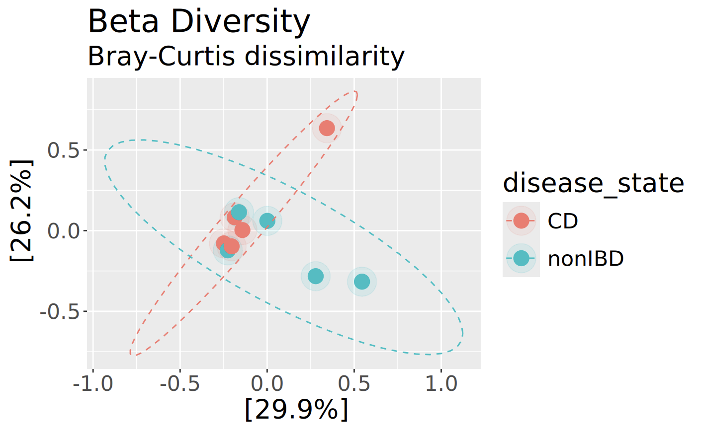

Now get the Robust Aitchison's distance:
```r
aitch_dist <- vegan::vegdist(as.data.frame(otu_table(bracken)), method = "robust.aitchison")
```

Get the ordination:
```r
aitch_ord <- wcmdscale(aitch_dist, eig = TRUE)
```

And plot it:
```r
plot_ordination(physeq = bracken, ordination = aitch_ord, color="disease_state") +
  geom_point(size=10, alpha=0.1) + geom_point(size=5) + stat_ellipse(type = "t", linetype = 2) + theme(text = element_text(size = 20)) +  ggtitle("Beta Diversity", subtitle = "Robust Aitchison's distance")
```

This should look like this:
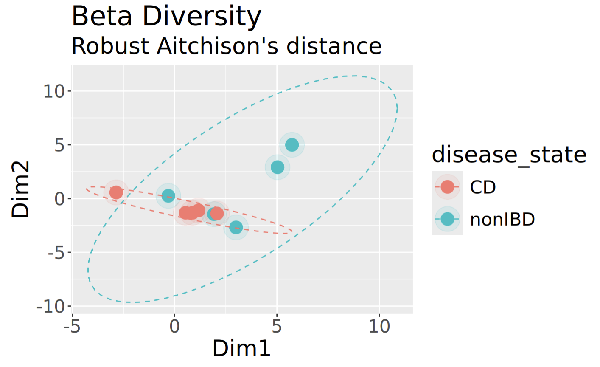

Although this plot clearly looks different than the one above for Bray-Curtis, what's reassuring to see is that the samples appear to group similarly regardless of which we are using. 

#### Visualization with Stacked Bar Charts

Another useful way to visualize the microbial composition of our samples is through the use of stacked bar charts. These charts break down the relative abundances of different taxa in our samples, informing us more about who is making up the communities. Additionally, we can compare our samples side-by-side to see if there are differences in the taxa abundances between samples. We will start by using the `percentages` object that we created in the beta diversity step.

It is almost impossible to visualise too many taxa at once in a stacked bar chart, so first of all, we'll take just the 20 most abundant taxa:
```r
percentages_top <- prune_taxa(names(sort(taxa_sums(percentages),decreasing=TRUE)[1:20]), percentages)
```

Next, we want to "melt" our phyloseq object percentages_glom into a new dataframe for constructing our plot with ggplot2. We can do this with the `psmelt()` function and create a new data frame like so:
```r
percentages_top_df <- psmelt(percentages_top)
```

Our Species data is categorical, so we have essentially just created a new "Species" category for simplicity. In fact, nearly all of the data in our percentages_df dataframe is categorical, which presents a problem. Ggplot2 will want to separate our data by factor levels, so we have to coerce our metadata column of interest to the factor class. We can do this easily with the `as.factor()` function:
```r
percentages_top_df$Species <- as.factor(percentages_top_df$Species)
```

Additionally, we can choose the colours of our chart. By default, it will be grayscale, and that's no fun! The RColorBrewer package provides many palettes to choose from for different types of data. We can use the "Spectral" palette, but have a problem: "Spectral" only has 11 colours, but we have more than 11 species! We can fix this by using the `colorRampPalette()` function from the "grDevices" package, which interpolates new colours with a given palette.

This command works by first using brewer.pal(11,"Spectral"), which returns a character vector of 11 colours in hexadecimal form. Then, we specify how many colours we want to "ramp" to by finding the number of unique factor levels, or Species, in our dataframe with `length(levels(Species))` which returns a numerical value. Finally, `colorRampPalette()(n)` creates a function that returns a new character vector of n hexadecimal colour codes, which we store in a new vector colours. 
```r
colors<- colorRampPalette(brewer.pal(11,"Spectral"))(length(levels(percentages_top_df$Species)))
```

Additionally, it will be helpful to see which samples come from each metadata group. Let's consider the `disease_state` column of our dataframe. We can differentiate between them by creating another character vector containing colours assigned to each group. To do this quickly, we can use an `ifelse()` function that checks whether the value of each cell in the Diagnosis column is equal to CD. If this is true, we set the colour to red. If it is false, we know that it must be equal to nonIDB instead, and set the colour to blue. R natively supports hundreds of named colours too, which you can view with `colours()`; feel free to pick your favourites! This works for any category that contains two different values.
```r
c <- ifelse(percentages@sam_data$disease_state == "CD", "red", "blue")
```

Finally, we can plot our stacked bar chart! Using the `ggplot()` function, we will combine all of the data and objects we have prepared. We must specify our dataframe with the data parameter. As well, we must tell ggplot how we want the graph to look with `aes()`, or the aesthetic map. First, we have to specify what our axes are. Then, we must specify how the bars are to be "filled", or separated. And, we want to add a `theme()` which colours our X-axis labels by the Diagnosis group, using the character vector we made above.
```r
relative_plot <- ggplot(data=percentages_top_df, aes(x=Sample, y=Abundance, fill=Species))+
  ggtitle("Relative Abundance", subtitle = "Species Level")+
  xlab("Sample ID")+
  ylab("Abundance (%)")+
  geom_bar(aes(), stat="identity", position="stack")+
  scale_fill_manual(values = colors)+
  theme(axis.text.x = element_text(angle = 45, vjust = 1, hjust=1, colour = c), 
        legend.text = element_text(size = 8))

relative_plot
```

This should look like this:
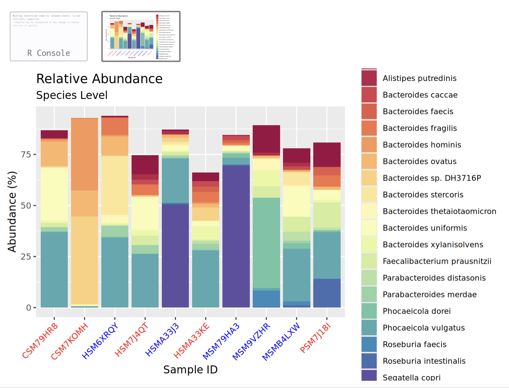

Try clicking the little button to open this in a new window to see it better!

#### Visualization with Heatmaps

Finally, let's have a look at our data in a heatmap. Luckily for us, phyloseq has a built-in function called `plot_heatmap()` that lets us plot a heatmap with our top 20 species, with a white to red colour scheme, and with samples grouped by disease_state:
```r
plot_heatmap(percentages_top, method = "PCoA", distance = "bray", low = "white", high = "red", na.value = "grey", sample.label="disease_state", taxa.label="Species")
```

This should look like this:
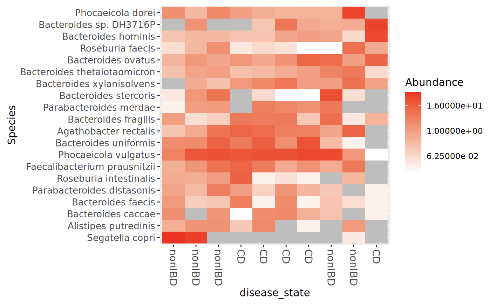

## 3.7. Visualisation of MetaPhlAn results in R

Now we're going to visualise the MetaPhlAn results. This time, I'll give you a hand importing the data initially but then it'll be up to you to modify the code that we've used above to make this work with the MetaPhlAn results!

```r
ft = read.delim("metagenome/metaphlan_output.txt", header = TRUE, sep = "\t", check.names = FALSE, skip=1)
df <- ft %>% 
  filter(str_detect(clade_name, "s__"), !str_detect(clade_name, "t__"))
rownames(df) = df$clade_name 
FT <- otu_table(as.matrix(df[, -1]), taxa_are_rows = TRUE) 

tax_df <- ft %>% 
  select(clade_name) 
rownames(tax_df) = ft$clade_ 
colnames(tax_df) = c('Species') 
TAX <- tax_table(as.matrix(tax_df)) 
```
Make sure that you're looking at each line of code to make sure that you understand what it is doing!

We can use the same sample data that we already had above to combine this together into a new phyloseq object:
```r
metaphlan = phyloseq(FT, TAX, samples)
```

Take a look at this. Unfortunately you will see that we only have 3 species in our samples :( this is because we used a small database with subsampled read files. So it probably isn't worth running the alpha and beta diversity visualisations here, but you can still take a look at a stacked bar chart and a heatmap to see how this compares to the Kraken results!

## 4.1. Preparing for module 4

The final thing that we'll do here before lunch is start the first command of the next module! In bioinformatics, it's common for some of the steps to take hours, days, or even weeks. In this case, the assembly of our reads into contigs that we'll be doing after lunch can take a few hours to run. We'll have the option to copy across the output, but if you'd like to run it yourself then you should start that now. 

First, make sure you go back to your terminal and into the server (out of R Studio). Open up your `tmux` session and change into `workspace/metagenome`.

We'll give you some more details on this after lunch, but go ahead and activate the environment that we'll be using:
```bash
conda activate anvio-9
```

Link the data that we'll need:
```bash
ln -s ~/CourseData/metagenome/mapped_matched_fastq .
```

And start running MEGAHIT to assemble your reads into contigs:
```bash
mkdir anvio

R1=$( ls mapped_matched_fastq/*_R1.fastq | tr '\n' ',' | sed 's/,$//' )
R2=$( ls mapped_matched_fastq/*_R2.fastq | tr '\n' ',' | sed 's/,$//' )
megahit -1 $R1 \
         -2 $R2 \
         --min-contig-len 1000 \
         --num-cpu-threads 8 \
         --presets meta-large \
         --memory 0.8 \
         -o anvio/megahit_out \
        --verbose
```

## Answers

**Question 1:** Take a look at this file. Are there any surprises? Which of the output files in ‘kneaddata_out’ will you use for analysis?

Yes! Very few reads have been removed for mapping to the human reference genome. This is because the HMP2 samples have already been quality-checked and had human reads removed from them. We'll be using the `_subsampled_kneaddata_paired_*.fastq/` files, because these are the reads that had a matching pair, were high enough quality, and didn't map to the human reference genome.

**Question 2:** How many reads are in each sample before and after KneadData?

All samples had 25,000 reads in each `R1` and `R2` file prior to kneaddata, and ~24,800-24,900 after kneaddata.

**Question 3:** How would you use these results? What do you think you would do with them?

Honestly, not very much. From what we've found, checking coverage is way more important in samples that are less well-represented in reference databases (e.g. soil or marine samples) or in samples with very high host contamination/low microbial biomass (like tumour tissues). There is nothing in these results that suggests that our taxonomic annotations are really off-base (like having no reads at all mapped to the reference genome despite thousands of Kraken-assigned reads), so it doesn't seem like we need to do anything further. If the GeCoCheck results indicate more concerns with our taxonomic annotations, there are scripts for filtering the Kraken results prior to further analysis. As it is, it is nice to have confirmation that Kraken is not hallucinating and we can be confident that it does seem that the identified taxa are actually in our samples. 

**Question 4:** Why do we prune rare taxa before rarefying?

**Question 5:** How can you use the `View()` command to see what metadata you can choose from?


