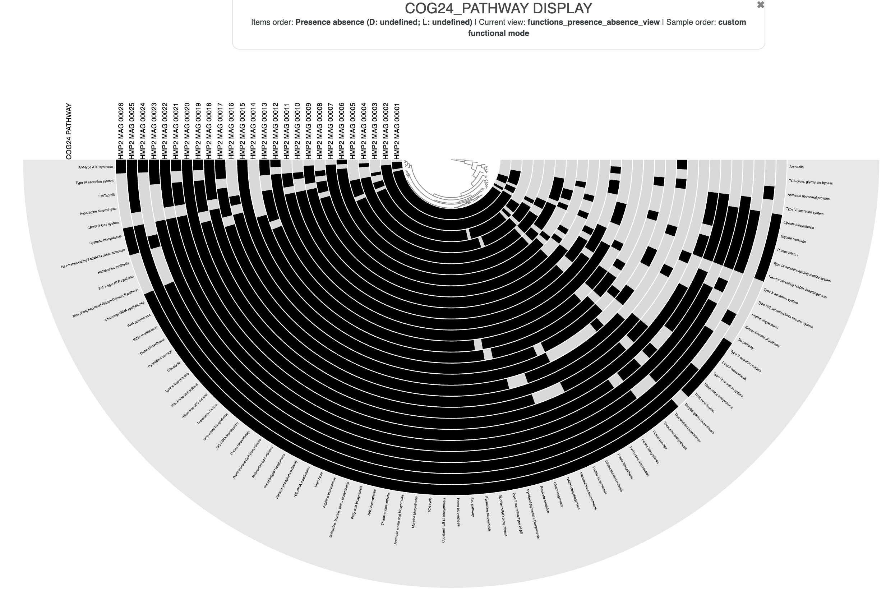
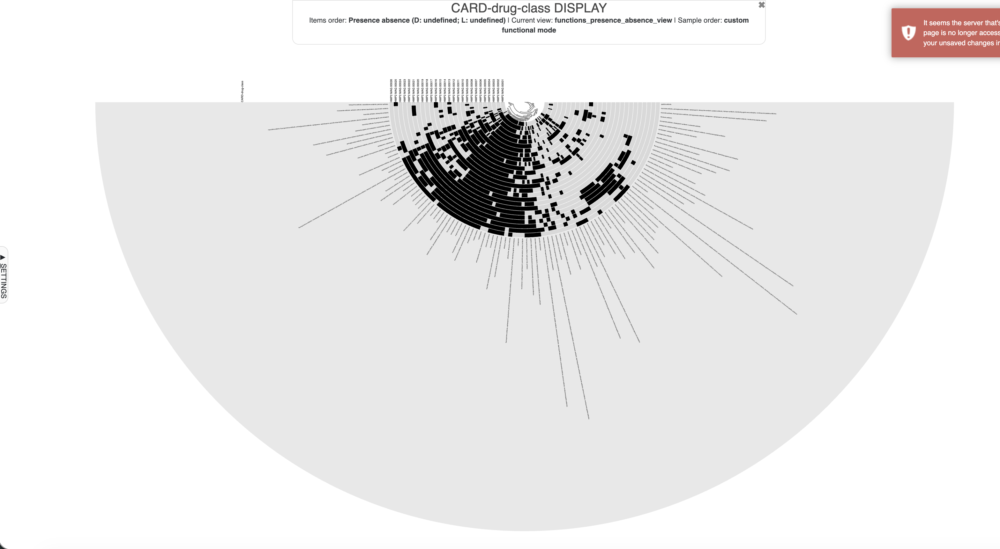
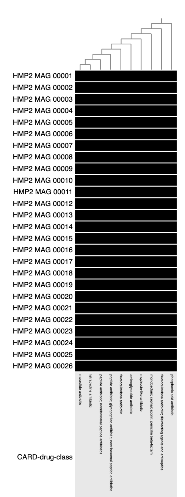
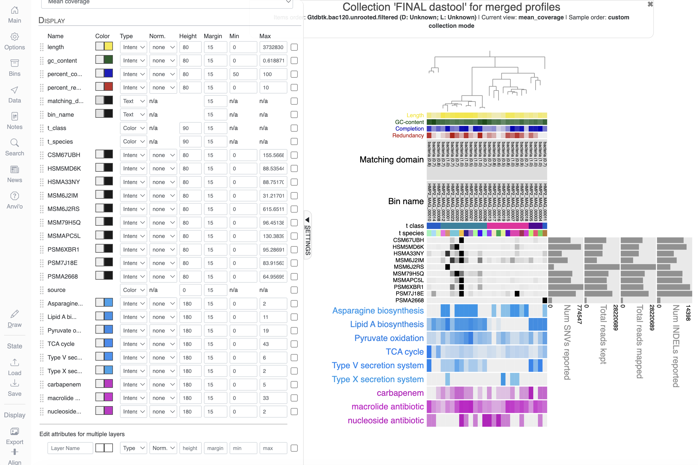
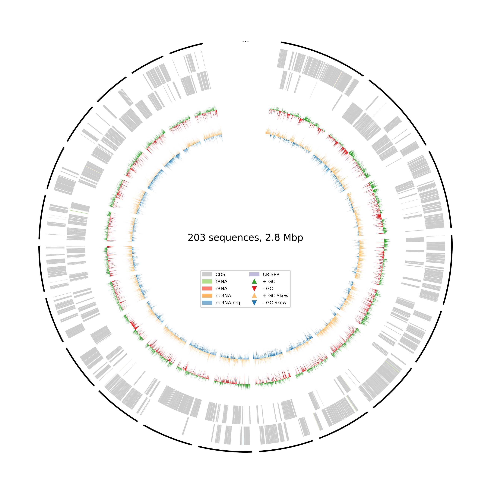
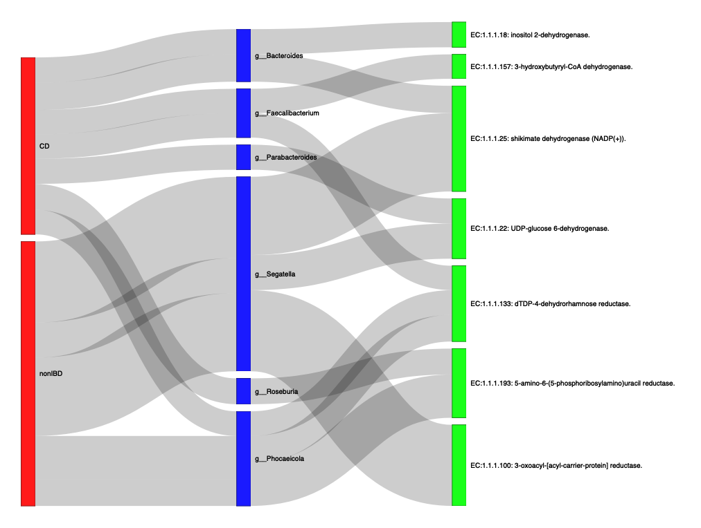

# Module 5

## Lecture

<iframe src="https://docs.google.com/presentation/d/1-G3QrPDxj2t7QLvPRwpdaaGKzld4b4a4/preview" width="640" height="480" allow="autoplay"></iframe>  

## Lab
<iframe src="https://docs.google.com/presentation/d/1SibH92C-IXyGG8wb29NqnROaazqesq2P/preview" width="640" height="480" allow="autoplay"></iframe>  

This tutorial is part of the 2026 CBW Microbiome Analysis (held in Guelph, ON, September 15-17). It is based on the metagenomics workflows available on the [Microbiome Helper](https://microbiomehelper.ca/).

**Author:** Robyn Wright

## Overview

The goal here is to introduce students to the different types of functional annotation that we can do, as well as the different things that we can annotate. This is not comprehensive and there are many different types of functional databases out there. Many steps of this can also stand alone, so you can choose which is most applicable to you. We'll cover:

- Functional annotation of our contigs/MAGs in Anvi'o:
    - General functional annotation of MAGs in our Anvi'o database using the NCBI Clusters of Orthologous Genes (COGs)
    - Annotation of MAGs in our Anvi'o database using the CARD RGI to identify AMR genes
    - Visualisation of NCBI COGs and AMR genes in Anvi'o (and combining this with our previous phylogenetic tree and taxonomy information on our MAGs)
- Read-based functional annotation:
    - General functional annotation of reads using MMSeqs2 with the UniRef 90 database (and linking this with the Kraken 2 taxonomy that we generated in module 3)
- Functional annotation of our MAGs in stand-alone programs:
    - General functional annotation of MAG fasta files using Bakta
    
:::: {.callout type="purple"}
Each of these sections (MAGs, reads or MAGs with Bakta) can be run independently, so feel free to choose the one that is of most use/interest to you to start with! It may be a lot to get through in this lab.
::::

:::: {.callout type="green"}
Throughout this module, there are some questions aimed to help your understanding of some of the key concepts. You’ll find the answers at the bottom of this page, but no one will be marking them.
::::

## 5.1. Functional annotation of MAGs using Anvi'o NCBI COGs

We are going to start off with functional annotation of the Anvi'o database so that we can see if our MAGs have any functions of interest - of course, here we don't really have any functions that we're particularly interested in, but in a real analysis, we'd usually have some functions that we think could be associated with a disease, a treatment, or a process of interest. We'll choose them at random here when we visualise them, but if you already have some functions that you're interested in then feel free to use those instead. 

We'll start by reactivating the Anvi'o environment and changing back to the directory we've been working from:
```bash
conda activate anvio-9
cd ~/workspace/metagenome
```

Before we add the functional annotations, let's look at what we already have here:
```bash
anvi-db-info -c anvio_full/anvio_databases/CONTIGS.db
```
If you look at the section `AVAILABLE FUNCTIONAL ANNOTATION SOURCES` then you should see that there is nothing listed, meaning we currently have no functional annotations.

We'll start by running the NCBI Clusters of Orthologous Genes (COGs) command within Anvi'o:
```bash
anvi-run-ncbi-cogs -c anvio_full/anvio_databases/CONTIGS.db -T 4
```
This will take about 10 minutes.

As you may have guessed, this used the [NCBI COGs](https://pmc.ncbi.nlm.nih.gov/articles/PMC102395/) to annotate all of our contigs with general functions. The current version within Anvi'o is COG24, and it includes three different levels of annotation: 

1. Functional categories: information storage and processing (translation, transcription, replication, etc), cellular processes and signalling (cell cycle control, division, motility, etc), and metabolism (energy production and transport)
2. Functions: the specific functional annotation
3. Pathways: e.g. glycolysis, photosystem I, TCA cycle

Once this has finished, look at the functional annotations available in our database now:
```bash
anvi-db-info -c anvio_full/anvio_databases/CONTIGS.db
```

You should now see:
```
AVAILABLE FUNCTIONAL ANNOTATION SOURCES
===============================================
* COG24_CATEGORY (XX annotations)
* COG24_FUNCTION (XX annotations)
* COG24_PATHWAY (XX annotations)
```

:::: {.callout type="green"}
**Question 1:** How many annotations in each category are there?
::::

Before we move on to the visualisation, we'll also annotate the contigs with AMR genes.

## 5.2. AMR annotation of MAGs with CARD RGI

Now we can use the Comprehensive Antibiotic Resistance Database (CARD) Resistance Gene Identifier (RGI) to identify AMR genes within our contigs/MAGs. CARD RGI actually has a few different options and can be run on reads, contigs or MAGs. It doesn't run inside Anvi'o, so we'll export the sequences from Anvi'o to a fasta file, run CARD RGI, and then import the annotations back into Anvi'o.

First, export the sequences for our genes (we already identified them in module 4, so we don't need to do this again):
```bash
anvi-get-sequences-for-gene-calls -c anvio_full/anvio_databases/CONTIGS.db \
                                  --get-aa-sequences \
                                  -o contigs_amino_acids.faa
```

Now activate the CARD RGI environment and make a directory for our output to go:
```bash
conda activate card-rgi-6.0.8
mkdir card_out_contigs
```

Now get the CARD database:
```bash
ln -s ~/CourseData/databases/card_data/ .
```
Note that I followed the directions [here](https://github.com/arpcard/rgi/blob/master/docs/rgi_load.rst) to get this. If you'd like to challenge yourself a little more, change out of and delete the `card_data` folder that you just made and follow the instructions to download and setup the database for yourself.

Now we'll run CARD RGI. Note that unlike many other tools, for this one we want to be inside the directory containing the CARD information and we'll give the full paths to our output folders instead.

Change into the `card_data` directory and set up our folder name (this is so that all of the *subshells* that parallel generates can find the `FOLDER` variable):
```bash
cd card_data

FOLDER='/home/ubuntu/workspace/metagenome/'
export FOLDER
```

And now run it:
```bash
rgi main \
                     -i ${FOLDER}contigs_amino_acids.faa \
                     -o ${FOLDER}card_out_contigs/contigs \
                     -t contig \
                     -a DIAMOND \
                     -n 4 \
                     --include_loose \
                     --local \
                     --clean \
                     --input_type protein
cd ..
```

You can see a description of them for yourself by typing `rgi main --help`, but there are some that might not be so obvious:

- `-t` - whether the data input is contigs (also use this option for reads!) or proteins
- `-a` - the alignment tool to use (DIAMOND or BLAST)
- `--include-loose` - that we want to include loose hits in addition to strict and perfect hits
- `--local` - that we want to use the local database (i.e., that we don't need to download the database)
- `--clean` - that we want to remove temporary files when we're done

Now that we have the annotations we just want to reformat some of these results into a format that Anvi'o can import:
```bash
echo -e "gene_callers_id\tsource\taccession\tfunction\te_value" > contigs_card_rgi_ARO.txt
tail -n +2 card_out_contigs/contigs.txt | awk -F'\t' '{print $1"\tCARD-ARO\t"$11"\t"$9"\t"$8}' >> contigs_card_rgi_ARO.txt

echo -e "gene_callers_id\tsource\taccession\tfunction\te_value" > contigs_card_rgi_drug-class.txt
tail -n +2 card_out_contigs/contigs.txt | awk -F'\t' '{print $1"\tCARD-drug-class\t"$11"\t"$15"\t"$8}' >> contigs_card_rgi_drug-class.txt

echo -e "gene_callers_id\tsource\taccession\tfunction\te_value" > contigs_card_rgi_gene-family.txt
tail -n +2 card_out_contigs/contigs.txt | awk -F'\t' '{print $1"\tCARD-gene-family\t"$11"\t"$17"\t"$8}' >> contigs_card_rgi_gene-family.txt
```

:::: {.callout type="green"}
**Question 2:** What do you think we're doing in each of these commands?
::::

Now we can reactivate the Anvi'o environment and import these into Anvi'o:
```bash
conda activate anvio-9 
anvi-import-functions -c anvio_full/anvio_databases/CONTIGS.db \
                      -i contigs_card_rgi_ARO.txt

anvi-import-functions -c anvio_full/anvio_databases/CONTIGS.db \
                      -i contigs_card_rgi_drug-class.txt

anvi-import-functions -c anvio_full/anvio_databases/CONTIGS.db \
                      -i contigs_card_rgi_gene-family.txt
```

Check that they are showing up in our contigs database now:
```bash
anvi-db-info -c anvio_full/anvio_databases/CONTIGS.db
```

It should look something like this now:
```
AVAILABLE FUNCTIONAL ANNOTATION SOURCES
===============================================
* CARD-ARO (11,786 annotations)
* CARD-drug-class (11,786 annotations)
* CARD-gene-family (11,786 annotations)
* COG24_CATEGORY (104,084 annotations)
* COG24_FUNCTION (104,084 annotations)
* COG24_PATHWAY (26,425 annotations)
```

## 5.3. Visualisation of MAG functional annotations

Next, we're going to visualise the functions, and then we'll visualise the MAGs with the functions. 

Anvi'o requires a list of the genomes that we're interested in for visualising functions. In our case, this is just all MAGs, so we can create that like this:
```bash
anvi-script-gen-genomes-file -c anvio_full/anvio_databases/CONTIGS.db \
                             -p anvio_full/anvio_databases/merged_profiles/PROFILE.db \
                             -C "FINAL_dastool" \
                             --output-file anvio_full/internal-genomes-final.txt
```

And then use this to first display the `COG24_PATHWAY`:
```bash
anvi-display-functions -i anvio_full/internal-genomes-final.txt \
                       --annotation-source COG24_PATHWAY \
                       --profile-db anvio_full/COG24_PATHWAY-PROFILE.db \
                       --server-only \
                       -P 8081
```

As before, you'll need to then go into a second terminal window and run:
```bash
ssh -L 8081:localhost:8081 -i CBW.pem ubuntu@##.uhn-hpc.ca
```

And then go to http://localhost:8081/. Hopefully it looks something like this:


Now let's look at the `CARD-drug-class` annotations:
```bash                      
anvi-display-functions -i anvio_full/internal-genomes-final.txt \
                       --annotation-source CARD-drug-class \
                       --profile-db anvio_full/CARD-drug-class-PROFILE.db \
                       --server-only \
                       -P 8081
```

You'll see that this shows the AMR drugs that the annotated genes give resistance to, and is the way that we often like to look at AMR - what often matters the most is the resistance that the microbes in our samples have, not the specific genes that they use. This should look something like this:


But this has a lot of information... so now we'll look at only the drug classes in all 26 MAGs (and remember that you can switch between the circle phylogram and phylogram!):
```bash                 
anvi-display-functions -i anvio_full/internal-genomes-final.txt \
                       --annotation-source CARD-drug-class \
                       --profile-db anvio_full/CARD-drug-class-PROFILE-26.db \
                       --min-occurrence 26 \
                       --server-only \
                       -P 8081
```

Which should look like this:


Once you've run one of these commands once, you'll see that you can't rerun them because you already have a profile made. Once you've run them once, you can see them again like this:
```bash   
anvi-interactive -p anvio_full/CARD-drug-class-PROFILE.db \
                 --manual \
                 --server-only \
                 -P 8081
```

:::: {.callout type="green"}
**Question 3:** How many drug classes are present in all of our MAGs?
::::

Now look at the gene families that are in all of our MAGs:
```bash
anvi-display-functions -i anvio_full/internal-genomes-final.txt \
                       --annotation-source CARD-gene-family \
                       --profile-db anvio_full/CARD-gene-family-PROFILE-26.db \
                       --min-occurrence 26 \
                       --server-only \
                       -P 8081
```

:::: {.callout type="green"}
**Question 4:** How many gene families are present in all of our MAGs?
::::

Finally, let's make it so we can view these with the other information about our MAGs and the phylogenetic tree. This part isn't very intuitive, but we need to export some text files with the functions in each MAG in them:
```bash
anvi-script-gen-function-matrix-across-genomes -i anvio_full/internal-genomes-final.txt \
                                               --annotation-source CARD-drug-class \
                                               --output-file-prefix anvio_full/CARD-drug-class-MAGs-final

anvi-script-gen-function-matrix-across-genomes -i anvio_full/internal-genomes-final.txt \
                                               --annotation-source COG24_PATHWAY \
                                               --output-file-prefix anvio_full/COG24_PATHWAY-MAGs-final
```

You can see that I've chosen the CARD drug classes and COG24 pathways. If you want to choose something different, then you are welcome to. Remember you can see the options like this: `anvi-db-info -c anvio_full/anvio_databases/CONTIGS.db`

If you look at the length of these files like this: `less anvio_full/CARD-drug-class-MAGs-final-PRESENCE-ABSENCE.txt | wc -l` and `anvio_full/COG24_PATHWAY-MAGs-final-PRESENCE-ABSENCE.txt` you'll see that we have 102 drug classes and 76 COG pathways (the counts show the file header, too). This is obviously going to be a big much to view, so let's just take a few. I've just selected a few more-or-less at random, so you can changes these if you like. Note that something like this is where in a real analysis we may do some kind of differential abundance testing before deciding to plot them! 

```bash
awk -F'\t' 'NR==1 || $28 == "macrolide antibiotic" || $28 == "carbapenem" || $28 == "nucleoside antibiotic"' anvio_full/CARD-drug-class-MAGs-final-FREQUENCY.txt > anvio_full/CARD-drug-class-MAGs-final-FREQUENCY-filtered.txt

awk -F'\t' 'NR==1 || $28 == "Type X secretion system" || $28 == "Lipid A biosynthesis" || $28 == "Type V secretion system" || $28 == "Asparagine biosynthesis" || $28 == "Pyruvate oxidation" || $28 == "TCA cycle"' anvio_full/COG24_PATHWAY-MAGs-final-FREQUENCY.txt > anvio_full/COG24_PATHWAY-MAGs-final-FREQUENCY-filtered.txt
```

:::: {.callout type="green"}
**Question 5:** Can you figure out what this code is doing?
::::

Now let's make a single file with all of the additional data that we want to show, so that we can add it with the `--additional-layers` flag. We're going to use Python for this seeing as we have a few modifications to make. Open it up by typing in `python` and pressing enter. 

Now paste in:
```python
import pandas as pd

tax = pd.read_csv('scg_taxonomy_FINAL_dastool_reduced_fixed.txt', index_col=0, header=0, sep='\t')
tax = tax.loc[:, ['t_class', 't_species']]

card = pd.read_csv('anvio_full/CARD-drug-class-MAGs-final-FREQUENCY-filtered.txt', index_col=0, header=0, sep='\t').transpose()
card.columns = card.loc['CARD-drug-class', :]
card = card.drop('CARD-drug-class', axis=0)

cog = pd.read_csv('anvio_full/COG24_PATHWAY-MAGs-final-FREQUENCY-filtered.txt', index_col=0, header=0, sep='\t').transpose()
cog.columns = cog.loc['COG24_PATHWAY', :]
cog = cog.drop('COG24_PATHWAY', axis=0)

combined = pd.concat([tax, card, cog], axis=1)

combined.index.name = "bin_name"
combined.to_csv('anvio_taxonomy_card_cog.txt', sep='\t')
```
Once it's finished, type in `quit()` to go back to the regular command line.


And let's view this!
```bash
anvi-interactive -c anvio_full/anvio_databases/CONTIGS.db \
                 -p anvio_full/anvio_databases/merged_profiles/PROFILE.db \
                 -C "FINAL_dastool" \
                 --additional-layers anvio_taxonomy_card_cog.txt \
                 --tree gtdbtk.bac120.unrooted.filtered.tree \
                 --server-only \
                 -P 8081
```

As you did previously, you can change to the GTDB tree view and change things like the class and species to text, and then sort the other layers however you would like to view them. 

Some other things I personally like to do:

- Change the completion/redundancy to intensity and change the minimum/maximum to reflect your data (i.e. 50-100 for completion and 0-10 for redundancy)
- Reorder the layers so that bin name, class and species are all next to the tree
- Change the colours for antibiotics and the COG groups
- Change the height of the layers

At the end, I have something that looks like this (you can see how I changed things on the left side!)


:::: {.callout type="purple"}
One final note that I'll add here is that obviously if things are present in MAGs then this is fine, but when they are not present you should consider the completeness of the genome when saying that something is "absent" - if a genome is only 50% complete then you potentially only have a 50/50 chance of a given function being present. This may actually be lower for some functions that we know don't sequence/assemble well. 
::::

## 5.4. MMSeqs initial setup

As mentioned above, there are many different options for annotating functions in reads depending on what you are interested in annotating, and as with everything else, there are different tools that can achieve this. Some of the most popular for annotating reads are MMSeqs and HUMAnN. We've chosen MMSeqs here because this is what we typically use in our lab because it gives an output on a read-by-read basis that we can link with our Kraken output, but this does mean that there are a few more steps involved than if we used HUMAnN. We've given an overview of both here:

### MMSeqs

[MMseqs2](https://github.com/soedinglab/MMseqs2) (Many-against-Many sequence searching) is a software suite to search and cluster huge protein and nucleotide sequence sets. We'll be using MMseqs to assign functions to our samples on a read-by-read basis by mapping them to the UniRef90 protein database, which allows us to link the function with the taxonomy that we've obtained from Kraken2 (although MMseqs can also be used for taxonomy assignment). MMseqs2 works by taking sequenced reads, translating them into protein and then mapping them against this protein database (in this case, [UniRef90](https://www.uniprot.org/help/uniref), a large protein database clustered at 90% identity).

### HUMAnN

[HUMAnN3](https://github.com/biobakery/humann) (HMP Unified Metabolic Analysis Network) is a tool for profiling the presence/absence and abundance of microbial pathways in a community from metagenomic (or metatranscriptomic) sequencing data. HUMAnN3 works by: (1) identifying the species in the samples using MetaPhlAn, (2) mapping these reads to pangenomes of the species using Bowtie2, and (3) aligning the reads that could not be mapped to the pangenomes to a protein database (usually UniRef50) with DIAMOND.

### MMSeqs setup

As we've done previously, we'll start by activating the conda environment and creating symlinks to the MMSeqs database that we'll be using:
```bash
conda activate mmseqs2-18.8cc5c
ln -s ~/CourseData/databases/UniRef90_2026-01/ .
```

We're going to be using the reads that we concatenated in module 3, so we don't need to copy in any data.

## 5.5. Run MMSeqs

Now, we'll start running MMseqs2. Note that these commands can actually all be combined for each sample, but so that we can see and understand what's going on, we're going to run each of them separately.

First, make a directory to store the output:
```bash
mkdir mmseqs_U90_out
```

Now, we'll use parallel to create databases for all of our sample files:
```bash
parallel -j 4 --progress 'mmseqs createdb {} mmseqs_U90_out/mmseqs-{/.}-queryDB' ::: cat_reads/*
```
This command creates an MMseqs database from the the input fastq file. The creation of this database is necessary for MMseqs as it vastly increases the speed at which translated DNA sequences can be mapped against a protein database.

Next, we'll actually run the searches with MMseqs:
```bash
parallel -j 1 --progress 'mmseqs search mmseqs_U90_out/mmseqs-{/.}-queryDB UniRef90_2026-01/UniRef90 mmseqs_U90_out/mmseqs-{/.}-resultDB tmp --db-load-mode 3 --threads 4 --max-seqs 25 -s 1 -a -e 1e-5' ::: cat_reads/*
```

This command is the real meat of the job file and runs the freshly created sample database against the provided UniRef90 protien database. There are a number of parameters in this command:

- `--db-load-mode 3` - This parameter tells MMseqs how to deal with loading the database into memory. For more information you can check out this page. However, setting this parameter to 3 helps when running MMseqs on a cluster environment.
- `--threads` - The number of processors we want MMseqs to use during the search
- `--max-seqs 25` - This indicates that we want MMseqs to output at maximum 25 hits for each sequence
- `-s 1` - This indicates the sensitivity that we want MMseqs to run at. Increasing this number will lower the speed at which MMseqs runs but will increase its sensitivity. For well-explored environments such as the human gut, a setting of 1 should suffice.
- `-a` - This indicates that we want our results to output backtraces for each sequence match. These are needed to convert the resulting MMseqs file into a usable file format.
- `-e 1e-5` - This indicates that we only want to keep matches that are below an E-value of 1e-5 (E-values are a measure of how well two sequences match one another, and the closer they are to zero, the better the match is).
- `> /dev/null 2>&1` - We could add this part to the end of the command if we wanted to run the command without having too much text printed to our screen.

:::: {.callout type="purple"}
Got an error message or it's taking a long time??<br>
We actually unfortunately don't have enough memory on these servers to run this command. If you haven't yet got an error message, you can stop this command with `ctrl`+`c`.
::::

We would also typically run the next command, that allows us to convert the resulting file from the MMSeqs2 format into one that is more usable:
```bash
parallel -j 1 --progress --eta 'mmseqs convertalis mmseqs_U90_out/mmseqs-{/.}-queryDB UniRef90_2026-01/UniRef90 mmseqs_U90_out/mmseqs-{/.}-resultDB mmseqs_U90_out/mmseqs-{/.}-s1.m8 --db-load-mode 2 --threads 4' ::: cat_reads/*
```

This command is similar and takes as input the query database we made from our first command, the UniRef90 database we searched against and the resulting file from our search command. It will output the files `mmseqs_U90_out/mmseqs-*-s1.m8`.

Again, if we didn't want to print the output of this then we could add `> /dev/null 2>&1` to the end of the command.

However, this takes about 4 minutes to run on each sample (so 40 mins total), so I'd suggest that you just copy across the output that we would have got:
```bash
cp -r ~/CourseData/metagenome/mmseqs_U90_out/ .
```

Now, we'll move these `*.m8` files to a new folder:
```bash
mkdir mmseqs_m8_files
mv mmseqs_U90_out/*.m8 mmseqs_m8_files/
```

Let's take a quick look at one of the files we just moved into the directory mmseqs_m8_files using the less command:
```bash
less mmseqs_m8_files/mmseqs-CSM7KOMH-s1.m8
```

We you will see is a file in BLAST tabular format:

| Column Number       | Data Type     |
| :------------- | :----------: |
| 0 |  query sequence ID  |
| 1 | Subject (database) sequence ID |
| 2 | 	Percent Identity |
| 3 | Alignment Length |
| 4 | Number of gaps |
| 5 | 	Number of mismatches |
| 6 | Start on the query sequence |
| 7 | End on the query sequence |
| 8 | Start on the database sequence |
| 9 | 	End on the database sequence |
| 10 | 	E value - the expectation that this alignment is random given the length of the sequence and length of the database |
| 11 | bit score - the score of the alignment itself |

## 5.6. Get MMSeqs top hits

The next step we need to take is to get the name of the protein sequence that had the best alignment for each sequence read in our samples. We can achieve this by running the command:
```bash
mkdir mmseqs_U90_out_tophit
python ~/CourseData/scripts/MMSeqs2_functional_annotation/pick_uniref_top_hit.py --unirefm8Dir mmseqs_m8_files --output_path mmseqs_U90_out_tophit
```

Now that we have the best protein sequence that matches best with each of the sequences in our samples we can begin creating our final data table containing the stratified abundance of each function in our samples. Because we (in the Langille lab) are continually updating some of these scripts, and the ones that we are using are ones that we have only recently developed, there are a few different steps that we'll take to get the files in the format that we want them to be in. Often as we develop things in bioinformatics, we'll try out a lot of different things, and as the protocols that we use things mature we can consolidate them into a single script. We have just about reached that point here, but we haven't consolidated things yet so we'll run these few steps.

## 5.7. Combine Kraken taxonomy and MMSeqs functions

While we don't have that many files and could just make a file by hand, it's good practice to make these files with scripts for when we're working on our own data and may have hundreds of samples!

We'll be using Python for this, and we can open up Python by typing in ```python``` and pressing enter. You should see some information about the Python version print out, and a new command prompt with ```>>>``` pop up. This shows us that we're now using Python rather than bash. 

Next, we'll import the package that we'll use:
```python
import os
```
**Note**: You'll need to press enter after each line to make sure that it runs! Make sure that the command prompt `>>>` has come up before you paste in the next code.

Now, we'll make a list of our samples:
```python
samples = os.listdir('cat_reads/') #this command creates a list of the files in cat_reads/
samples = [s.split('.')[0] for s in samples] #and this command uses a for loop to get only the sample names - the part of the file names before the '.'
```

Print out the list to see what's in it:
```python
print(samples)
```

:::: {.callout type="green"}
**Question 6:** What's in the list that we've printed?
::::

Now we'll set up a few variables so that we don't need to keep typing them out:
```python
kraken_path = 'kraken2_outraw_rename/'
kraken_suffix = '.kraken'
mmseqs_path = 'mmseqs_U90_out_tophit/mmseqs-'
mmseqs_suffix = '-s1.m8-parsed.txt'
mmseqs_m8_path = 'mmseqs_m8_files/mmseqs-'
mmseqs_m8_suffix = '-s1.m8'
```

And then we'll create a new file (```multi-sample-outfiles-w-m8.txt```) and loop through the samples adding them to the new file:
```python
with open('multi-sample-outfiles-w-m8.txt', 'w') as f:
  for sample in samples:
    string = sample+'\t'
    string += kraken_path+sample+kraken_suffix+'\t'+'kraken2'+'\t'
    string += mmseqs_path+sample+mmseqs_suffix+'\t'+'uniref'+'\t'
    string += mmseqs_m8_path+sample+mmseqs_m8_suffix+'\n'
    s = f.write(string)
```
Make sure that you press enter to execute this command.
You'll see that for each sample, we're adding the sample name, the path to the kraken output for that file, the path to the mmseqs output for that file, and the path to the mmseqs m8 output for that file, each separated by a tab (```\t```).

Now we can quit Python again by entering ```quit()``` (and pressing enter).

If you take a look at this file that we just made, you should see all of your samples in there along with the outputs from Kraken and MMseqs.

Now that we have this master file we can pass this information into the helper script to add all of it together for our samples:
```bash
python ~/CourseData/scripts/MMSeqs2_functional_annotation/parse_TaxonomyFunction_single.py --multisample multi-sample-outfiles-w-m8.txt --outputf HMP2_workshop --database UniRef90_2026-01/ --kraken_paired
```

This will create a few different output files:

- `HMP2_workshop-unstrat-matrix-RPKM.txt`: this is simply a count of the functions that we have in our files as annotated by MMSeqs
- `HMP2_workshop-unstrat-matrix-RPKM-withEC.txt`: this is the same as above, but has the UniRef ID's mapped to EC numbers
- `HMP2_workshop-strat-matrix-RPKM.txt`: as the first file, but with each function broken down by the taxa that contribute to it (we usually refer to this as a `stratified` output file)
- `HMP2_workshop-strat-matrix-RPKM-withEC.txt`: as the second file, but with the functions broken down by taxa again

This might take a while, it might say "killed", or it might just give you an error (although it runs elsewhere). Either way, we can copy the output if we need to, and take a look at it:
```bash
cp ~/CourseData/metagenome/HMP2_workshop* .
less HMP2_workshop-strat-matrix-RPKM.txt
```

## 5.8. Visualise MMSeqs and Kraken in JarrVis

Now we're finally ready to run JarrVis to visualise our taxonomy-function information from MMseqs! [JarrVis](https://github.com/dhwanidesai/JarrVis/tree/main) is a tool made by our lab to visualise the links between taxonomy and function in different sample groups. The preprint is [here](https://www.biorxiv.org/content/10.1101/2025.04.13.648596v1) if you'd like to see some examples of how it can be used.

First, we're going to need to manipulate the `HMP2_workshop-strat-matrix-RPKM-withEC.txt` so that we can visualise it. There are a few things that we need:
1. A full taxonomy string, e.g.: `Alistipes onderdonkii (taxid 328813)` -> `p__Bacteroidota;c__Bacteroidia;o__Bacteroidales;f__Rikenellaceae;g__Alistipes;s__Alistipes onderdonkii`
2. Descriptions for the EC numbers, e.g.: `EC:1.1.1.133` -> `EC:1.1.1.133: dTDP-4-dehydrorhamnose reductase`
3. To convert this to the format required for JarrVis, which is that each line is a sample-taxon-function-abundance, like this:
```
Sample	Genus	Gene	Contribution
HSM7J4QT	p__Bacillota;c__Clostridia;o__Lachnospirales;f__Lachnospiraceae;g__Mediterraneibacter;s__Unclassified	EC:1.1.1.100: 3-oxoacyl-[acyl-carrier-protein] reductase.	187.2525273941754
HSM7J4QT	p__Bacillota;c__Clostridia;o__Lachnospirales;f__Lachnospiraceae;g__Mediterraneibacter;s__Mediterraneibacter torques	EC:1.1.1.100: 3-oxoacyl-[acyl-carrier-protein] reductase.	193.4018259453191
HSM7J4QT	p__Bacteroidota;c__Bacteroidia;o__Bacteroidales;f__Bacteroidaceae;g__Phocaeicola;s__Phocaeicola vulgatus	EC:1.1.1.100: 3-oxoacyl-[acyl-carrier-protein] reductase.	197.42025737789507
HSM7J4QT	p__Bacteroidota;c__Bacteroidia;o__Bacteroidales;f__Bacteroidaceae;g__Bacteroides;s__Bacteroides caccae	EC:1.1.1.131: mannuronate reductase.	175.01671409619615
HSM7J4QT	p__Bacteroidota;c__Bacteroidia;o__Bacteroidales;f__Bacteroidaceae;g__Bacteroides;s__Bacteroides uniformis	EC:1.1.1.131: mannuronate reductase.	178.3637876420721
```

To do this in Python, we'll be first:
1. Importing the packages that we need
2. Using the taxonomy information that comes with the Kraken database (`k2_pluspf_08_GB_20260626/ktaxonomy.tsv`) to get the parent taxonomy ID, level, and name for each taxonomy ID. For example, the taxonomy ID 853: parent 216851 (`**`), level S (`S`pecies), name `*Faecalibacterium prausnitzii*`
3. Making lists of the full taxonomy tanks for each taxon
4. Getting the EC descriptions from the MMSeqs UniRef database (`UniRef90_2026-01/EC_descriptions.txt`)
5. Adding the descriptions and taxonomy information to the existing file `HMP2_workshop-strat-matrix-RPKM-withEC.txt`
6. Converting this to the format required for JarrVis:

1:
```python
import pandas as pd
import os
import pickle
```

2:
```python
taxonomy = {}
for row in open('k2_pluspf_08_GB_20260626/ktaxonomy.tsv', 'r'):
  row = row.replace('\n', '').split('\t|\t')
  taxid, parent, level, name = row[0], row[1], row[2], row[4]
  taxonomy[taxid] = [parent, level, name]
```

3:
```python
full_taxonomy = {}
for taxid in taxonomy:
  parent_id = taxonomy[taxid][0]
  tax_list = [taxonomy[taxid][2]]
  nodes_list = [taxid]
  level_list = [taxonomy[taxid][1]]
  while parent_id in taxonomy:
    if parent_id in ['1', '0']:
      break
    tax_list.append(taxonomy[parent_id][2])
    nodes_list.append(parent_id)
    level_list.append(taxonomy[parent_id][1])
    parent_id = taxonomy[parent_id][0]
  full_taxonomy[taxid] = [nodes_list, tax_list, level_list]
```

4:
```python
descriptions = {}
for row in open('UniRef90_2026-01/EC_descriptions.txt', 'r'):
  row = row.replace('\n', '').split('\t')
  descriptions[row[0]] = row[1]
```

5:
```python
tax_levels = {'P':'p__', 'C':'c__', 'O':'o__', 'F':'f__', 'G':'g__', 'S':'s__'}
file = pd.read_csv('HMP2_workshop-strat-matrix-RPKM-withEC.txt', index_col=0, header=0, sep='\t')
file = file.groupby(by=file.index).sum()
samples = list(file.columns)
file[['tax', 'function']] = ''
for row in file.index.values:
  function, tax = row.split('|')
  function = function.replace(';', '')
  if function in descriptions:
    function = function+': '+descriptions[function]
  file.loc[row, 'function'] = function
  taxid = tax.split('taxid ')[1].replace(')', '')
  full_tax = full_taxonomy[taxid]
  this_tax = []
  for level in tax_levels:
    if level in full_tax[2]:
      index = full_tax[2].index(level)
      name = full_tax[1][index]
      this_tax.append(tax_levels[level]+name)
    else:
      this_tax.append(tax_levels[level]+'Unclassified')
  this_tax = ';'.join(this_tax)
  file.loc[row, 'tax'] = this_tax
  
file.to_csv('HMP2_workshop-strat-matrix-RPKM-withEC_descriptions.txt', sep='\t')
```
6:
```python
new_file = []
for sample in samples:
  for row in file.index.values:
    if file.loc[row, sample] > 0:
      if len(file.loc[row, 'function']) > 1000: continue 
      new_file.append([sample, file.loc[row, 'tax'], file.loc[row, 'function'], file.loc[row, sample]])

new_file = pd.DataFrame(new_file, columns=['Sample', 'Genus', 'Gene', 'Contribution']).set_index('Sample')
new_file.to_csv('HMP2_workshop-strat-matrix-RPKM-withEC_descriptions_for_jarrvis.txt', sep='\t')
```

Take a look at this final output file to see what the format is like. Now we're ready to visualise!

1. First off, download `HMP2_workshop-strat-matrix-RPKM-withEC_descriptions_for_jarrvis.txt` and `mgs_metadata.txt`. Download both of these to your laptop.
2. If you already have RStudio (desktop) installed, go ahead and open it up. If not, download and install it from [here](https://posit.co/download/rstudio-desktop/), and then open it up.
3. Open the console and type: `library(shiny)`. If this works, continue to 5. If not, do step 4.
4. Open the console and type: `install.packages('shiny')` - it may ask you more questions, but you probably want to say yes/y to everything. Type: `library(shiny)`
5. Type: `runGist("943ff5fdbd94815cc27f302d9f56ff0b")` - you should see some things running and then a box will pop up!
6. In `"Upload stratified output File (TSV)"`, click browse and choose the `HMP2_workshop-strat-matrix-RPKM-withEC_descriptions_for_jarrvis.txt` file
7. In `"Upload Sample Metadata File (TSV)"`, click browse and choose the `mgs_metadata.txt` file
8. Click `"Select Metadata Categories"` - you should see the Metadata Categories box populate itself with `"disease_state"` (if you had more metadata categories in your metadata file, these would come up here for you to choose from)
9. Choose the taxonomy level to collapse at - you can choose whatever you'd like, but I went with genera
10. Click `"Select Taxa Categories"` - you won't see anything change, but the next `"Filter by Taxa"` box now has all of the taxa. Click on `"Select All"` here.
11. Click `"Select Function Categories"` - this is the same as for taxa, so now click on `"Filter by Function"` and `"Select All"` again.
12. Now click on `"Update the Gene Contribution Threshold from data"`. You can move up the bottom filter so that we don't plot all of the really low abundance stuff - I've found that to ~500 seems to be sensible for visualising everything.
13. Now scroll to the bottom of the window and click 1"Display plot"1.
14. Now scroll back up and you should see the functions in each group and be able to start exploring them. Try clicking on some of the links and seeing how they go back to the sample groupings.
15. Note: Sometimes weird things happen! If you get an error when you try to display the plot, try quitting RStudio (if it asks you if you want to save your workspace click never), re-opening it, and starting again from step 3 here.

:::: {.callout type="green"}
**Question 7:** What do you see in the JarrVis output?
::::

## 5.9. General functional annotation of MAG fasta files using Bakta

The final way that we'll show you adding functions is annotating the MAG fasta files directly. This is the same method as we'd use for annotating individual genomes, and will annotate all of the genes within them.

You may have heard of [`Prokka`](https://github.com/tseemann/prokka), which is the predecessor to [`Bakta`](https://github.com/oschwengers/bakta) - the `Prokka` developers now recommend using `Bakta` instead, so that's what we're doing here. `Bakta` is "a tool for the rapid & standardized annotation of bacterial genomes and plasmids from both isolates and MAGs." We're using the light version of the database here, but there are other options for your own research.

Let's activate the environment and tell Bakta where to find its database:
```bash
conda activate bakta-1.12.1
export BAKTA_DB=/media/cbwdata/CourseData/tools/bakta/db-light
```

And now change to the correct directory (if we're not already there) and run it:
```bash
cd ~/workspace/metagenome
mkdir bakta_out
parallel -j 1 'bakta \
               --db $BAKTA_DB \
               --output bakta_out/{/.} \
               --threads 4 \
               {}' ::: MAG_fasta/*
```

If you have any functions/genes that you're particularly interested in, take a look for them in the Bakta output (I think you're advanced enough in your bioinformatics knowledge by now that you can figure out how to do this for yourself :)). 

Bakta also gives some visualisations like this:


This is created by [pyCirclize](https://github.com/moshi4/pyCirclize) and shows genomic features across your genome. You can read more information about it [here](https://github.com/oschwengers/bakta#description-1). 

## Extras

Some other things that we can do either in Anvi'o or with MAGs/functions:

- [Other Anvi'o workflows and tutorials](https://anvio.org/learn/)
- [Programs available within Anvi'o](https://anvio.org/help/main/)
- [BlastKOALA and GhostKOALA](https://www.kegg.jp/ghostkoala/)
- [IslandViewer](https://www.pathogenomics.sfu.ca/islandviewer)
- [METABOLIC](https://microbiomejournal.biomedcentral.com/articles/10.1186/s40168-021-01213-8)

## Answers

**Question 1**: How many annotations in each category are there?

```
* COG24_CATEGORY (104,084 annotations)
* COG24_FUNCTION (104,084 annotations)
* COG24_PATHWAY (26,425 annotations)
```

**Question 2:** What do you think we're doing in each of these commands?

In the first line for each, we are creating a file and saving the header. Then, For each of the ARO, drug classes that genes give resistance to, and gene families, we're taking the gene name, which is in the first column `$1`, telling Anvi'o what we want the functional category to be called (e.g. `CARD-gene-family`), giving the accession from the eleventh column `$11`, giving the name of the functional annotation (column varies for each), and then finally giving the e-value from the eighth column `$8` (note that CARD RGI doesn't actually give an e-value, so we have used the `Best_Hit_Bitscore` column instead).

**Question 3:** How many drug classes are present in all of our MAGs?

10

**Question 4:** How many gene families are present in all of our MAGs?

8

**Question 5:** Can you figure out what this code is doing?

In each of the `CARD-drug-class-MAGs-final-PRESENCE-ABSENCE.txt` and `COG24_PATHWAY-MAGs-final-PRESENCE-ABSENCE.txt` files, we're taking the first row (`NR == 1`) and then any rows where the 28th column matches the names we've given, so e.g. when the 28th column is `$28 == "Pyruvate oxidation"`. The `||` indicates that we want rows where `$28 == "Pyruvate oxidation` **OR** `$28 == "TCA cycle"`, and then we're saving this as a new file. Hopefully by now you're realising that a lot of bioinformatics is just converting files into different formats!!

**Question 6:** What's in the list that we've printed?

We should see a list of all of our samples like this:
```
['HSM7J4QT', 'CSM79HR8', 'HSM6XRQY', 'MSM9VZHR', 'CSM7KOMH', 'HSMA33J3', 'MSMB4LXW', 'HSMA33KE', 'MSM79HA3', 'PSM7J18I']
```

**Question 7:** What do you see in the JarrVis output?

Hopefully you see something like this:

Note that this will vary a bit depending on the filtering parameters you have used!
